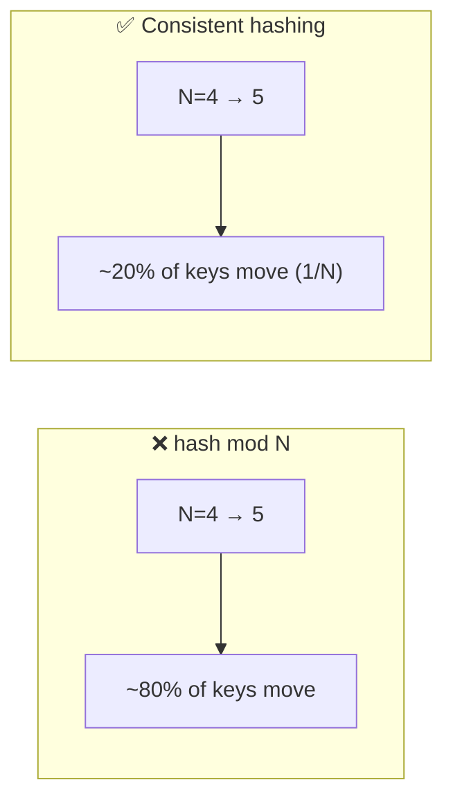

# 051 · Consistent Hashing

> ⏱ 9 min · 📈 51% · 🅰️ Part A (core) · Phase 06: Scaling Data
>
> `██████████░░░░░░░░░░` 51% of the whole guide

---

## 🎯 One-sentence idea

**Consistent hashing places both servers and keys on a circle (a "ring"). Each key belongs to the next server clockwise, so adding or removing a server only moves the keys next to it (about 1/N of them) instead of reshuffling everything.**

## 🧸 Analogy

A **round table** with seats numbered 0–359 like a clock face:

- Waiters (servers) stand at a few spots around the table.
- Each guest (key) sits at a seat determined by their name, and is served by **the next waiter clockwise**.
- A new waiter joins and stands between two others → they take over **only the guests between them and the previous waiter**. Everyone else keeps their waiter.
- A waiter leaves → **only their guests** move to the next waiter clockwise.

With the naive approach (`guest_number % number_of_waiters`), adding one waiter would reassign **almost every guest**.

## 🖼️ Visual

```
                 0°
            ┌────●────┐  ● Server A @ 10°
         K1 ◆          ◆ K2
       ●                  ●  Server B @ 120°
   Server D @ 300°
       ◆ K4             ◆ K3
            └────●────┘
               Server C @ 200°

K1 @ 350° → next clockwise → Server A (10°)
K2 @ 60°  → Server B
K3 @ 150° → Server C
K4 @ 250° → Server D
Add Server E @ 170° → only keys in (120°,170°] move from C to E ✅
```



## 🔬 How it works

- **Hash space** as a ring (e.g., 0 to 2³² − 1). Hash each **server** to one or more points, and hash each **key** to a point.
- **Lookup:** find the first server point **clockwise** from the key's hash (a binary search over sorted server positions → O(log N)).
- **Adding a server:** it takes over keys from **one neighbour**. About K/N keys move.
- **Removing a server:** its keys go to **the next server clockwise**.
- **Virtual nodes (vnodes):** each physical server gets **many points** on the ring (e.g., 100–256).
  - ✅ Evens out the load (without vnodes, random positions give very uneven arcs).
  - ✅ When a server leaves, its load spreads across **many** servers, not just one neighbour.
  - ✅ Stronger servers can get more vnodes (weighting).
- **Replication on the ring:** store each key on the next **N distinct servers** clockwise (Dynamo/Cassandra style).
- **Alternatives:** **rendezvous (highest random weight) hashing** (pick the server with the highest hash(key, server)), **jump consistent hash** (fast, minimal memory, for numbered buckets), **Maglev hashing** (load balancers).

## 🧩 Worked example

**Why modulo is terrible:**

```
10 keys, hash values 0..9. N=4 servers: server = h % 4
Change to N=5: server = h % 5
Keys that stay on the same server: h where h%4 == h%5 → h ∈ {0,1,2,3}
→ 6 of 10 moved. At scale, ~80% of keys move (1 − 1/5).
```

**Minimal ring in Python:**

```python
import bisect, hashlib

def h(s): return int(hashlib.md5(s.encode()).hexdigest(), 16) % 2**32

class Ring:
    def __init__(self, nodes, vnodes=100):
        self.ring = sorted((h(f"{n}#{i}"), n) for n in nodes for i in range(vnodes))
        self.keys = [p for p, _ in self.ring]

    def node_for(self, key):
        i = bisect.bisect(self.keys, h(key)) % len(self.ring)   # first point clockwise
        return self.ring[i][1]

ring = Ring(["cache-a", "cache-b", "cache-c"])
ring.node_for("user:42")   # → e.g. "cache-b"
```

## ⚖️ Trade-offs

| Approach | Keys moved on resize | Balance | Complexity |
|---|---|---|---|
| `hash mod N` | ~all | Good | Trivial |
| Consistent hashing (no vnodes) | ~1/N | ❌ Uneven | Low |
| Consistent hashing + vnodes | ~1/N | ✅ Good | Medium |
| Rendezvous hashing | ~1/N | ✅ Good | Low (O(N) per lookup) |
| Fixed logical partitions + map | Move whole partitions | ✅ Good | Medium (needs a map service) |

## 🌍 Real world

- **Amazon Dynamo, Cassandra, Riak** use rings with vnodes. **Memcached clients** (ketama) use consistent hashing.
- **Discord** used consistent hashing to route guilds to servers. **Akamai** CDN origins came from the original 1997 consistent hashing paper.
- **Envoy/Nginx** offer ring-hash load balancing. **Google Maglev** uses its own consistent hashing.

## 📌 Cheat card

> - **Ring + walk clockwise to the next server.**
> - Adding or removing a server moves only **~1/N** of the keys (vs ~all with `mod N`).
> - **Virtual nodes** → even load + spread-out recovery.
> - **Replicate to the next N distinct servers** on the ring.
> - Use it for **caches, sharded KV stores, sticky load balancing**.

## 🧪 Feynman check

Explain the round-table analogy, and why a new waiter only takes guests from one neighbour, and why virtual nodes (a waiter standing at several spots) make it fairer.

⚠️ **Common confusion:** "Consistent hashing solves hot keys." It balances **key ranges** across servers, but one very hot key still lands on one server. Handle hot keys separately (lesson 032).

## ⚡ Quick recall

1. With consistent hashing, roughly what fraction of keys move when you add a server to N servers?
<details><summary>Answer</summary>

About 1/(N+1) (roughly 1/N).
</details>

2. What problem do virtual nodes solve?
<details><summary>Answer</summary>

Uneven load from random server positions, and concentration of load on one neighbour when a server fails.
</details>

3. How do Dynamo-style systems replicate using the ring?
<details><summary>Answer</summary>

Each key is stored on the next N distinct physical servers clockwise from its position.
</details>

## 🎤 Interview practice

**Q1. "You have 10 cache servers using hash(key) % 10. You add 2 more, and the database gets crushed. Why? How do you fix it?"**
<details><summary>Model answer</summary>

- Changing to `% 12` remaps about 5/6 of the keys, so there's a **massive cache miss storm** and every miss hits the DB.
- Fix: **consistent hashing with virtual nodes**. Adding 2 servers moves ~2/12 ≈ 17% of the keys.
- Also: add capacity gradually, warm the new nodes, and protect the DB with request coalescing and rate limits.
- **Likely follow-up:** "What about a node crash?" → only that node's keys miss (spread over many nodes thanks to vnodes).
</details>

**Q2. "Design the data placement for a distributed key-value store."**
<details><summary>Model answer</summary>

- A consistent hash ring with vnodes, and the **replication factor N=3** (the next 3 distinct nodes).
- **Membership** via gossip (lesson 087). Each node knows the ring and can coordinate requests.
- **Quorum reads and writes** (R + W > N) for tunable consistency (lesson 054).
- **Adding a node:** it claims vnodes and streams the data for those ranges from their current owners.
- Heterogeneous hardware → more vnodes for bigger nodes.
- **Likely follow-up:** "Rack/AZ awareness?" → when choosing the N replicas, skip nodes in the same rack/AZ as the ones already chosen (lesson 092).
</details>

---

⬅️ [✅ Checkpoint 50%](checkpoint-50.md) · 🗺️ [Phase map](README.md) · ➡️ [052 · CAP Theorem](052-cap-theorem.md)

✅ **Safe stopping point.** Tick lesson 051 in [PROGRESS.md](../../PROGRESS.md).
