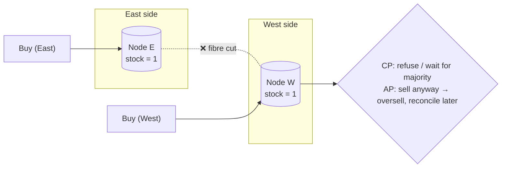

# 052 · The CAP Theorem

> ⏱ 9 min · 📈 52% · 🅰️ Part A (core) · Phase 06: Scaling Data
>
> `██████████░░░░░░░░░░` 52% of the whole guide

---

## 📖 Story

2:04 p.m. Somewhere under a city street, a construction crew's excavator bites through a bundle of fibre-optic cable. Sparks. A shrug. Lunch.

Inside Pantry, the **East** data centre and the **West** data centre suddenly can't hear each other. Both are healthy and humming, serving customers. But every replication message between them now falls into a void.

At 2:06 p.m. a customer in the East taps **"Buy"** on the **last portion** of a cook's famous dumplings. At 2:06 p.m. a customer in the West taps **"Buy"** on the same portion.

Each side holds a copy of the stock count: `1`. Neither can ask the other what it just did.

Before I explain anything, I want you to decide, right now, what each side should do. Sell? Refuse? Wait?

Every answer costs something. That cost has a name.

## 🎯 One-sentence idea

**When a network partition splits a distributed system, each side must either refuse some requests to stay consistent (CP) or keep answering with possibly stale data (AP), and since partitions are unavoidable, the real choice is C vs A during a partition.**

## 🧸 Analogy

Two **bank branches** sharing balances by phone. **The line goes down.** A customer at branch A wants £100.

- 🔒 **CP:** "We can't confirm your balance right now. Please try later." Correct, but **unavailable**.
- 🟢 **AP:** "Here's £100." Helpful, but if a partner withdraws at branch B at the same moment, the account goes **negative**, and the branches reconcile later.

While the line is down, you **can't** have both.

## 🖼️ Visual

*Diagram brief:* two nodes separated by a jagged red "partition" line. A write lands on the left side, and a read hits the right side, where a fork shows the two possible behaviours.



## 🔬 How it works

- **CAP's C is linearizability:** every read sees the latest write, as if there were one copy (not ACID's C). **A** = every request to a non-failed node gets a non-error response. **P** = the system keeps operating despite lost or delayed messages.
- **P is not optional.** Switch failures, cut cables, long GC pauses, and cloud network blips *will* happen, so the theorem really says: **during a partition, choose C or A.**
- **CP systems** refuse or block on the **minority side** and keep a single truth through consensus or majority quorums: **etcd, ZooKeeper, HBase, Spanner**, MongoDB with majority read/write concerns.
- **AP systems** keep answering everywhere and **reconcile later** (LWW, CRDTs, merges): **Cassandra at CL=ONE, DynamoDB's default reads, Riak, CouchDB, DNS**.
- **It's a per-operation choice, not a product label.** Tune it (Cassandra `QUORUM` vs `ONE`, DynamoDB strongly consistent reads), and mix within one app. When there's **no** partition, the trade-off becomes **latency vs consistency** (PACELC, lesson 083).

## 🧩 Worked example

**Maya's per-feature choices:**

| Pantry feature | During the partition… | Choice |
|---|---|---|
| Cart | Keep adding items, merge later | **AP** |
| Likes, reviews | Stale counts are harmless | **AP** |
| Last-portion stock at checkout | Never oversell | **CP** (or AP with a safety buffer) |
| Payments, wallet | Never double-spend | **CP** |
| Leader election, config | Exactly one truth | **CP** |
| Menu browsing | Serve cached data | **AP** |

**Cassandra, N=3 replicas:**

```
W=ONE,  R=ONE     → AP-ish: always fast, may read stale
W=QUORUM, R=QUORUM → overlapping majorities → read latest (while a majority is reachable)
Partition leaves 1 replica reachable → QUORUM ops FAIL (choose C), ONE ops succeed (choose A)
```

**The dumplings:** stock is **CP**, so only the side holding the majority of replicas sells. The other side shows *"Couldn't confirm. Try again in a moment."* Nobody gets a cancelled dinner at 7:40 p.m.

## ⚖️ Trade-offs

| | CP | AP |
|---|---|---|
| During a partition | Some requests fail or wait | Every node answers |
| Data | Always the latest | May be stale, conflicts possible |
| Machinery | Consensus, quorums | Conflict resolution, reconciliation |
| Great for | Money, locks, inventory, config | Feeds, carts, counters, DNS |

## 🌍 Real world

- **Eric Brewer** conjectured CAP in 2000, and **Gilbert & Lynch** proved it in 2002. Brewer's "CAP Twelve Years Later" stresses that it's a *partition-time* choice, not "pick 2 of 3."
- **Amazon's Dynamo** chose AP for the cart: "always writable."
- **Google Spanner** is CP, but its redundant private network makes partitions so rare that it's *effectively* highly available.

## 📌 Cheat card

> - **Partitions happen → choose C or A during them.** "Pick 2 of 3" misleads.
> - CAP's **C = linearizability** ≠ ACID's C.
> - **CP:** refuse or wait to stay correct (etcd, ZooKeeper, Spanner). **AP:** answer and reconcile (Cassandra, Dynamo, DNS).
> - **Choose per feature.** Money and locks → CP. Feeds and carts → AP.
> - No partition → **latency vs consistency** (PACELC).

## 🧪 Feynman check

Explain the two branches with a dead phone line, and why the bank can't be both "always helpful" and "always correct" until the line is fixed.

⚠️ **Common confusion:** "We're CA, because we don't have partitions." Any system where two machines talk over a network *can* be partitioned. "CA" really only describes a **single node**, and a single node can't survive its own failure.

## ⚡ Quick recall

1. What does "C" mean in CAP?
<details><summary>Reveal Answer</summary>

Linearizability: every read returns the most recent write, as if there were a single copy.
</details>

2. Why isn't "P" optional?
<details><summary>Reveal Answer</summary>

Networks can always drop or delay messages, so a distributed system must decide how to behave when that happens.
</details>

3. Give one CP and one AP system.
<details><summary>Reveal Answer</summary>

CP: etcd, ZooKeeper, Spanner, HBase. AP: Cassandra (low consistency levels), DynamoDB default reads, Riak, DNS.
</details>

## 🎤 Interview practice

**Q. "Is your social-media feed design CP or AP? Justify it, and explain how you'd still guarantee unique usernames."**
<details><summary>Model answer</summary>

- **The feed is AP.**
  - Users should always get a feed, even one missing a post from seconds ago. Staleness is harmless, and an error page loses engagement.
  - Mechanisms: async replication, cache-backed timelines, and serving stale data on dependency failure.
- **Some operations are CP:** username and email uniqueness, auth tokens and permission changes, and payments for ads and subscriptions.
- **Unique usernames inside an AP system:**
  - Route claims to a **CP component**: a consensus-backed store (etcd-style), a strongly consistent table with a **conditional write** (`PUT if not exists`) on the username's partition, or a **single-leader** relational unique index.
  - During a partition, the minority side **rejects** sign-ups ("try again shortly") instead of risking duplicates.
- **A concrete failure walk-through:** DC1 and DC2 lose their link.
  - A post written in DC1 **won't show in DC2's feeds** until the link heals (AP, converges later).
  - A username claim in DC2 **fails fast** if DC2 can't reach a quorum (CP).
- **Likely follow-up:** "What do users experience in each mode?" → CP: occasional errors or retries on one side. AP: briefly stale or out-of-order content, fixed automatically.
</details>

## 📖 Teaser

> 📖 *The partition heals, and Maya's team immediately starts arguing about how "consistent" each feature needs to be, as if consistency were a menu rather than a switch.*

---

⬅️ [051 · Consistent Hashing](051-consistent-hashing.md) · 🗺️ [Phase map](README.md) · ➡️ [053 · Consistency Models](053-consistency-models.md)

✅ **Safe stopping point.** Tick lesson 052 in [PROGRESS.md](../../PROGRESS.md).
