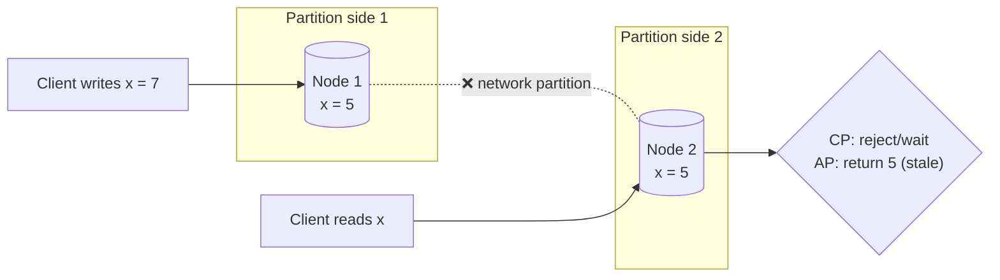

# 052 · The CAP Theorem

> ⏱ 9 min · 📈 52% · 🅰️ Part A (core) · Phase 06: Scaling Data
>
> `██████████░░░░░░░░░░` 52% of the whole guide

---

## 📖 Story

At 2 pm, a construction crew cuts the fibre between Pantry's two data centres. Both halves keep running, but they can't talk to each other. A customer in the east orders the last portion of dumplings, and so does a customer in the west. Each side has to make a choice.

## 🎯 One-sentence idea

**When a network partition splits a distributed system, each side must choose: refuse some requests to stay consistent (CP), or keep answering with possibly stale data (AP). Partitions are unavoidable, so the real choice is C vs A during a partition.**

## 🧸 Analogy

Two **bank branches** that share account data by phone. The **phone line goes down** (a partition). A customer at branch A wants to withdraw $100.

- 🔒 **Choose Consistency (CP):** "Sorry, we can't confirm your balance with the other branch right now. Please try later." Correct, but **unavailable**.
- 🟢 **Choose Availability (AP):** "Sure, here's $100." Always helpful, but if the customer's partner is withdrawing at branch B at the same moment, the account could go **negative**. The branches reconcile when the line comes back.

You **can't** have both while the line is down.

## 🖼️ Visual



## 🔬 How it works

- **C (Consistency)** in CAP = **linearizability**: every read sees the most recent write, as if there were one copy of the data. (Not the same as ACID's C!)
- **A (Availability)** = every request to a **non-failed** node gets a (non-error) response.
- **P (Partition tolerance)** = the system keeps working despite lost or delayed messages between nodes.
- **Partitions happen** (switch failures, GC pauses, cross-region link cuts), so **P isn't optional**. The theorem says: **during a partition, pick C or A**.
- **When there's no partition**, you can have both C and A. The trade-off then is **latency vs consistency** (PACELC, lesson 083).
- **CP systems:** refuse writes/reads on the minority side, or wait for consensus. Examples: **ZooKeeper, etcd, HBase, Spanner** (with very rare unavailability), and MongoDB with majority writes/reads.
- **AP systems:** keep serving and reconcile later (eventual consistency, conflict resolution). Examples: **Cassandra, DynamoDB (default), Riak, CouchDB, DNS**.
- **It's per operation, not per product:** many databases let you tune it (Cassandra `QUORUM` vs `ONE`, DynamoDB strongly consistent reads), and one app can use CP for payments and AP for likes.

## 🧩 Worked example

**Choosing per feature in an e-commerce app:**

| Feature | During a partition… | Choice |
|---|---|---|
| Shopping cart | Let users keep adding items, merge later | **AP** |
| Product reviews / likes | Stale counts are fine | **AP** |
| Inventory at checkout | Don't sell what we don't have | **CP** (or reserve with a buffer) |
| Payments / balances | Never double-spend | **CP** |
| Leader election / config | Must have one truth | **CP** |
| Product catalog browsing | Serve cached, stale is OK | **AP** |

**Cassandra tunable example (N=3 replicas):**

```
Write CL=ONE, Read CL=ONE      → AP-ish: fast, may read stale
Write CL=QUORUM, Read CL=QUORUM → overlapping majorities: reads see latest (while a quorum is reachable)
During a partition leaving only 1 replica reachable → QUORUM ops fail (choosing C), ONE ops succeed (choosing A)
```

## ⚖️ Trade-offs

| | CP | AP |
|---|---|---|
| During a partition | Some requests fail or wait | All nodes answer |
| Data | Always the latest (linearizable) | May be stale, conflicts are possible |
| Needs | Consensus, quorums | Conflict resolution, reconciliation |
| Great for | Money, locks, inventory, config | Feeds, carts, counters, caching, DNS |

## 🌍 Real world

- **Eric Brewer** proposed CAP (2000), and Gilbert & Lynch proved it (2002). Brewer's later "CAP Twelve Years Later" clarified that it's about partition-time choices, and not "pick 2 of 3."
- **Amazon's Dynamo** chose AP for the shopping cart ("always writable").
- **Google Spanner** is CP but achieves very high availability through redundant networks. Partitions are rare, but it still chooses C when they happen.

## 📌 Cheat card

> - **Partitions happen → choose C or A during them.** "Pick 2 of 3" is misleading.
> - CAP's **C = linearizability** ≠ ACID's C.
> - **CP:** refuse or wait to stay correct (etcd, ZooKeeper, Spanner). **AP:** answer and reconcile later (Cassandra, Dynamo, DNS).
> - **Choose per feature:** money and locks → CP. Feeds and carts → AP.
> - No partition? The trade-off becomes **latency vs consistency** → PACELC.

## 🧪 Feynman check

Explain the two bank branches with a broken phone line, and why the bank can't be both "always helpful" and "always correct" until the line is fixed.

⚠️ **Common confusion:** "We're CA because we don't have partitions." Any system with more than one machine talking over a network can have partitions. "CA" only really describes a single-node system.

## ⚡ Quick recall

1. What does "C" mean in CAP?
<details><summary>Answer</summary>

Linearizability: every read returns the most recent write, as if there were a single copy.
</details>

2. Why isn't "P" optional?
<details><summary>Answer</summary>

Networks can always drop or delay messages. A distributed system must decide how to behave when that happens.
</details>

3. Give one CP and one AP system.
<details><summary>Answer</summary>

CP: etcd, ZooKeeper, Spanner, HBase. AP: Cassandra (at low consistency levels), DynamoDB (default), Riak, DNS.
</details>

## 🎤 Interview practice

**Q1. "Is your design CP or AP? Justify it."** (Asked about a social media feed.)
<details><summary>Model answer</summary>

- The feed is **AP**. Users should always get a feed, even if it's missing a post from a few seconds ago. Staleness is harmless, and unavailability hurts engagement.
- But **some parts are CP**: account creation (unique usernames), auth tokens, and payments for ads or subscriptions.
- Explain the mechanism: async replication and caches for the feed. A strongly consistent store or conditional writes for uniqueness.
- **Likely follow-up:** "How do you guarantee unique usernames in an AP system?" → route username claims to a CP component (a consensus-backed store, or a conditional write on a single partition).
</details>

**Q2. "Explain CAP with a concrete failure scenario."**
<details><summary>Model answer</summary>

- Two replicas in different datacenters, and the link between them fails.
- A client writes x=7 to DC1. Another client reads x from DC2.
- **CP:** DC2 can't confirm it has the latest value, so it returns an error or waits (or only the majority side serves writes).
- **AP:** DC2 returns the old x=5. When the link heals, the replicas reconcile (LWW, merge, or conflict resolution).
- **Likely follow-up:** "What does the user experience in each case?" → CP: errors or timeouts on one side. AP: possibly stale or conflicting data that is fixed later.
</details>

> 📖 *Next time: Maya realizes "consistent" isn't one thing. It's a whole menu.*

---

⬅️ [051 · Consistent Hashing](051-consistent-hashing.md) · 🗺️ [Phase map](README.md) · ➡️ [053 · Consistency Models](053-consistency-models.md)

✅ **Safe stopping point.** Tick lesson 052 in [PROGRESS.md](../../PROGRESS.md).
