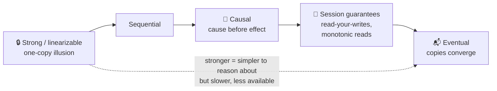

# 053 · Consistency Models

> ⏱ 10 min · 📈 53% · 🅰️ Part A (core) · Phase 06: Scaling Data
>
> `██████████░░░░░░░░░░` 53% of the whole guide

---

## 📖 Story

The team argues. "Likes can be a bit stale," says one. "Balances can't," says another. "Comments must appear in order," says a third. They're all right. Maya learns there are many levels of consistency, and each feature gets to order its own.

## 🎯 One-sentence idea

**A consistency model is the promise a system makes about what reads can return after writes. It ranges from strong (everyone sees the latest value, like a single copy) to eventual (copies agree *eventually*), with useful middle grounds like causal and read-your-writes.**

## 🧸 Analogy

News of a **football goal** spreading:

- 📺 **Strong (linearizable):** everyone watches **one live broadcast**. The moment the goal happens, *every* viewer sees it. No one ever sees an older score.
- 🔗 **Causal:** you might hear about it late, but you'll **never** hear "what a comeback!" **before** hearing about the goal that caused it.
- 🙋 **Read-your-writes:** the person who **posted** the score always sees their own post.
- 📬 **Eventual:** news spreads by word of mouth. Some people know, some don't yet, and **eventually everyone knows**.

## 🖼️ Visual



## 🔬 How it works

- **Strong consistency / linearizability:** once a write completes, **all** later reads (by anyone) see it. The system behaves like a single machine.
  - Needs coordination (consensus or quorums with a leader) → higher latency, and less availability during partitions (CP).
  - Needed for: locks, leader election, unique constraints, balances, inventory.
- **Sequential consistency:** everyone sees operations in the **same order**, but not necessarily in real time.
- **Causal consistency:** operations that are **causally related** (a reply after a post) are seen in order by everyone. Unrelated concurrent operations may appear in different orders.
  - It's the strongest model that stays **available during partitions**. Great for social and collaborative apps.
- **Session guarantees** (per client):
  - **Read-your-writes:** you see your own updates (lesson 047).
  - **Monotonic reads:** you never see time go backwards.
  - **Monotonic writes:** your writes apply in the order you issued them.
  - **Writes-follow-reads:** a write based on something you read is ordered after that read.
- **Eventual consistency:** if writes stop, all replicas **converge** to the same value. No guarantee of *when*, or what you read meanwhile.
  - Needs conflict resolution (LWW, CRDTs). It's highly available and fast.
- **BASE** (Basically Available, Soft state, Eventually consistent) is the philosophy of many AP systems.
- **Mix per feature:** the same app might use strong consistency for payments, causal for comments, and eventual for like counts.

## 🧩 Worked example

**Comment thread anomaly under eventual consistency:**

```
Alice posts:  "Is the store open today?"      (write 1 → replica A)
Bob replies:  "Yes, until 9pm!"               (write 2 → replica B, after reading write 1)
Carol reads from replica C, which received write 2 but not write 1 yet:
  → sees "Yes, until 9pm!" with no question 🤔
Causal consistency prevents this: write 2 depends on write 1, so C must show 1 first.
```

**How systems implement causal consistency:** attach dependency metadata (version vectors or a session's "last seen" timestamp), and replicas **delay** showing a write until its dependencies have arrived.

**Picking models for a banking app vs a social app:**

| Operation | Model |
|---|---|
| Transfer money | Strong (linearizable, ACID) |
| View my balance right after a transfer | Strong or read-your-writes |
| Transaction history on a replica | Read-your-writes + monotonic reads |
| Social comments/replies | Causal |
| Like counter | Eventual |
| Friend suggestions | Eventual (hours of staleness are fine) |

## ⚖️ Trade-offs

| Model | Latency | Availability during a partition | Programmer effort |
|---|---|---|---|
| Strong | 🐢 Highest (coordination) | ❌ Minority side unavailable | 🟢 Easiest to reason about |
| Causal | 🟡 Medium | ✅ Available | 🟡 Metadata tracking |
| Session guarantees | 🟢 Low | ✅ (with stickiness) | 🟡 Routing and tokens |
| Eventual | 🚀 Lowest | ✅ | 🔴 Must handle anomalies and conflicts |

## 🌍 Real world

- **Spanner, etcd, ZooKeeper, CockroachDB** provide strong/linearizable operations.
- **MongoDB** offers causal consistency sessions. **Azure Cosmos DB** famously offers 5 levels: strong, bounded staleness, session, consistent prefix, eventual.
- **DNS, CDN caches, Cassandra at CL=ONE** are eventually consistent.
- **Amazon S3** moved from eventual to **strong read-after-write** consistency in 2020.

## 📌 Cheat card

> - **Strong** = one-copy illusion (slow, CP). **Eventual** = converges someday (fast, AP).
> - **Causal** = cause before effect. It's the strongest model that stays available during partitions.
> - **Session guarantees:** read-your-writes, monotonic reads, and friends.
> - **Pick per operation:** money → strong · comments → causal · counters → eventual.
> - Mnemonic: **BASE vs ACID**.

## 🧪 Feynman check

Using the football-goal story, explain the difference between strong, causal, and eventual consistency, and give one feature where eventual is totally fine.

⚠️ **Common confusion:** "Eventual consistency means data might be wrong forever." No. It **converges** once updates stop propagating. The issue is *temporary* staleness and conflicts, which your design must tolerate.

## ⚡ Quick recall

1. What does linearizability guarantee?
<details><summary>Answer</summary>

After a write completes, every subsequent read (by any client) returns that value or a newer one, as if there were a single copy.
</details>

2. What anomaly does causal consistency prevent?
<details><summary>Answer</summary>

Seeing an effect before its cause (e.g., a reply before the question it answers).
</details>

3. Name two session guarantees.
<details><summary>Answer</summary>

Read-your-writes, monotonic reads, monotonic writes, writes-follow-reads (any two).
</details>

## 🎤 Interview practice

**Q1. "What consistency model would you choose for a collaborative comment system, and how would you implement it?"**
<details><summary>Model answer</summary>

- **Causal** (+ read-your-writes). Replies must appear after their parents, and authors see their own comments immediately.
- Implement: each comment references its parent ID. A client renders a reply only once its parent is present (buffer orphans). A session token tracks the last-written timestamp so the author's reads go to caught-up replicas.
- Counts (replies, likes) can be eventually consistent.
- **Likely follow-up:** "Why not strong consistency?" → cross-region coordination on every comment adds latency, and it isn't needed for correctness here.
</details>

**Q2. "A PM asks, 'Why can't we just make everything strongly consistent?'"**
<details><summary>Model answer</summary>

- Strong consistency needs **coordination** (consensus or quorums): higher latency (especially cross-region, ~100+ ms per write), lower throughput, and **unavailability** on the minority side during partitions.
- Most features don't need it: users tolerate a like count that's a second old, but not a slow app or downtime.
- Apply strong consistency where it matters (money, inventory, uniqueness, permissions), and weaker models elsewhere.
- **Likely follow-up:** "How do you explain eventual consistency to users?" → UX patterns: optimistic UI updates, "syncing…" indicators, and last-updated timestamps.
</details>

> 📖 *Next time: Maya wants fresh reads without asking every copy every time.*

---

⬅️ [052 · CAP Theorem](052-cap-theorem.md) · 🗺️ [Phase map](README.md) · ➡️ [054 · Quorums](054-quorums.md)

✅ **Safe stopping point.** Tick lesson 053 in [PROGRESS.md](../../PROGRESS.md).
