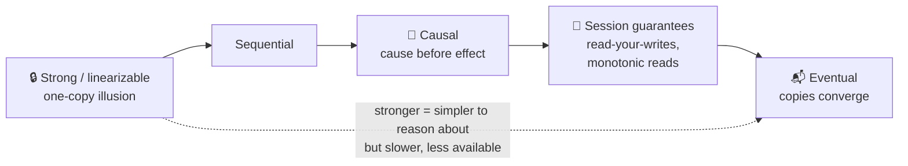

# 053 · Consistency Models

> ⏱ 10 min · 📈 53% · 🅰️ Part A (core) · Phase 06: Scaling Data
>
> `██████████░░░░░░░░░░` 53% of the whole guide

---

## 📖 Story

Three bug reports land on Maya's desk in the same afternoon, and each one feels like a different kind of ghost.

**Ghost one:** a customer replies *"Yes! Until 9 p.m.!"* to a question about a cook's hours. A third customer, reading from another replica, sees the **answer with no question**, floating alone on the page.

**Ghost two:** a cook's wallet shows **£240**, then refreshes to **£190**, then **£240** again. Money appears to be flickering in and out of existence.

**Ghost three:** a dish's ❤️ count reads 1,204 on one phone and 1,198 on another.

Maya wants to stamp "make it consistent" on all three. But each fix costs latency, and in the wrong place, availability.

I told her what I'll tell you: these are **three different promises**. Consistency isn't a switch. It's a **menu**, and each feature gets to order its own dish.

## 🎯 One-sentence idea

**A consistency model is the promise a system makes about what reads can return after writes, ranging from strong (everyone sees the latest value, like a single copy) to eventual (copies agree *eventually*), with valuable middle grounds such as causal and read-your-writes.**

## 🧸 Analogy

News of a **football goal** spreading:

- 📺 **Strong:** everyone watches **one live broadcast**. No one ever sees an older score.
- 🔗 **Causal:** you may hear late, but never hear "what a comeback!" **before** the goal that caused it.
- 🙋 **Read-your-writes:** whoever **posted** the score always sees their own post.
- 📬 **Eventual:** word of mouth. **Eventually everyone knows.**

## 🖼️ Visual

*Diagram brief:* a ladder of promises from strongest to weakest, with "easier to reason about" at the top and "faster, more available" at the bottom.



## 🔬 How it works

- **Linearizable (strong):** once a write completes, **every** later read by anyone sees it, in real-time order. It needs coordination (consensus/quorums), so it's slower and the minority side is unavailable during partitions. **Sequential** keeps one global order but drops the real-time requirement.
- **Causal:** causally related operations (a reply after its question) appear in order **for everyone**. Concurrent unrelated operations may differ. It's the **strongest model that stays available during partitions**.
- **Session guarantees (per client):** **read-your-writes**, **monotonic reads** (no time travel backwards, which is ghost two), **monotonic writes**, and **writes-follow-reads**. They're implemented with sticky replicas or session tokens (lesson 047).
- **Eventual:** once writes stop, all replicas **converge**, with no promise about *when* or what you read in the meantime. It needs conflict resolution (LWW/CRDTs) and is the backbone of **BASE**.
- **Mix per operation:** strong for money and uniqueness, causal for conversations, eventual for counters and suggestions.

## 🧩 Worked example

**Ghost one, under eventual consistency:**

```
Q:  "Is the kitchen open today?"      (write 1 → replica A)
A:  "Yes! Until 9 p.m.!"              (write 2 → replica B, written AFTER reading write 1)
Reader on replica C got write 2 before write 1 → sees an answer with no question 🤔
```

**Causal fix:** write 2 carries a **dependency** `{depends_on: write1}` (or a version vector). Replica C **buffers** write 2 until write 1 arrives, so cause always precedes effect.

**Maya's menu:**

| Pantry operation | Model |
|---|---|
| Wallet payout, transfer | **Strong** (linearizable, ACID) |
| Cook views her balance after a payout | **Read-your-writes + monotonic reads** (kills ghost two) |
| Q&A threads, chat replies | **Causal** (kills ghost one) |
| ❤️ counts | **Eventual** (ghost three is fine) |
| "Cooks you might like" | **Eventual** (hours of staleness are OK) |

## ⚖️ Trade-offs

| Model | Latency | Availability in a partition | Programmer effort |
|---|---|---|---|
| Strong | 🐢 Highest | ❌ Minority side down | 🟢 Easiest to reason about |
| Causal | 🟡 Medium | ✅ | 🟡 Dependency metadata |
| Session | 🟢 Low | ✅ (with stickiness) | 🟡 Routing and tokens |
| Eventual | 🚀 Lowest | ✅ | 🔴 Must tolerate anomalies |

## 🌍 Real world

- **Spanner, etcd, ZooKeeper, and CockroachDB** offer linearizable operations.
- **MongoDB** has causal-consistency sessions. **Azure Cosmos DB** famously exposes five levels: strong, bounded staleness, session, consistent prefix, and eventual.
- **Amazon S3** switched from eventual to **strong read-after-write** consistency in December 2020.

## 📌 Cheat card

> - **Strong** = one-copy illusion (slow, CP). **Eventual** = converges someday (fast, AP).
> - **Causal** = cause before effect, the strongest model that stays available during partitions.
> - **Session guarantees:** read-your-writes, monotonic reads/writes, writes-follow-reads.
> - **Order per feature:** money → strong · threads → causal · counters → eventual.

## 🧪 Feynman check

Using the football goal, explain strong vs causal vs eventual, and name one Pantry feature where eventual is perfectly fine.

⚠️ **Common confusion:** "Eventual consistency means the data might be wrong forever." No: replicas **converge** once updates stop propagating. The real cost is **temporary** staleness and conflicts, which your UX and code must tolerate.

## ⚡ Quick recall

1. What does linearizability guarantee?
<details><summary>Reveal Answer</summary>

After a write completes, every later read by any client returns that value or a newer one, as if there were a single copy.
</details>

2. What anomaly does causal consistency prevent?
<details><summary>Reveal Answer</summary>

Seeing an effect before its cause, such as a reply before the question it answers.
</details>

3. Name two session guarantees.
<details><summary>Reveal Answer</summary>

Any two of: read-your-writes, monotonic reads, monotonic writes, writes-follow-reads.
</details>

## 🎤 Interview practice

**Q. "Pick a consistency model for a collaborative comment system and implement it. Then answer the PM who asks, 'Why not make everything strongly consistent?'"**
<details><summary>Model answer</summary>

- **Model:** **causal + read-your-writes**. Replies must follow their parents everywhere, and authors must see their own comments instantly. Reply and like counts can be eventual.
- **Implementation:**
  - Each comment stores `parent_id` (and optionally a version vector or HLC timestamp).
  - Replicas and clients **buffer orphans** until the parent arrives, then render in order.
  - A **session token** carries the author's last write position, so their reads route to a caught-up replica or the leader.
  - Counts are maintained asynchronously.
- **To the PM:**
  - Strong consistency needs **coordination on every write**: a majority round trip, which is **~100+ ms per write** cross-region, plus lower throughput.
  - During a partition, the **minority side goes read-only or down**.
  - Users forgive a like count that's a second old. They don't forgive a slow or unavailable app.
  - So we buy strong consistency **only where correctness demands it**: payments, inventory, uniqueness, permissions.
- **UX for weaker models:** optimistic UI updates, "syncing…" states, and "updated 2 s ago" timestamps.
- **Likely follow-up:** "How do you implement monotonic reads cheaply?" → sticky replica per session (`hash(user_id)`), or a session token carrying the last-seen LSN.
</details>

## 📖 Teaser

> 📖 *Maya wants fresh reads without asking every single copy every single time, and the answer turns out to be a little bit of arithmetic about overlapping majorities.*

---

⬅️ [052 · CAP Theorem](052-cap-theorem.md) · 🗺️ [Phase map](README.md) · ➡️ [054 · Quorums](054-quorums.md)

✅ **Safe stopping point.** Tick lesson 053 in [PROGRESS.md](../../PROGRESS.md).
