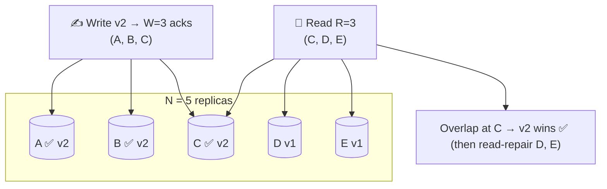

# 054 · Quorums (R + W > N)

> ⏱ 9 min · 📈 54% · 🅰️ Part A (core) · Phase 06: Scaling Data
>
> `██████████░░░░░░░░░░` 54% of the whole guide

---

## 📖 Story

Every Pantry shopping cart now lives on **three replicas**, in three different availability zones.

Maya tries the safe setting first: **every write waits for all three**. Then one zone has a bad afternoon, and its replica answers in **900 ms** instead of 2. Every "Add to cart" in the country now takes almost a second, because the whole write waits for the slowest straggler. When that replica dies outright, writes **stop completely**.

She swings to the fast setting: **write to one, read from one**. Lightning fast, until a customer adds a dish, refreshes, and reads from a replica that hasn't heard yet. *"My cart is empty?!"*

All three is too slow and fragile. One is too stale.

I showed Maya a little piece of arithmetic that still delights me, because it **guarantees the reader and the writer always meet**. Let me show you too.

## 🎯 One-sentence idea

**With N copies, if writes wait for W acknowledgements and reads consult R replicas, then R + W > N guarantees every read overlaps at least one replica holding the latest write, and tuning R and W trades speed against freshness and availability.**

## 🧸 Analogy

A **club with 5 committee members** (N=5), each keeping a copy of the rules:

- To **change a rule**, you need **3 signatures** (W=3).
- To **check a rule**, you ask **3 members** (R=3).
- 3 + 3 = 6 > 5, so the two groups **must share at least one person**, and that person knows the newest rule.
- Ask only 2 (R=2) and you might pick exactly the 2 who **didn't** sign.

## 🖼️ Visual

*Diagram brief:* five replica circles. Three glow green after a write (W=3). A read lasso grabs three circles (R=3), and the lassos overlap on exactly one green circle, marked "newest wins."



## 🔬 How it works

- **N** = replicas, **W** = write ACKs required, **R** = replicas read. **R + W > N ⇒ overlap**, so at least one replica in every read set holds the latest write. The reader picks the **highest version** and can **read-repair** the stale ones.
- **Tuning for N=3:** **W=2, R=2** (balanced, tolerates 1 failure each way), **W=3, R=1** (fast reads, writes die with any node), **W=1, R=3** (fast writes, slow reads), **W=1, R=1** (fastest, **no overlap**, eventual).
- **Availability math:** writes survive **N − W** failures, and reads survive **N − R**. Latency is set by the **W-th or R-th fastest** replica, so stragglers beyond the quorum don't matter.
- **Quorums ≠ linearizability:** **sloppy quorums** (hinted handoff writes to substitute nodes) break the overlap, **concurrent writes** still conflict, and a **failed** write (< W ACKs) may still have landed on some replicas. True linearizability needs read repair before returning, or **consensus** (lesson 085).
- **Majority quorums (⌊N/2⌋+1)** are the backbone of **consensus and leader election**: two majorities always intersect, so **two leaders can never both win**. Use **odd N** (3 or 5).

## 🧩 Worked example

**Maya's fix: N=3, W=2, R=2 (Cassandra `QUORUM`).**

```
Write latency = 2nd-fastest of 3 replicas → the 900 ms straggler is ignored
Read latency  = 2nd-fastest of 3          → fresh reads guaranteed (2 + 2 > 3)
One AZ dies   → reads AND writes keep working
Multi-region  → LOCAL_QUORUM: quorum inside the local DC (no ocean round trip), async to the other DC
```

| N=3 setting | Writes survive | Reads survive | Fresh reads? |
|---|---|---|---|
| W=2, R=2 | 1 down | 1 down | ✅ |
| W=3, R=1 | 0 down | 2 down | ✅ |
| W=1, R=3 | 2 down | 0 down | ✅ |
| W=1, R=1 | 2 down | 2 down | ❌ eventual |

**Why majorities prevent split brain:** 5 nodes, a 3 | 2 partition → only the 3-side reaches a majority (3 ≥ 3). The 2-side can't elect a leader or commit.

## ⚖️ Trade-offs

| Maya's choice | What she gains | What she pays |
|---|---|---|
| Larger W | Durability, fresher reads | Slower, less available writes |
| Larger R | Fresher reads | Slower, less available reads |
| R + W > N | Overlap → up-to-date reads | More latency than R=W=1 |
| R + W ≤ N | Lowest latency, highest availability | Stale reads |
| Odd N (3, 5) | Clean majorities | 5 costs more than 3 |

## 🌍 Real world

- **Cassandra, ScyllaDB, and Riak** expose `ONE`, `QUORUM`, `ALL`, and `LOCAL_QUORUM`.
- **DynamoDB** replicates across 3 AZs and offers eventually consistent (half price) or strongly consistent reads.
- **etcd, ZooKeeper, and Raft groups** run 3 or 5 voters (tolerating 1 or 2 failures).

## 📌 Cheat card

> - **R + W > N ⇒ the reader meets the writer.**
> - N=3 default: **W=2, R=2**, tolerating 1 failure each way.
> - **Majority = ⌊N/2⌋+1.** Two majorities overlap → **no split brain**.
> - Use **odd N**. 5 tolerates 2 failures.
> - Quorums **≠** perfect linearizability.

## 🧪 Feynman check

Explain the club signatures, and why asking 2 members might return an old rule while asking 3 always works.

⚠️ **Common confusion:** "More replicas means more consistency." Consistency comes from **overlap (R + W > N)**, not from N. Five replicas with W=1, R=1 are still only eventually consistent.

## ⚡ Quick recall

1. N=5, W=3. What's the minimum R for overlapping reads?
<details><summary>Reveal Answer</summary>

R = 3 (3 + 3 = 6 > 5).
</details>

2. With N=3, W=2, R=2, how many node failures can reads and writes each tolerate?
<details><summary>Reveal Answer</summary>

One each.
</details>

3. Why do consensus systems use majority quorums?
<details><summary>Reveal Answer</summary>

Any two majorities share at least one node, so two conflicting decisions (like two leaders) can't both reach a majority.
</details>

## 🎤 Interview practice

**Q. "Configure replication for a key-value store that survives one node failure with fresh reads. Then explain why a 4-node consensus cluster is no better than 3."**
<details><summary>Model answer</summary>

- **The configuration:**
  - **N=3, W=2, R=2** across **3 AZs**: overlapping quorums mean fresh reads, and each operation tolerates one failure.
  - Latency is set by the **2nd-fastest** replica, so one sick node doesn't slow anyone down.
  - **Versioned values** (timestamps/vector clocks). The reader returns the newest and **read-repairs** stale replicas.
  - Background **anti-entropy** (Merkle trees) heals replicas nobody reads.
  - Multi-region: **`LOCAL_QUORUM`** per region for latency, async cross-region replication, and accept cross-region staleness (or use a global consensus store for the rare data that needs it).
  - Need two failures? **N=5, W=3, R=3**.
- **Why 4 isn't better than 3:**
  - The majority of 3 is 2 → it tolerates 1 failure. The majority of 4 is **3** → it **still tolerates only 1**.
  - The 4th node adds cost, write latency, and one more thing to break, and a **2 | 2 split** leaves **neither** side with a majority, so the cluster stalls.
  - Use **odd sizes**: 3 (1 failure) or 5 (2 failures). Beyond 5, every write waits for more ACKs for rarely needed tolerance.
- **Likely follow-up:** "Does W=2, R=2 make it linearizable?" → not by itself. Sloppy quorums and concurrent writes can still surface anomalies. You need read-repair-before-return or consensus for strict linearizability.
</details>

## 📖 Teaser

> 📖 *Reads and writes meet reliably now, and then a phone loses signal mid-payment, the app helpfully retries, and a customer is charged twice for one dinner.*

---

⬅️ [053 · Consistency Models](053-consistency-models.md) · 🗺️ [Phase map](README.md) · ➡️ [055 · Idempotency](055-idempotency.md)

✅ **Safe stopping point.** Tick lesson 054 in [PROGRESS.md](../../PROGRESS.md).
