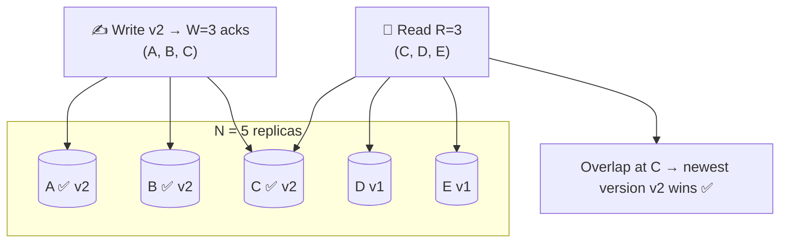

# 054 · Quorums (R + W > N)

> ⏱ 9 min · 📈 54% · 🅰️ Part A (core) · Phase 06: Scaling Data
>
> `██████████░░░░░░░░░░` 54% of the whole guide

---

## 🎯 One-sentence idea

**With N copies of the data, if every write waits for W copies to confirm and every read asks R copies, then R + W > N guarantees the reader overlaps with at least one copy that has the latest write. Tuning R and W trades speed against freshness and availability.**

## 🧸 Analogy

A **club with 5 committee members** (N=5) who each keep a copy of the rules:

- To **change a rule**, you must get **3 signatures** (W=3).
- To **check a rule**, you ask **3 members** (R=3).
- Because 3 + 3 = 6 > 5, the members you ask and the members who signed **must overlap in at least one person**, and that person knows the latest rule. 🎯
- If you asked only 2 people (R=2, 2+3=5, not > 5), you might happen to ask the 2 who **didn't** sign → an old rule.

## 🖼️ Visual



## 🔬 How it works

- **N** = replication factor (copies). **W** = acks needed for a write to succeed. **R** = replicas consulted per read.
- **R + W > N → read and write sets overlap** → a read sees at least one up-to-date copy (the one with the highest version wins).
- **Common settings (N=3):**
  - **W=2, R=2 (majority/quorum):** balanced, and tolerates 1 node down for both reads and writes.
  - **W=3, R=1:** fast reads, but a write fails if any node is down.
  - **W=1, R=3:** fast writes, slow reads.
  - **W=1, R=1:** fastest, **no overlap guarantee** → eventual consistency.
- **Fault tolerance:** writes survive N − W failures, and reads survive N − R failures.
- **Versioning:** replicas return values with versions or timestamps, and the reader picks the newest (and may **read-repair** the stale replicas).
- **Caveats (quorums aren't magic linearizability):**
  - **Sloppy quorums + hinted handoff:** during failures, writes may go to *other* nodes → overlap not guaranteed.
  - **Concurrent writes** still need conflict resolution.
  - A **failed write** (fewer than W acks) may still have landed on some replicas.
  - For true linearizability, you also need read repair before returning, or consensus (Raft/Paxos, lesson 085).
- **Majority quorum** (⌊N/2⌋ + 1) is also the building block of **consensus** and **leader election**: two majorities always overlap, so there can never be two leaders.

## 🧩 Worked example

**Cassandra consistency levels (RF = 3):**

```sql
-- Strong-ish: QUORUM writes + QUORUM reads → 2 + 2 > 3 ✅
INSERT INTO carts (...) VALUES (...) USING CONSISTENCY QUORUM;   -- (driver setting)
SELECT * FROM carts WHERE user_id = ?;                            -- at QUORUM

-- Multi-datacenter: LOCAL_QUORUM → a quorum within the local DC only (fast, and no cross-ocean wait)
```

**Availability math (N=3):**

| Setting | Writes survive | Reads survive | Fresh reads? |
|---|---|---|---|
| W=2, R=2 | 1 down | 1 down | ✅ |
| W=3, R=1 | 0 down | 2 down | ✅ |
| W=1, R=3 | 2 down | 0 down | ✅ |
| W=1, R=1 | 2 down | 2 down | ❌ (eventual) |

**Why majorities prevent split brain:** with 5 nodes, a partition of 3 | 2 → only the side with 3 can form a majority (3 ≥ 3). The 2-node side can't elect a leader or commit writes.

## ⚖️ Trade-offs

| Choice | Gain | Cost |
|---|---|---|
| Larger W | Durability, fresher reads | Slower writes, lower write availability |
| Larger R | Fresher reads | Slower reads, lower read availability |
| R + W > N | Overlap → up-to-date reads | Higher latency than R=W=1 |
| R + W ≤ N | Lowest latency, highest availability | Possible stale reads |
| Odd N (3, 5) | Clean majorities | 5 costs more than 3 |

## 🌍 Real world

- **Cassandra/ScyllaDB/Riak** expose tunable consistency levels (ONE, QUORUM, ALL, LOCAL_QUORUM).
- **DynamoDB** replicates across 3 AZs, and offers eventually consistent (cheaper) or strongly consistent reads.
- **etcd/ZooKeeper/Raft clusters** use majority quorums of 3 or 5 nodes (tolerating 1 or 2 failures).

## 📌 Cheat card

> - **R + W > N ⇒ the reader meets the writer.**
> - N=3 default: **W=2, R=2** (majority) tolerates 1 failure each way.
> - Majority = **⌊N/2⌋ + 1**. Two majorities always overlap → **no split brain**.
> - Use **odd N** (3 or 5). 5 nodes tolerate 2 failures.
> - Quorums ≠ perfect linearizability (sloppy quorums, concurrent writes).

## 🧪 Feynman check

Explain the club-signatures analogy, and why asking only 2 members might give you an old rule while asking 3 always works.

⚠️ **Common confusion:** "More replicas = more consistent." Consistency comes from **overlap (R + W > N)**, not from N alone. N=5 with W=1 and R=1 is still eventually consistent.

## ⚡ Quick recall

1. N=5, W=3. What's the minimum R for overlapping reads?
<details><summary>Answer</summary>

R=3 (3 + 3 = 6 > 5).
</details>

2. With N=3, W=2, R=2, how many node failures can reads and writes tolerate?
<details><summary>Answer</summary>

One each.
</details>

3. Why do consensus systems use majority quorums?
<details><summary>Answer</summary>

Any two majorities share at least one node, so two conflicting decisions (e.g., two leaders) can't both reach a majority.
</details>

## 🎤 Interview practice

**Q1. "Configure replication for a key-value store that must survive 1 node failure with fresh reads."**
<details><summary>Model answer</summary>

- **N=3, W=2, R=2**: overlapping quorums (fresh reads), and each operation tolerates 1 failure.
- Versioned values, and the reader picks the newest and read-repairs the stale replicas.
- Place the replicas in 3 different AZs.
- For multi-region: `LOCAL_QUORUM` within a region for latency, with async cross-region replication (and accept cross-region staleness).
- **Likely follow-up:** "What if you need 2-failure tolerance?" → N=5, W=3, R=3.
</details>

**Q2. "Why is a 4-node cluster no better than a 3-node cluster for consensus?"**
<details><summary>Model answer</summary>

- Majority of 3 = 2 → tolerates 1 failure. Majority of 4 = 3 → **still tolerates only 1 failure**.
- The 4th node adds cost and one more thing to fail, and with a 2 | 2 split, neither side has a majority.
- So use **odd sizes**: 3 (tolerates 1) or 5 (tolerates 2).
- **Likely follow-up:** "Why not 7 or 9?" → more nodes = slower writes (more acks) for rare benefit. 5 is the usual max for consensus groups.
</details>

---

⬅️ [053 · Consistency Models](053-consistency-models.md) · 🗺️ [Phase map](README.md) · ➡️ [055 · Idempotency](055-idempotency.md)

✅ **Safe stopping point.** Tick lesson 054 in [PROGRESS.md](../../PROGRESS.md).
