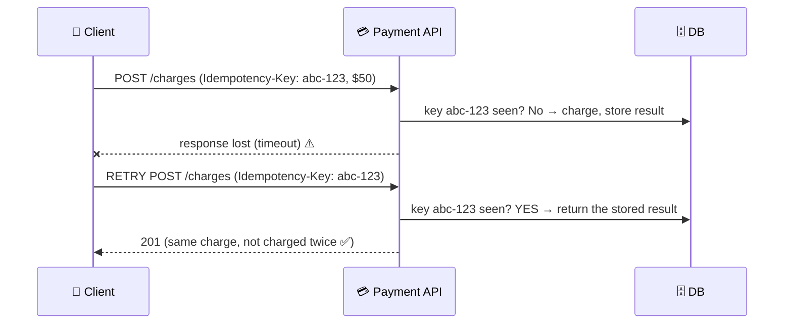

# 055 · Idempotency & Deduplication

> ⏱ 9 min · 📈 55% · 🅰️ Part A (core) · Phase 06: Scaling Data
>
> `███████████░░░░░░░░░` 55% of the whole guide

---

## 📖 Story

A customer's phone lost signal just as she tapped "Pay." The app retried automatically, and she was charged *twice* for one dinner. I want this lesson to stick with you more than almost any other. Networks fail, retries happen, and duplicates are inevitable. So every important operation must be safe to repeat.

## 🎯 One-sentence idea

**An operation is idempotent if doing it twice has the same effect as doing it once. Because retries and duplicate messages are unavoidable in distributed systems, making operations idempotent (usually with a unique idempotency key) is how you avoid double charges and double orders.**

## 🧸 Analogy

An **elevator button**:

- Press "5" once → the elevator goes to floor 5.
- Press it **ten more times** impatiently → it **still just goes to floor 5**. The extra presses change nothing. That's **idempotent**. ✅

Compare with a **vending machine** where each press **drops another snack and charges you again**. Pressing twice = two snacks, two charges. **Not idempotent.** ❌

## 🖼️ Visual



## 🔬 How it works

- **Why duplicates happen:** client timeouts + retries, network glitches, load balancer retries, at-least-once message queues (lesson 060), users double-clicking, and crash/restart replays.
- **Naturally idempotent operations:** `GET`, `PUT` (set to a value), `DELETE`, "set status = shipped", "add user to set".
- **Not naturally idempotent:** `POST /payments`, "increment balance", "send email", "append to list".
- **Making operations idempotent:**
  - **Idempotency keys:** the client generates a unique key per *intended* operation (UUID) and sends it with every retry. The server stores `key → result` and returns the stored result for repeats.
  - **Unique constraints:** a DB unique index on `(idempotency_key)` or a natural key (`order_id`, `(user_id, billing_period)`), so a duplicate insert fails safely.
  - **Conditional updates / versioning:** `UPDATE ... WHERE status = 'pending'` → the second time, 0 rows change.
  - **Dedup tables for consumers:** store processed message IDs, and skip ones already seen (with a TTL).
  - **Convert deltas to absolute values:** "set balance to 150" (with version check) instead of "add 50".
- **Race safety:** two identical requests arriving *simultaneously* must not both run. Insert the key first (as "in progress") under a **unique constraint or lock**, then do the work.
- **Scope and expiry:** keys are scoped per client/account, and kept long enough to cover retry windows (e.g., 24 h–7 days).
- **Same key, different body?** Reject it (`422`), because it's likely a client bug.

## 🧩 Worked example

**Server-side idempotency (SQL):**

```sql
CREATE TABLE idempotency_keys (
  key          text PRIMARY KEY,
  account_id   bigint NOT NULL,
  request_hash text NOT NULL,
  status       text NOT NULL,        -- 'in_progress' | 'done'
  response     jsonb,
  created_at   timestamptz DEFAULT now()
);
```

```python
def create_charge(req):
    key = req.headers["Idempotency-Key"]
    try:
        db.insert("idempotency_keys", key=key, account_id=req.account,
                  request_hash=hash(req.body), status="in_progress")   # unique → only the first wins
    except UniqueViolation:
        row = db.get("idempotency_keys", key)
        if row.request_hash != hash(req.body): return 422               # same key, different request
        if row.status == "in_progress":       return 409                # still running, retry later
        return row.response                                             # replay the stored result ✅

    result = payments.charge(req.account, req.amount)                   # the real side effect
    db.update("idempotency_keys", key, status="done", response=result)
    return result
```

**Idempotent message consumer:**

```python
def handle(msg):
    if redis.set(f"processed:{msg.id}", 1, nx=True, ex=7*86400):   # first time?
        apply_business_logic(msg)       # (ideally in the same DB transaction as a dedup row)
    # else: duplicate → skip silently
```

## ⚖️ Trade-offs

| Technique | Gain | Cost |
|---|---|---|
| Idempotency keys | Safe retries for any operation | Key storage, client cooperation |
| Unique constraints on natural keys | Simple, bulletproof in the DB | Needs a natural unique identity |
| Conditional/versioned updates | No extra table | Only for state transitions |
| Consumer dedup table | Handles at-least-once delivery | Storage and TTL tuning |
| No idempotency | Simplicity | Double charges, duplicate orders 😱 |

## 🌍 Real world

- **Stripe's API** popularized the `Idempotency-Key` header. Keys are stored for 24 hours.
- **AWS APIs** use `ClientToken` for idempotent resource creation (e.g., EC2 RunInstances).
- **Kafka** has an **idempotent producer** (dedupes retries per partition via sequence numbers).
- **Payment networks** reconcile duplicates with unique transaction references.

## 📌 Cheat card

> - **Idempotent = twice has the same effect as once.** The elevator button, not the vending machine.
> - **Retries + at-least-once delivery make duplicates inevitable**, so design for them.
> - Tools: **Idempotency-Key header · unique constraints · conditional updates · dedup tables**.
> - **Claim the key first** (unique insert), then do the work, to handle simultaneous duplicates.
> - Prefer **absolute state** ("set to X") over **deltas** ("add X").

## 🧪 Feynman check

Explain the elevator-button vs vending-machine analogy, and walk through how an idempotency key saves a customer from being charged twice after a timeout.

⚠️ **Common confusion:** "HTTP retries are only a client problem." Load balancers, proxies, SDKs, and message brokers all retry. **Every write path** that matters must tolerate duplicates.

## ⚡ Quick recall

1. Is "set status to shipped" idempotent? Is "increment stock by 1"?
<details><summary>Answer</summary>

"Set status to shipped" is idempotent. "Increment by 1" is not.
</details>

2. What does the server store for an idempotency key?
<details><summary>Answer</summary>

The key (scoped to the client), a hash of the request, the processing status, and the response to replay on retries.
</details>

3. How do you handle two identical requests arriving at the same moment?
<details><summary>Answer</summary>

Atomically claim the key first (a unique insert or lock). Only the winner proceeds, and the other gets "in progress" (409) or waits and gets the stored result.
</details>

## 🎤 Interview practice

**Q1. "Design a payment API that never double-charges, even with retries."**
<details><summary>Model answer</summary>

- The client sends an **Idempotency-Key** (UUID) per payment attempt, reused on retries.
- The server inserts the key with a **unique constraint** (status in_progress) → calls the payment processor **with the same key** (processors are idempotent too) → stores the result → returns it.
- Duplicate key → return the stored response. Same key with a different payload → 422. Still in progress → 409 or wait.
- Keys are kept 24 h+. A **ledger** records entries with unique references. **Reconciliation** jobs compare with the processor.
- **Likely follow-up:** "What if the server crashes after charging but before saving the result?" → on retry, query the processor by the idempotency key or reference to learn the outcome, and reconcile. Never charge blindly again.
</details>

**Q2. "Our queue delivers messages at least once, and some emails are sent twice. Fix it."**
<details><summary>Model answer</summary>

- Give each message a stable **message/event ID**, and make the consumer **idempotent**: record `processed(event_id)` (unique) **before or atomically with** the side effect.
- For external side effects (email), use a **dedup key with the provider** where possible, or a "sent" table checked before sending.
- Accept that true exactly-once is impossible end to end, and aim for **effectively-once** via idempotency (lesson 060).
- **Likely follow-up:** "How long do you keep processed IDs?" → longer than the maximum redelivery window (e.g., 7 days), with a TTL.
</details>

> 📖 *Chapter 7 is next. The dinner rush arrives all at once.*

---

⬅️ [054 · Quorums](054-quorums.md) · 🗺️ [Phase map](README.md) · ➡️ [✅ Checkpoint 55%](checkpoint-55.md)

✅ **Safe stopping point.** Tick lesson 055 in [PROGRESS.md](../../PROGRESS.md), then do the checkpoint!
