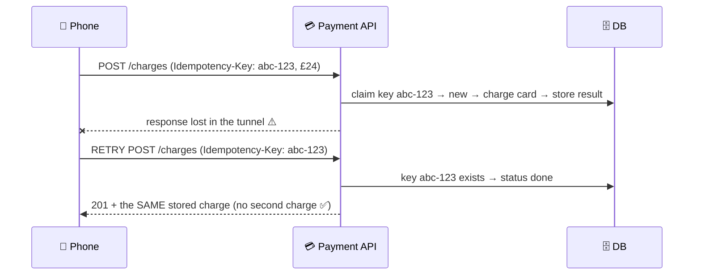

# 055 · Idempotency & Deduplication

> ⏱ 9 min · 📈 55% · 🅰️ Part A (core) · Phase 06: Scaling Data
>
> `███████████░░░░░░░░░` 55% of the whole guide

---

## 📖 Story

A customer is on a train, entering a tunnel. She taps **"Pay £24."**

The request leaves her phone. It reaches Pantry's API. The card is charged. The response, *"Success!"*, races back toward her phone and **dies in the dark** of the tunnel.

Her phone waits. **10-second timeout.** The app does exactly what its retry library tells it to: **send the payment again.**

The train leaves the tunnel. Two notifications buzz in her pocket, one second apart:

**£24.00 charged. £24.00 charged.**

One dinner, two charges, and one very public review.

I want this lesson to stick with you more than almost any other. **Networks fail. Retries happen. Duplicates are inevitable.** So every operation that matters must be **safe to repeat**.

## 🎯 One-sentence idea

**An operation is idempotent if doing it twice has the same effect as doing it once, and because retries and duplicate messages are unavoidable, making operations idempotent (usually with a unique idempotency key) is how you prevent double charges and double orders.**

## 🧸 Analogy

An **elevator button**: press "5" once and the elevator goes to floor 5. Press it ten more times impatiently and it **still just goes to floor 5**. ✅ Idempotent.

A **vending machine** that drops another snack and charges you again on every press. ❌ Not idempotent.

## 🖼️ Visual

*Diagram brief:* a request with a key tag travels to the server, the server records the key, and the response is lost in a dark tunnel. The retry carries the **same key**, the server finds it in its ledger, and replays the stored answer. One charge.



## 🔬 How it works

- **Duplicates come from everywhere:** client timeouts + retries, LB and proxy retries, SDK auto-retries, **at-least-once queues** (lesson 060), double-clicks, and crash-replay. Design for them on **every** important write path.
- **Naturally idempotent:** `GET`, `PUT` (set to X), `DELETE`, "set status = shipped", "add to set". **Not idempotent:** `POST /payments`, "increment balance", "send email", "append to list". Prefer **absolute state** ("set to X") over **deltas** ("add X").
- **Idempotency keys:** the client generates a **UUID per intended operation** and reuses it on every retry. The server stores `key → (request hash, status, response)`, **scoped per account**, kept **24 h–7 days**. Same key with a different body → **422**.
- **Claim first, then act:** atomically insert the key as `in_progress` under a **unique constraint** *before* doing the side effect, so two simultaneous duplicates can't both run. The loser gets **409** or waits and gets the stored result.
- **Other tools:** **unique constraints on natural keys** (`(user_id, billing_period)`), **conditional transitions** (`UPDATE … WHERE status='pending'`), and **consumer dedup tables** of processed message IDs, ideally written **in the same transaction** as the business change.

## 🧩 Worked example

```sql
CREATE TABLE idempotency_keys (
  key          text PRIMARY KEY,
  account_id   bigint NOT NULL,
  request_hash text NOT NULL,
  status       text NOT NULL,        -- 'in_progress' | 'done'
  response     jsonb,
  created_at   timestamptz DEFAULT now()
);
```

```python
def create_charge(req):
    key = req.headers["Idempotency-Key"]
    try:
        db.insert("idempotency_keys", key=key, account_id=req.account,
                  request_hash=sha256(req.body), status="in_progress")    # unique → one winner
    except UniqueViolation:
        row = db.get("idempotency_keys", key)
        if row.request_hash != sha256(req.body): return 422               # same key, different request
        if row.status == "in_progress":         return 409                # still running → retry later
        return row.response                                               # replay ✅

    result = processor.charge(req.account, req.amount, idempotency_key=key)  # pass it downstream too
    db.update("idempotency_keys", key, status="done", response=result)
    return result
```

**Idempotent consumer:**

```python
def handle(event):
    with db.transaction():
        inserted = db.execute("INSERT INTO processed(event_id) VALUES (%s) ON CONFLICT DO NOTHING", event.id)
        if inserted.rowcount == 1:
            apply_business_change(event)        # same transaction → atomic with the dedup mark
```

**The tunnel, replayed:** the retry carries `abc-123` → the stored result is returned → **one charge**.

## ⚖️ Trade-offs

| Maya's choice | What she gains | What she pays |
|---|---|---|
| Idempotency keys | Safe retries for any operation | Key storage, client cooperation |
| Unique natural keys | Bulletproof in the DB | Needs a natural identity |
| Conditional transitions | No extra table | Only fits state machines |
| Consumer dedup table | Survives at-least-once delivery | Storage, TTL tuning |
| No idempotency | Simpler code | Double charges, angry customers |

## 🌍 Real world

- **Stripe** popularized the `Idempotency-Key` header, with keys stored for 24 hours.
- **AWS APIs** use a `ClientToken` for idempotent creation (e.g. EC2 `RunInstances`).
- **Kafka's idempotent producer** dedupes retries per partition using producer IDs + sequence numbers.

## 📌 Cheat card

> - **Idempotent = twice equals once.** The elevator button, not the vending machine.
> - **Retries + at-least-once ⇒ duplicates.** Design for them.
> - **Idempotency-Key · unique constraints · conditional updates · dedup tables.**
> - **Claim the key first, then act.**
> - **Pass the key downstream** (payment processors are idempotent too).

## 🧪 Feynman check

Explain the elevator vs the vending machine, then walk through how an idempotency key saves the train passenger from a double charge.

⚠️ **Common confusion:** "Retries are only the client's problem." **Load balancers, proxies, SDKs, service meshes, and message brokers all retry**, often without telling you. Every write path that touches money, inventory, or messages must tolerate duplicates.

## ⚡ Quick recall

1. Is "set status to shipped" idempotent? Is "increment stock by 1"?
<details><summary>Reveal Answer</summary>

"Set status to shipped" is idempotent. "Increment by 1" is not.
</details>

2. What does the server store for an idempotency key?
<details><summary>Reveal Answer</summary>

The key (scoped to the client), a hash of the request, the processing status, and the response to replay on retries.
</details>

3. How do you handle two identical requests arriving at the same moment?
<details><summary>Reveal Answer</summary>

Atomically claim the key first (unique insert or lock). Only the winner proceeds, and the other gets 409 or waits and receives the stored result.
</details>

## 🎤 Interview practice

**Q. "Design a payment API that never double-charges, even across retries and server crashes. Then fix a queue consumer that sometimes sends emails twice."**
<details><summary>Model answer</summary>

- **The payment API:**
  1. The client sends an **`Idempotency-Key`** (UUID) per payment intent and reuses it on every retry.
  2. The server **claims** the key with a **unique insert** (`in_progress`) plus a request hash.
  3. It calls the processor **passing the same key**, because processors dedupe too.
  4. It stores the result as `done` with the response, and returns it.
  - Duplicate → **replay the stored response**. Same key with a different body → **422**. Still in progress → **409**.
  - Keys live **≥ 24 h**, longer than any client retry window.
- **Crash after charging but before saving:**
  - On retry, the row is stuck `in_progress` past a timeout → **query the processor by key/reference** to learn the truth, then finish or roll forward. **Never charge blindly again.**
  - A double-entry **ledger** with unique references, and nightly **reconciliation** against the processor's settlement files (lesson 096), catch anything left over.
- **Duplicate emails:**
  - The queue is **at-least-once**, so give each event a stable **`event_id`**.
  - The consumer records `processed(event_id)` **atomically** with its state change.
  - For the external email, use the provider's **dedup/idempotency key**, or check a `sent_emails(event_id)` table before sending.
  - True end-to-end exactly-once is impossible. Aim for **effectively-once** through idempotency (lesson 060).
  - Keep processed IDs longer than the **maximum redelivery window** (e.g. 7 days, with a TTL).
- **Likely follow-up:** "Where does the key come from if the client is a browser?" → generate it when the checkout page loads (one per intent), persist it in the form or local storage, and reuse it on every resubmit.
</details>

## 📖 Teaser

> 📖 *Chapter 7 is next. At exactly 7 p.m., ten thousand dinner orders arrive at once, and every one of them is waiting on everything else.*

---

⬅️ [054 · Quorums](054-quorums.md) · 🗺️ [Phase map](README.md) · ➡️ [✅ Checkpoint 55%](checkpoint-55.md)

✅ **Safe stopping point.** Tick lesson 055 in [PROGRESS.md](../../PROGRESS.md), then do the checkpoint!
