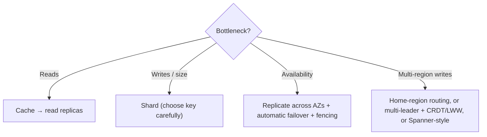

# 📌 Phase 06 Cheatsheet: Scaling Data

## 🧠 Core ideas

| # | Idea in one line |
|---|---|
| 046 | **Leader writes, followers copy the log and serve reads.** Async = fast but lossy on failover. |
| 047 | **Lag is real.** Read-your-writes (leader or LSN), monotonic reads (sticky replica). |
| 048 | **Multi-leader / leaderless** = available writes, but **conflicts** (LWW, siblings, CRDTs, home leader). |
| 049 | **Sharding** = split data for storage + write scale. Many logical shards → few nodes. |
| 050 | **Shard key:** high cardinality, even, query-local, stable. Salt hot keys. |
| 051 | **Consistent hashing:** ring + clockwise, ~1/N moves, virtual nodes. |
| 052 | **CAP:** during a partition choose **C or A**. CP for money and locks, AP for feeds and carts. |
| 053 | **Strong → causal → session → eventual.** Pick per operation. |
| 054 | **R + W > N** → fresh reads. Majority = ⌊N/2⌋ + 1. Odd N. |
| 055 | **Idempotency keys + unique constraints** → safe retries, no double charges. |

## 🔢 Numbers

```
Typical replica lag: ms (can spike to seconds or minutes)
Failover: ~10–60 s (detect + promote + reconnect)
N=3 → majority 2 → tolerates 1 failure · N=5 → majority 3 → tolerates 2
Consistent hashing: adding the (N+1)th node moves ~1/(N+1) of keys · vnodes 100–256 per node
Idempotency keys kept ~24 h–7 days
```

## 🪄 Tricks & mnemonics

- **Replication = copies (availability, reads). Sharding = splits (capacity, writes).** You usually need both.
- **"R + W > N means the Reader meets the Writer."**
- **CAP: "Choose A Partner"**: when Partitioned, pick C or A.
- **Hot key? Consistent hashing won't save you.** Salt, cache, or give it a dedicated shard.
- **Timestamps/auto-increment + range sharding = hotspot.**
- **Elevator button, not vending machine** (idempotency).

## 🗺️ Decision helper



## ⚠️ Top mistakes

- Expecting replicas to help write throughput.
- Ignoring replication lag in "save → redirect → view" flows.
- LWW on data where concurrent edits matter (carts, documents).
- `hash mod N` for sharding or caches.
- Saying "we're CA."
- Retrying non-idempotent operations blindly.

---

🗺️ [Phase map](README.md) · 🎤 [Interview questions](INTERVIEW-QUESTIONS.md)
