# 🧬 Phase 06: Scaling Data

> **Lessons 046–055 · 46% → 55% · 🅰️ Part A (core)**
> By the end of this phase you'll **copy data (replication)**, **split data (sharding)**, and reason about **consistency, CAP, and quorums**, the heart of distributed data.

## 📖 Chapter 6: Pantry Goes National

Pantry explodes across the country, then across an ocean. One database machine can't hold the data or survive a failure. In this chapter, Maya copies data (replication), splits it (sharding), and wrestles with the deepest questions of distributed data: what happens when machines disagree, when the network breaks, and when a request arrives twice?

## 🗺️ Phase map

```mermaid
flowchart LR
    L46["046<br/>Leader–follower<br/>replication"] --> L47["047<br/>Replication lag &<br/>read-your-writes"]
    L47 --> L48["048<br/>Multi-leader &<br/>leaderless"]
    L48 --> L49["049<br/>Sharding"]
    L49 --> L50["050<br/>Shard keys &<br/>hotspots"]
    L50 --> C50{{"✅ Checkpoint 50%"}}
    C50 --> L51["051<br/>Consistent<br/>hashing"]
    L51 --> L52["052<br/>CAP theorem"]
    L52 --> L53["053<br/>Consistency<br/>models"]
    L53 --> L54["054<br/>Quorums"]
    L54 --> L55["055<br/>Idempotency"]
    L55 --> C55{{"✅ Checkpoint 55%"}}
```

| # | Lesson | ⏱ | One-line idea |
|---|---|---|---|
| 046 | [Leader–follower replication](046-leader-follower-replication.md) | 9 min | One writer, many readers, copies everywhere |
| 047 | [Replication lag & read-your-writes](047-replication-lag.md) | 9 min | Copies run behind, so plan for it |
| 048 | [Multi-leader & leaderless](048-multi-leader-and-leaderless.md) | 10 min | Many writers means conflicts. Resolve them wisely |
| 049 | [Sharding](049-sharding.md) | 10 min | Split data across machines so each holds a slice |
| 050 | [Shard keys, hotspots & cross-shard queries](050-shard-keys-and-hotspots.md) | 10 min | The key you split by makes or breaks you |
| ✅ | [Checkpoint 50%](checkpoint-50.md) | 15 min | 🎉 **HALFWAY!** |
| 051 | [Consistent hashing](051-consistent-hashing.md) | 9 min | Add or remove servers and move only a sliver of keys |
| 052 | [CAP theorem](052-cap-theorem.md) | 9 min | When the network splits, choose consistency or availability |
| 053 | [Consistency models](053-consistency-models.md) | 10 min | Strong, eventual, causal, and friends |
| 054 | [Quorums (R + W > N)](054-quorums.md) | 9 min | Overlapping reads and writes give fresh answers |
| 055 | [Idempotency & deduplication](055-idempotency.md) | 9 min | Doing it twice = doing it once |
| ✅ | [Checkpoint 55%](checkpoint-55.md) | 15 min | |

📌 [Phase cheatsheet](CHEATSHEET.md) · 🎤 [Phase interview questions](INTERVIEW-QUESTIONS.md)

⬅️ Previous phase: [05 Databases](../05-databases/README.md) · ➡️ Next phase: [07 Async & messaging](../07-async-messaging/README.md)
