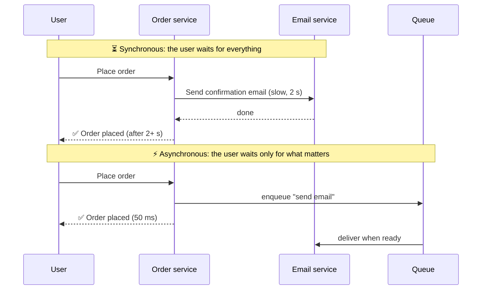

# 056 · Sync vs Async Communication

> ⏱ 8 min · 📈 56% · 🅰️ Part A (core) · Phase 07: Async & Messaging
>
> `███████████░░░░░░░░░` 56% of the whole guide

---

## 📖 Story

At 7 pm, 50,000 orders arrived in ten minutes. Each checkout waited for the confirmation email, the kitchen printer, the loyalty points, and the analytics, so the slowest one set the pace for everyone. I asked Maya the question I'll ask you now: does the customer really need to wait for all of that?

## 🎯 One-sentence idea

**Synchronous calls make the caller wait for the answer (simple, immediate, but it couples both sides' speed and uptime). Asynchronous messaging lets the caller hand off work and move on (resilient and spike-absorbing, but eventually consistent and harder to trace).**

## 🧸 Analogy

- 📞 **Sync = a phone call.** You wait on the line until the other person answers and replies. If they're busy or away, **you're stuck**.
- 📨 **Async = leaving a voicemail or email.** You say what you need and go on with your day. They handle it when they can, and they may notify you later. If they're on holiday, the message **waits safely**.

Ordering at a restaurant is async: the waiter **puts a ticket on the rail** and goes to serve other tables, and doesn't stand in the kitchen waiting for your pasta.

## 🖼️ Visual



## 🔬 How it works

- **Synchronous (request/response):** HTTP/REST, gRPC. The caller **blocks** until it gets a response or a timeout.
  - ✅ Simple mental model, immediate results, easy error handling.
  - ❌ **Temporal coupling:** both sides must be up at the same time. Latency **adds up** along call chains, and failures **cascade**.
- **Asynchronous (messaging):** queues, pub/sub, event streams. The caller **sends a message and returns**.
  - ✅ **Decoupling** (the producer doesn't care who processes it or when), **spike absorption** (the queue buffers bursts), **retries** built in, and independent scaling of consumers.
  - ❌ **Eventual consistency** (the result isn't instant), harder debugging (tracing across queues), message ordering and duplicates, and the queue is one more system to run.
- **What goes async?** Work the user **doesn't need to wait for**: emails and notifications, thumbnails and video transcoding, analytics events, search indexing, fraud checks (sometimes), report generation, and syncing to other services.
- **What stays sync?** Things the user needs **right now** to continue: login, reading a page, validating a payment authorization, and checking stock at checkout.
- **Async request–reply:** for long jobs, return **202 Accepted + a job ID**, and let the client poll `/jobs/{id}` or receive a webhook or push when it's done.

## 🧩 Worked example

**Checkout flow, split sync/async:**

```
SYNC (user waits, ~300 ms):
  validate cart → reserve inventory → authorize payment → create order → respond "Order #123 confirmed"

ASYNC (via events, seconds to minutes later):
  OrderPlaced event →
     • email service: send confirmation
     • warehouse service: create pick list
     • analytics: record sale
     • recommendation service: update "bought together"
     • loyalty service: award points
```

**Long-running job API:**

```http
POST /v1/reports            → 202 Accepted  {"job_id": "r_789", "status": "queued"}
GET  /v1/reports/r_789      → 200 {"status": "running", "progress": 40}
GET  /v1/reports/r_789      → 200 {"status": "done", "url": "https://.../report.pdf"}
```

**Latency and availability math:** order → email service (99.5% up, p99 2 s) **synchronously** means checkout availability ≤ 99.5% and p99 ≥ 2 s. Made async, checkout is unaffected by the email service's health.

## ⚖️ Trade-offs

| | Sync | Async |
|---|---|---|
| User gets the result | Immediately | Later (or a job ID) |
| Coupling | Tight (both up, both fast) | Loose |
| Traffic spikes | Hit every service directly | Absorbed by the queue |
| Failure handling | Caller must handle it now | Retries, dead-letter queues |
| Consistency | Immediate | Eventual |
| Debugging | Easier (one call stack) | Harder (needs tracing and correlation IDs) |

## 🌍 Real world

- **Amazon** checkout confirms the order quickly, and emails, shipping, and recommendations happen asynchronously.
- **Uber, Netflix, LinkedIn** move huge event volumes through Kafka to decouple hundreds of services.
- **Webhooks** (Stripe, GitHub) are async callbacks to your system.

## 📌 Cheat card

> - **Sync = phone call. Async = voicemail / a ticket on the rail.**
> - **Keep sync only what the user must wait for.** Everything else goes async.
> - Async gives you **decoupling, spike absorption, and retries**, and costs you **eventual consistency and tracing**.
> - Long jobs → **202 + job ID + poll/webhook**.
> - **Sync chains multiply failure and add latency.** Keep them short.

## 🧪 Feynman check

Explain the phone call vs voicemail analogy, and decide for a food-delivery app: which steps must be sync, and which can be async?

⚠️ **Common confusion:** "Async makes things faster." Async makes the **caller** faster and more resilient. The total work still happens, and the *end-to-end* completion may even take longer. It moves waiting off the critical path.

## ⚡ Quick recall

1. Name two benefits of async messaging.
<details><summary>Answer</summary>

Decoupling (independent availability and scaling), spike absorption (buffering), built-in retries, faster user responses (any two).
</details>

2. What's a good API pattern for a job taking 5 minutes?
<details><summary>Answer</summary>

Return 202 Accepted with a job ID, then let the client poll a status endpoint or receive a webhook or push notification.
</details>

3. Why do long synchronous call chains hurt availability?
<details><summary>Answer</summary>

Every service in the chain must be up, so availabilities multiply, and one slow service stalls all the callers.
</details>

## 🎤 Interview practice

**Q1. "Our signup endpoint takes 3 seconds because it sends a welcome email, creates a CRM record, and provisions a sample project. Improve it."**
<details><summary>Model answer</summary>

- Keep sync only: validate, create the user row, and return a session (~100 ms).
- Publish a `UserSignedUp` event (via the **outbox**, lesson 062) → independent consumers: email, CRM sync, sample-project provisioning.
- Make the consumers **idempotent** and retryable, with dead-letter queues for poison messages.
- The UI can show "setting up your workspace…" and update when provisioning completes (poll or push).
- **Likely follow-up:** "What if the email service is down for an hour?" → messages wait in the queue and are delivered when it recovers. Signup is unaffected.
</details>

**Q2. "When would you NOT use async messaging?"**
<details><summary>Model answer</summary>

- When the caller **needs the result to proceed** (authorization checks, reads for rendering, price calculation).
- When **strong consistency** is needed immediately (e.g., reserving the last seat must be answered now).
- In small systems, where a queue's operational cost outweighs its benefits.
- For low-latency request/response, where queue hops add overhead.
- **Likely follow-up:** "Can you mix them?" → yes: a sync API that internally enqueues work and returns 202, or sync for the critical path with async for side effects.
</details>

> 📖 *Next, Maya needs somewhere safe to put all that "later" work.*

---

⬅️ [✅ Checkpoint 55%](../06-scaling-data/checkpoint-55.md) · 🗺️ [Phase map](README.md) · ➡️ [057 · Message Queues](057-message-queues.md)

✅ **Safe stopping point.** Tick lesson 056 in [PROGRESS.md](../../PROGRESS.md).
