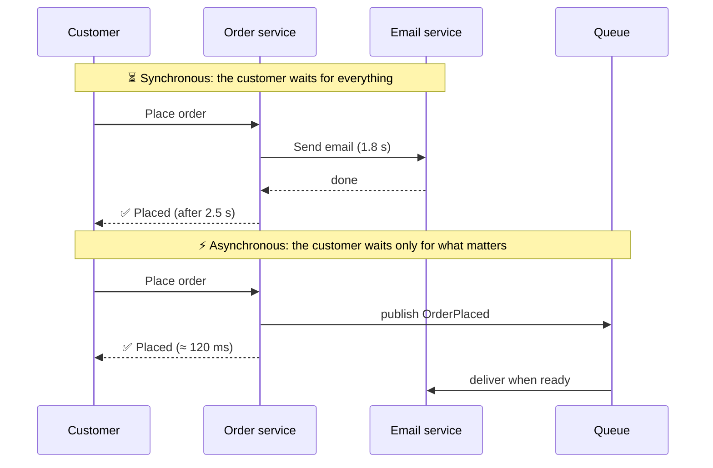

# 056 · Sync vs Async Communication

> ⏱ 8 min · 📈 56% · 🅰️ Part A (core) · Phase 07: Async & Messaging
>
> `███████████░░░░░░░░░` 56% of the whole guide

---

## 📖 Story

7:00 p.m. The dinner rush hits like a wave breaking over a seawall: **50,000 orders in ten minutes.**

And every single checkout is a **relay race with five runners**, each one waiting for the previous:

1. Save the order (20 ms).
2. Send the confirmation email (**1.8 s**, the email provider is struggling tonight).
3. Print the ticket in the cook's kitchen (400 ms).
4. Award loyalty points (150 ms).
5. Record analytics (90 ms).

The customer stares at a spinner for **2.5 seconds**. Then the email provider stalls completely, and **checkout dies with it**. Orders fail because a *thank-you email* couldn't be sent.

It's like a restaurant where the waiter refuses to take your order until the dishwasher, the accountant, and the marketing team have all signed off.

I asked Maya the question I'll ask you now: **does the customer really need to wait for all of that?**

## 🎯 One-sentence idea

**Synchronous calls make the caller wait for the answer (simple and immediate, but they couple both sides' speed and uptime), while asynchronous messaging lets the caller hand off work and move on (resilient and spike-absorbing, but eventually consistent and harder to trace).**

## 🧸 Analogy

- 📞 **Sync = a phone call.** You wait on the line. If they're busy, **you're stuck**.
- 📨 **Async = voicemail.** You leave the message and get on with your day. It **waits safely** until they're back.

A restaurant waiter **clips a ticket on the rail** and goes back to the tables. They don't stand in the kitchen watching your pasta boil.

## 🖼️ Visual

*Diagram brief:* two timelines. In the sync timeline, the user's bar stretches across every downstream call. In the async timeline, the user's bar ends after the order is saved, and the rest happens later through a queue.



## 🔬 How it works

- **Synchronous (HTTP, gRPC):** the caller blocks until a response or a timeout. It's simple and immediate, but brings **temporal coupling** (both sides must be up *now*): latencies **add**, availabilities **multiply**, and failures **cascade**.
- **Asynchronous (queues, pub/sub, streams):** the caller publishes a message and returns. You get **decoupling**, **load levelling** (the queue absorbs bursts), built-in **retries**, and independent consumer scaling. You pay with **eventual consistency**, duplicates and ordering issues, and tracing that needs correlation IDs.
- **Keep sync only for what the user needs to continue:** login, rendering a page, payment *authorization*, and the stock check at checkout.
- **Move everything else async:** emails, notifications, kitchen tickets, loyalty, analytics, search indexing, thumbnails, reports, and syncing to other services.
- **Long jobs use async request–reply:** **202 Accepted + job ID**, then the client polls `/jobs/{id}` or gets a webhook or push when it's done.

## 🧩 Worked example

```
SYNC (customer waits, ~120–300 ms):
  validate cart → reserve stock → authorize payment → insert order → "Order #123 confirmed"

ASYNC (OrderPlaced event, seconds later):
  • email service        → confirmation email
  • kitchen service      → print ticket
  • loyalty service      → award points
  • analytics            → record sale
  • recommendations      → update "bought together"
```

```http
POST /v1/reports          → 202 Accepted {"job_id":"r_789","status":"queued"}
GET  /v1/reports/r_789    → 200 {"status":"running","progress":40}
GET  /v1/reports/r_789    → 200 {"status":"done","url":"https://…/report.pdf"}
```

**The math:** with the email service (99.5% up, p99 2 s) on the sync path, checkout availability is **≤ 99.5%** and p99 is **≥ 2 s**. Off the path, checkout runs at **~120 ms p99**, and the email provider's bad night costs **zero orders**. The emails simply arrive a few minutes late.

## ⚖️ Trade-offs

| | Sync | Async |
|---|---|---|
| User gets the result | Immediately | Later, or a job ID |
| Coupling | Tight (both up, both fast) | Loose |
| Traffic spikes | Hit every service | Absorbed by the queue |
| Failure handling | The caller must cope now | Retries, DLQs |
| Consistency | Immediate | Eventual |
| Debugging | One call stack | Needs tracing and correlation IDs |

## 🌍 Real world

- **Amazon** confirms orders fast, and emails, fulfilment, and recommendations happen asynchronously.
- **Uber, Netflix, and LinkedIn** decouple hundreds of services through Kafka.
- **Webhooks** (Stripe, GitHub) are async callbacks into *your* system.

## 📌 Cheat card

> - **Sync = phone call. Async = voicemail / a ticket on the rail.**
> - **Sync only what the user must wait for.** Everything else goes async.
> - Async gives you **decoupling + load levelling + retries**, and costs you **eventual consistency + tracing**.
> - Long jobs → **202 + job ID + poll/webhook**.
> - **Sync chains multiply failure.** Keep them short.

## 🧪 Feynman check

Explain phone call vs voicemail, then sort every step of a food-delivery checkout into "must be sync" and "can be async."

⚠️ **Common confusion:** "Async makes things faster." Async makes the **caller** faster and more resilient. The total work is the same, and end-to-end completion may even take *longer*. It moves waiting **off the critical path**.

## ⚡ Quick recall

1. Name two benefits of async messaging.
<details><summary>Reveal Answer</summary>

Any two of: decoupling, spike absorption, built-in retries, faster user responses.
</details>

2. What's a good API pattern for a job that takes 5 minutes?
<details><summary>Reveal Answer</summary>

Return 202 Accepted with a job ID, then let the client poll a status endpoint or receive a webhook or push.
</details>

3. Why do long synchronous call chains hurt availability?
<details><summary>Reveal Answer</summary>

Every service must be up, so availabilities multiply, and one slow service stalls every caller upstream.
</details>

## 🎤 Interview practice

**Q. "Signup takes 3 seconds because it sends a welcome email, creates a CRM record, and provisions a sample project. Fix it. And when would you NOT use async?"**
<details><summary>Model answer</summary>

- **Shrink the sync path:** validate → create the user row → issue a session → respond (**~100 ms**).
- **Publish `UserSignedUp`** reliably via the **transactional outbox** (lesson 062), so the event can't be lost if the process dies after the commit.
- **Independent consumers:** email, CRM sync, and sample-project provisioning, each **idempotent**, retried with backoff, with a **DLQ** for poison messages.
- **UX:** "Setting up your workspace…" with a poll or push update when provisioning finishes.
- **If the email service is down for an hour:** messages wait in the queue and drain on recovery. Signups are unaffected.
- **When *not* to go async:**
  - The caller **needs the result to proceed** (auth checks, data for rendering, price quotes).
  - **Immediate strong consistency** is required (claiming the last seat must be answered now).
  - Small systems where a broker's ops cost outweighs the benefit.
  - Ultra-low-latency request/response, where queue hops add overhead.
- **Mixing is normal:** a sync API that enqueues and returns 202, or a sync critical path with async side effects.
</details>

## 📖 Teaser

> 📖 *The "later" work is off the critical path, but now it needs somewhere safe to wait, because if the email service is down those messages can't just evaporate.*

---

⬅️ [✅ Checkpoint 55%](../06-scaling-data/checkpoint-55.md) · 🗺️ [Phase map](README.md) · ➡️ [057 · Message Queues](057-message-queues.md)

✅ **Safe stopping point.** Tick lesson 056 in [PROGRESS.md](../../PROGRESS.md).
