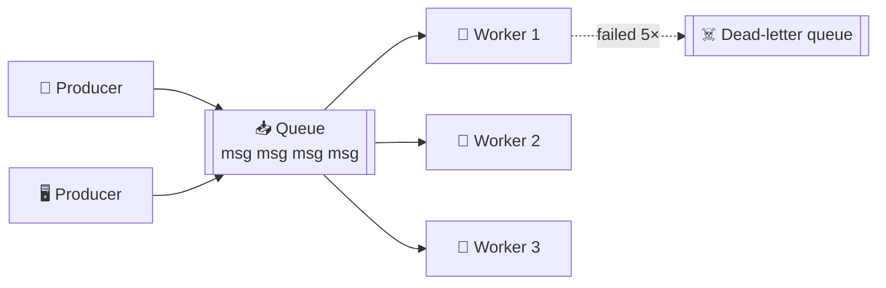

# 057 · Message Queues

> ⏱ 9 min · 📈 57% · 🅰️ Part A (core) · Phase 07: Async & Messaging
>
> `███████████░░░░░░░░░` 57% of the whole guide

---

## 🎯 One-sentence idea

**A message queue is a durable to-do list between services. Producers add tasks, workers take them one at a time, and each task is handled by exactly one worker (the competing consumers pattern). It smooths out spikes and lets work happen reliably in the background.**

## 🧸 Analogy

The **ticket rail in a restaurant kitchen**:

- Waiters (producers) **clip order tickets** on the rail as fast as customers order.
- Cooks (consumers) **take the next ticket**, cook it, and throw the ticket away when the dish is done (**ack**).
- At rush hour the rail **gets long**, but no order is lost. Add more cooks to clear it faster (**scale consumers**).
- If a cook drops a dish halfway through, the ticket goes **back on the rail** for someone else (**redelivery**).
- A ticket that keeps failing ("dish we can't make") goes to a **"problem orders" pile** (**dead-letter queue**).

## 🖼️ Visual



## 🔬 How it works

- **Produce → store durably → deliver to one consumer → consumer processes → ack → delete.**
- **Competing consumers:** many workers read the same queue, and each message goes to **one** of them. Scale by adding workers.
- **Acknowledgements & visibility timeout:**
  - A worker receives a message, and it becomes **invisible** to others for N seconds.
  - If the worker **acks** in time, it's deleted. If the worker crashes or times out, the message **reappears** → redelivery (**at-least-once**, lesson 060). So consumers must be **idempotent** (lesson 055).
- **Retries & dead-letter queue (DLQ):** after N failed attempts, move the message to a DLQ for inspection. This stops a "poison message" from blocking the queue forever.
- **Ordering:** most queues are **best-effort ordered**. Strict FIFO is possible (SQS FIFO, per-group ordering) at lower throughput.
- **Delayed messages / scheduling:** "process in 10 minutes" (retries with backoff, reminders).
- **Priority queues:** urgent jobs first (separate queues per priority is the usual approach).
- **Monitoring:** **queue depth** and **age of the oldest message** are the key signals. Autoscale workers on them (lesson 025).
- **Common tools:** **RabbitMQ** (AMQP, flexible routing), **AWS SQS** (managed, simple), **Redis lists/streams**, **Celery/Sidekiq** (task frameworks), **Kafka** (a log, not a classic queue, lesson 059).

## 🧩 Worked example

**Image-processing pipeline (SQS-style):**

```python
# Producer (API)
sqs.send_message(QueueUrl=Q, MessageBody=json.dumps({"image_id": 42, "sizes": [128, 512]}))

# Worker
while True:
    for m in sqs.receive_message(QueueUrl=Q, MaxNumberOfMessages=10,
                                 WaitTimeSeconds=20,            # long polling
                                 VisibilityTimeout=120)["Messages"]:
        job = json.loads(m["Body"])
        if already_done(job["image_id"]):                       # idempotency check
            sqs.delete_message(QueueUrl=Q, ReceiptHandle=m["ReceiptHandle"]); continue
        make_thumbnails(job)                                    # takes ~5 s
        sqs.delete_message(QueueUrl=Q, ReceiptHandle=m["ReceiptHandle"])   # ack
```

**Sizing workers with Little's Law:**

```
Arrivals: 200 jobs/s, each takes 2 s of worker time
Workers busy at once = 200 × 2 = 400 → run ~500 workers for headroom
Flash spike to 2,000 jobs/s for 1 minute → the queue grows by ~(2,000 − 250) × 60 ≈ 105k messages
→ drains in minutes after the spike, and nothing is lost ✅
```

## ⚖️ Trade-offs

| You gain | You pay | Use it when |
|---|---|---|
| Spike absorption (load levelling) | Added latency before processing | Bursty workloads |
| Reliable retries, DLQ | Duplicate deliveries → idempotency | Must-not-lose tasks |
| Independent scaling of workers | Another system to operate | Background jobs |
| FIFO ordering | Lower throughput | Order truly matters (per entity) |

## 🌍 Real world

- **SQS** is one of AWS's oldest services, used for decoupling everywhere.
- **RabbitMQ** powers task queues at many companies (often via Celery in Python).
- **GitHub, Shopify** run huge background job systems (Resque/Sidekiq-style on Redis).

## 📌 Cheat card

> - **Queue = ticket rail. Each message → one worker. Ack when done.**
> - **Visibility timeout + ack → at-least-once** → make consumers **idempotent**.
> - **DLQ** for poison messages after N retries.
> - Watch **queue depth + oldest message age**. Autoscale workers on them.
> - **Load levelling:** the queue absorbs spikes, and workers process at a steady rate.

## 🧪 Feynman check

Explain the kitchen ticket rail, including what happens when a cook drops a dish (redelivery) and when a ticket is impossible to cook (dead-letter queue).

⚠️ **Common confusion:** "A message queue guarantees each message is processed exactly once." Standard queues are **at-least-once**, since crashes after processing but before the ack cause redelivery. You get effectively-once only with idempotent consumers.

## ⚡ Quick recall

1. What is a visibility timeout?
<details><summary>Answer</summary>

The period a received message is hidden from other consumers. If it isn't acked in time, it becomes visible again for redelivery.
</details>

2. What's a dead-letter queue for?
<details><summary>Answer</summary>

To hold messages that repeatedly fail processing, so they don't block the main queue and can be inspected or replayed.
</details>

3. Which metric best signals that workers are falling behind?
<details><summary>Answer</summary>

Queue depth growing and/or the age of the oldest message rising.
</details>

## 🎤 Interview practice

**Q1. "Design a system to send 10 million push notifications for a marketing campaign without overloading anything."**
<details><summary>Model answer</summary>

- A campaign service **batches recipients** into messages (e.g., 1,000 user IDs each) and enqueues them (10k messages).
- Workers pull batches, fetch device tokens, and call APNs/FCM with **rate limits** that respect the provider quotas.
- **Idempotency:** track `(campaign_id, user_id)` as sent, so retries don't double-notify.
- Retries with backoff for transient errors, and a DLQ for persistent failures. Remove invalid tokens.
- Throttle overall throughput to avoid a thundering herd of app opens hitting the backend (stagger the sends).
- **Likely follow-up:** "How do you prioritize transactional notifications (password reset) over marketing?" → separate queues and worker pools (bulkheads, lesson 064).
</details>

**Q2. "Messages in our queue are processed out of order and it causes bugs. What do you do?"**
<details><summary>Model answer</summary>

- Ask whether **global** order is really needed. Usually **per-entity** order suffices (per order ID or per user).
- Use **FIFO with message groups** (SQS FIFO `MessageGroupId`) or **Kafka partitions keyed by entity ID** (lesson 059), so one entity's messages are processed in order.
- Or make handlers **order-insensitive**: include versions or timestamps, and ignore stale updates ("only apply if version > current").
- **Likely follow-up:** "What's the cost of strict ordering?" → less parallelism: one slow message blocks the rest of its group.
</details>

---

⬅️ [056 · Sync vs Async](056-sync-vs-async.md) · 🗺️ [Phase map](README.md) · ➡️ [058 · Pub/Sub & Fan-Out](058-pub-sub-and-fan-out.md)

✅ **Safe stopping point.** Tick lesson 057 in [PROGRESS.md](../../PROGRESS.md).
