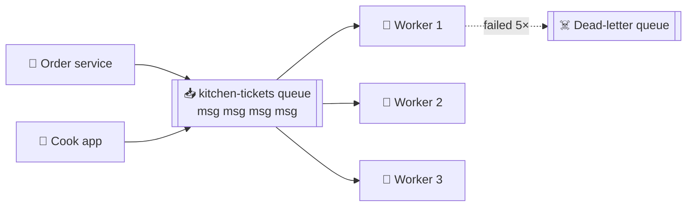

# 057 · Message Queues

> ⏱ 9 min · 📈 57% · 🅰️ Part A (core) · Phase 07: Async & Messaging
>
> `███████████░░░░░░░░░` 57% of the whole guide

---

## 📖 Story

Maya has moved the "later" work out of checkout. For a few hours, she keeps it in an **in-memory list** on the order service. It's quick, simple, and fragile as a soap bubble.

At 7:22 p.m. that server is redeployed. The list, holding **3,800 unsent kitchen tickets**, evaporates. Cooks never hear about the orders. Customers wait. And wait. And then call.

The next night the kitchen-ticket printer service crashes for twenty minutes. Thousands of tickets have nowhere to go. A sudden spike of 2,000 orders a second slams into workers that can handle 250.

She needs something between the services that **holds work safely**, **survives crashes**, and **lets workers catch up at their own pace**.

I told her what she needed, and I'll show you the same: a **durable to-do list between services**.

## 🎯 One-sentence idea

**A message queue is a durable to-do list between services: producers append tasks, workers take them, and each task is handled by exactly one worker (competing consumers), which smooths spikes and makes background work reliable.**

## 🧸 Analogy

The **ticket rail in a restaurant kitchen**:

- Waiters **clip tickets** on the rail as fast as orders arrive.
- Cooks **take the next ticket**, cook it, and bin the ticket when done (**ack**).
- At rush hour the rail **gets long**, but nothing is lost. Add cooks to clear it (**scale consumers**).
- A cook drops a dish halfway through? The ticket goes **back on the rail** (**redelivery**).
- A dish nobody can make goes to the **"problem orders" pile** (**dead-letter queue**).

## 🖼️ Visual

*Diagram brief:* producers clip messages onto a long rail. Three workers pull from the far end. One poisoned message falls through a trapdoor into a dead-letter bin after five failed attempts.



## 🔬 How it works

- **Lifecycle:** produce → **stored durably** (replicated to disk) → delivered to **one** consumer → processed → **ack** → deleted. Many workers read one queue (**competing consumers**), so you scale by adding workers.
- **Visibility timeout:** a received message is **hidden** for N seconds. No ack in time (crash, timeout) → it **reappears** → redelivery. That makes queues **at-least-once**, so consumers must be **idempotent** (lesson 055).
- **Retries + DLQ:** back off between attempts, and after N failures move the message to a **dead-letter queue**, so one poison message can't block the line forever. Alert on DLQ depth and replay after the fix.
- **Ordering and extras:** standard queues are best-effort ordered. **FIFO / message groups** give per-key order at lower throughput. You also get **delayed** messages (scheduled retries, reminders) and **priority** via separate queues.
- **Operate on two signals:** **queue depth** and **age of the oldest message**. Autoscale workers on them (lesson 025). Common tools: **SQS**, **RabbitMQ**, **Redis streams**, Celery/Sidekiq. Kafka is a *log*, not a classic queue (lesson 059).

## 🧩 Worked example

```python
# Producer (order service)
sqs.send_message(QueueUrl=Q, MessageBody=json.dumps({"order_id": 123, "cook_id": 7}))

# Worker
while True:
    for m in sqs.receive_message(QueueUrl=Q, MaxNumberOfMessages=10,
                                 WaitTimeSeconds=20,              # long polling
                                 VisibilityTimeout=60)["Messages"]:
        job = json.loads(m["Body"])
        if not ticket_already_printed(job["order_id"]):           # idempotency
            print_kitchen_ticket(job)
        sqs.delete_message(QueueUrl=Q, ReceiptHandle=m["ReceiptHandle"])   # ack
```

**Absorbing the 2,000/s spike with Little's Law:**

```
Normal: 200 tickets/s × 1 s each → ~200 busy workers; run 250
Spike:  2,000/s for 60 s → backlog grows ≈ (2,000 − 250) × 60 ≈ 105,000 messages
Autoscaler sees the oldest-message age climb → scales to 1,000 workers → backlog drains in ~2–3 min
Lost tickets: 0 ✅   Deploys and crashes: messages simply reappear and are retried ✅
```

## ⚖️ Trade-offs

| Maya's choice | What she gains | What she pays |
|---|---|---|
| A durable queue | No lost work across crashes and deploys | Another system to run |
| Load levelling | Spikes absorbed | Seconds to minutes of processing delay |
| At-least-once + retries | Reliability | Duplicates → idempotency required |
| FIFO ordering | Per-key order | Lower throughput, head-of-line blocking |

## 🌍 Real world

- **Amazon SQS** is one of AWS's oldest services and decouples systems everywhere.
- **RabbitMQ** powers countless task queues, often behind **Celery**.
- **GitHub and Shopify** run enormous background job systems on Redis-backed queues (Resque/Sidekiq lineage).

## 📌 Cheat card

> - **Queue = ticket rail. One message → one worker. Ack when done.**
> - **Visibility timeout + ack ⇒ at-least-once** → **idempotent consumers**.
> - **DLQ** after N retries.
> - Watch **depth + oldest-message age**. Autoscale on them.
> - **Load levelling:** the queue soaks up spikes, and workers run at a steady rate.

## 🧪 Feynman check

Explain the kitchen ticket rail, including what happens when a cook drops a dish (redelivery) and when a ticket is impossible to cook (DLQ).

⚠️ **Common confusion:** "A message queue processes each message exactly once." Standard queues are **at-least-once**: a worker can finish the work and crash just before it acks, and the message comes back. "Exactly once" only appears to happen when your **consumer is idempotent**.

## ⚡ Quick recall

1. What is a visibility timeout?
<details><summary>Reveal Answer</summary>

The window during which a received message is hidden from other consumers. If it isn't acked in time, it becomes visible again for redelivery.
</details>

2. What's a dead-letter queue for?
<details><summary>Reveal Answer</summary>

Holding messages that repeatedly fail, so they don't block the main queue and can be inspected or replayed later.
</details>

3. Which metric best signals that workers are falling behind?
<details><summary>Reveal Answer</summary>

A growing queue depth and, especially, a rising age of the oldest message.
</details>

## 🎤 Interview practice

**Q. "Send 10 million push notifications for a campaign without overloading anything, and without delaying password-reset messages."**
<details><summary>Model answer</summary>

- **Fan-in batching:** the campaign service splits recipients into messages of ~1,000 user IDs → **~10k messages** on a `marketing-push` queue.
- **Workers:**
  - Pull a batch, resolve device tokens, and call **APNs/FCM** under **per-provider rate limits** (token buckets).
  - Remove invalid tokens on feedback.
- **Idempotency:** a `(campaign_id, user_id)` sent-marker (unique), so redeliveries never double-notify.
- **Failures:** exponential backoff for transient errors (429/5xx from the provider), and a **DLQ** for persistent failures, with an alert.
- **Protect the backend:** **stagger** the sends over 30–60 minutes, so 10M app opens don't stampede the API, and pre-scale or CDN-cache the landing content.
- **Transactional vs marketing (bulkheads):** a **separate `transactional-push` queue and worker pool** with its own capacity and higher priority, so a 10M-message campaign can never sit in front of a password reset (lesson 064).
- **Ordering:** not needed here. Where per-entity order matters, use **FIFO message groups** or Kafka partitions keyed by entity, or make handlers **version-aware** ("apply only if version > current").
- **Likely follow-up:** "What's the cost of strict ordering?" → less parallelism: one slow message blocks everything behind it in its group.
</details>

## 📖 Teaser

> 📖 *The queue is solid, but now five different teams all want to hear about every new order, and a queue only hands each message to one of them.*

---

⬅️ [056 · Sync vs Async](056-sync-vs-async.md) · 🗺️ [Phase map](README.md) · ➡️ [058 · Pub/Sub & Fan-Out](058-pub-sub-and-fan-out.md)

✅ **Safe stopping point.** Tick lesson 057 in [PROGRESS.md](../../PROGRESS.md).
