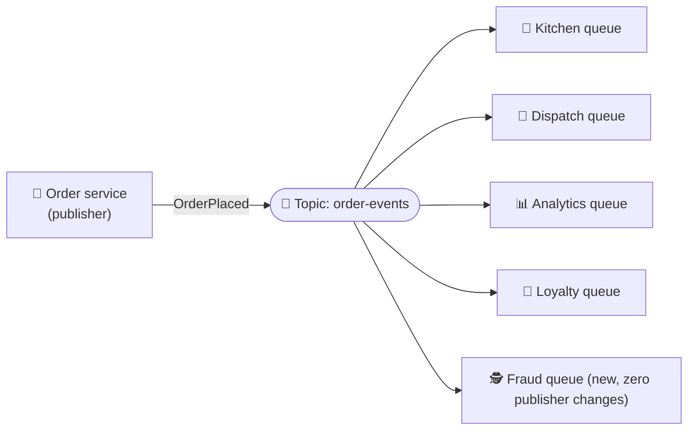

# 058 · Pub/Sub & Fan-Out

> ⏱ 8 min · 📈 58% · 🅰️ Part A (core) · Phase 07: Async & Messaging
>
> `███████████░░░░░░░░░` 58% of the whole guide

---

## 📖 Story

Every new Pantry order matters to **five** different teams: the **kitchen**, the **courier dispatch**, **analytics**, **loyalty**, and the brand-new **fraud** team.

Maya's order service has quietly turned into an exhausted **switchboard operator**. After every order it calls the kitchen. Then dispatch. Then analytics. Then loyalty. Then fraud. Five calls, five failure modes, five timeouts to tune. When the fraud team asks to be added, Maya has to **edit, test, and redeploy checkout**, the most critical code in the company, just so someone else can listen.

Then analytics goes down for an hour, and the switchboard keeps ringing its dead line, slowing every order.

The order service shouldn't have to know who cares. It should just **announce**, once.

I suggested a better way, and I'll share it with you: **announce once, and let anyone who cares listen in.**

## 🎯 One-sentence idea

**In publish/subscribe, a publisher sends an event to a topic and every subscriber gets its own copy, so one event fans out to many independent listeners and the publisher never needs to know who they are.**

## 🧸 Analogy

A **YouTube channel**: the creator **publishes** once, and every **subscriber** is notified and watches in their own time. New fans subscribe **without the creator changing anything**.

A **queue** is a **deli counter**: each ticket is served by **one** clerk, not all of them.

## 🖼️ Visual

*Diagram brief:* one publisher fires a single event into a broadcast tower (topic). Five separate antennas, each with its own buffer, receive a copy and process it at their own speed.



```
Queue:    1 message → exactly ONE consumer (work distribution)
Pub/sub:  1 message → EVERY subscriber gets a copy (broadcast)
Combined: topic → one queue per service → competing workers inside each service
```

## 🔬 How it works

- **Topic → subscriptions:** each subscription receives every message **independently**, with its own pace, backlog, retries, and DLQ. A slow analytics subscriber never slows the kitchen.
- **Fan-out to queues (the workhorse pattern):** topic → **one durable queue per subscribing service** → that service's workers compete on it (AWS **SNS → SQS**, GCP Pub/Sub subscriptions, Kafka consumer groups).
- **Push vs pull, plus filtering:** the broker pushes to an endpoint or subscribers pull. **Attribute filters** deliver subsets ("only orders > £100", "country = DE").
- **Durable vs ephemeral:** **durable** pub/sub (Kafka, SNS→SQS, Google Pub/Sub, Redis Streams) stores messages until each subscriber processes them. **Ephemeral** pub/sub (Redis Pub/Sub, MQTT QoS 0) **drops** messages for offline subscribers. That's fine for live UI signals, and fatal for business events.
- **Events are past-tense facts with contracts:** `OrderPlaced`, not `SendEmail`. Every event carries an **ID, type, schema version, and timestamp**, with schemas versioned in a registry and evolved backward-compatibly.

## 🧩 Worked example

```
SNS topic "order-events"
 ├─ SQS "kitchen-queue"   (filter: none)               → kitchen workers
 ├─ SQS "dispatch-queue"  (filter: delivery=true)      → dispatch workers
 ├─ SQS "analytics-queue" (filter: none)               → warehouse loader
 └─ SQS "fraud-queue"     (filter: total_cents>10000)  → fraud scorer   ← added in 10 minutes
```

```json
{
  "event_id": "evt_01J8Z…",
  "type": "OrderPlaced",
  "version": 2,
  "occurred_at": "2026-10-01T19:00:00Z",
  "data": { "order_id": "o_123", "user_id": "u_42", "cook_id": 7, "total_cents": 4599 }
}
```

**Before vs after:** checkout made **5 synchronous calls** (p99 ~1.4 s, any outage could block orders) → **1 publish** (p99 ~120 ms). The analytics outage now just grows *its* queue, which drains when it recovers.

**Ephemeral pub/sub, used correctly:** WebSocket gateways `SUBSCRIBE order:123:live` to push the courier's dot to the customer. A missed dot is harmless, because the next one arrives in 2 s.

## ⚖️ Trade-offs

| Maya's choice | What she gains | What she pays |
|---|---|---|
| Durable pub/sub | New consumers with zero publisher changes, isolated failures | Harder to see "who depends on this event?" |
| A queue per subscriber | Independent pace, retries, scaling | Storage per subscription |
| Ephemeral pub/sub | Very low latency, simple | Offline subscribers miss messages |
| Broker-side filtering | Subscribers get only what they need | Broker config complexity |

## 🌍 Real world

- **AWS SNS + SQS**, **Google Cloud Pub/Sub**, **Azure Service Bus topics**, and **Kafka consumer groups**.
- **Redis Pub/Sub** routes chat messages between WebSocket gateways (lesson 016).
- **MQTT** pub/sub connects millions of IoT devices.

## 📌 Cheat card

> - **Queue = one worker per message. Pub/sub = every subscriber gets a copy.**
> - **Topic → a queue per service → workers.**
> - **Durable** for business events. **Ephemeral** for loss-tolerant live updates.
> - Events = **past-tense facts** + **ID, type, version, timestamp**.
> - **New consumers need zero producer changes.**

## 🧪 Feynman check

Explain the YouTube channel vs the deli counter, and why Pantry could add a fraud checker without touching checkout.

⚠️ **Common confusion:** "Pub/sub guarantees subscribers get messages." Only **durable** pub/sub does. Plain Redis Pub/Sub is fire-and-forget: a subscriber that's restarting during a deploy simply **never sees** the messages sent in that window.

## ⚡ Quick recall

1. What's the difference between a queue and pub/sub, in one sentence?
<details><summary>Reveal Answer</summary>

A queue delivers each message to one consumer, while pub/sub delivers each message to every subscriber.
</details>

2. Why fan a topic out into one queue per service?
<details><summary>Reveal Answer</summary>

Each service gets its own durable backlog, retries, and pace, and scales its own workers independently.
</details>

3. Why name events in the past tense?
<details><summary>Reveal Answer</summary>

They're facts that already happened, not commands, so producers stay unaware of what consumers will do with them.
</details>

## 🎤 Interview practice

**Q. "When a cook uploads a recipe video, we must transcode it, generate thumbnails, run moderation, and notify followers only once it's approved. Design the flow, and say whether Redis Pub/Sub could carry these events."**
<details><summary>Model answer</summary>

- **Publish once:** upload complete → `VideoUploaded {video_id, cook_id, s3_key}` to a **durable** topic.
- **Independent subscriptions (a queue each):**
  - **Transcoder:** heavy, autoscaled on queue depth, emits `VideoTranscoded`.
  - **Thumbnailer:** emits `ThumbnailsReady`.
  - **Moderation:** emits `VideoApproved` or `VideoRejected`.
- **Coordinating "notify only when approved AND transcoded":**
  - A small **state machine / orchestrator** (Step Functions, Temporal) or an aggregator consumer.
  - It tracks per-video step status, and when both conditions hold, publishes `VideoReady` → the **notification service** fans out to followers (lesson 078).
  - The video row moves `processing → ready | blocked`.
- **Reliability:** every consumer is **idempotent** (keyed on `video_id` + step), with retries + backoff, a **DLQ** per subscription, and alerts on DLQ depth.
- **Redis Pub/Sub?** **No.** It's fire-and-forget: a subscriber that's down or slow **loses** events, and there's no replay.
  - Use Kafka, SNS+SQS, Google Pub/Sub, or **Redis Streams with consumer groups** (persistence, acks, replay by ID).
  - Keep Redis Pub/Sub for ephemeral signals: typing indicators, live courier dots, invalidation hints.
- **Likely follow-up:** "How do you know who consumes an event before changing its schema?" → a schema registry with compatibility checks plus a subscriber catalogue. Add fields freely, and never remove or rename them without a new version.
</details>

## 📖 Teaser

> 📖 *The broadcasts work beautifully, until analytics finds a bug that corrupted last week's revenue numbers and asks to replay seven days of orders that the queue already deleted.*

---

⬅️ [057 · Message Queues](057-message-queues.md) · 🗺️ [Phase map](README.md) · ➡️ [059 · Log-Based Streaming (Kafka)](059-log-based-streaming.md)

✅ **Safe stopping point.** Tick lesson 058 in [PROGRESS.md](../../PROGRESS.md).
