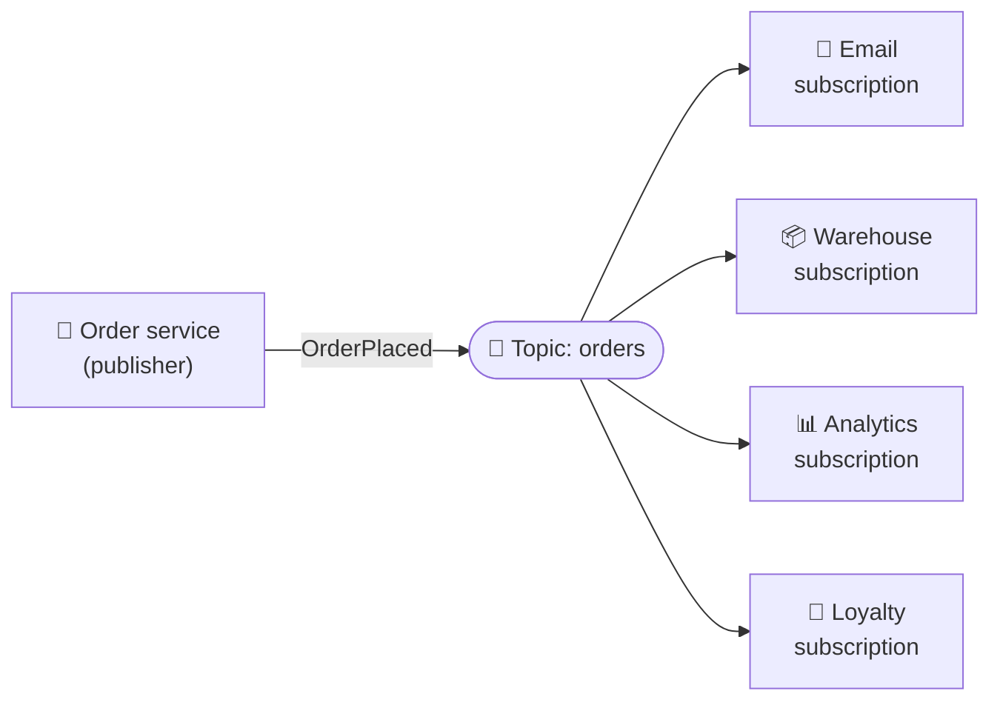

# 058 · Pub/Sub & Fan-Out

> ⏱ 8 min · 📈 58% · 🅰️ Part A (core) · Phase 07: Async & Messaging
>
> `███████████░░░░░░░░░` 58% of the whole guide

---

## 📖 Story

Every new order mattered to the kitchen, the courier team, analytics, loyalty, and the new fraud team. Maya's order service was turning into a switchboard operator, calling everyone one by one. I suggested a better way, and I'll share it with you: announce once, and let anyone who cares listen in.

## 🎯 One-sentence idea

**In publish/subscribe, a publisher sends an event to a topic, and every subscriber gets its own copy. One event fans out to many independent listeners, and the publisher doesn't know or care who they are.**

## 🧸 Analogy

A **YouTube channel**:

- The creator **publishes** a video (event) to their **channel** (topic).
- Every **subscriber** gets notified, and each watches in their own time.
- The creator doesn't message each fan personally, and doesn't even know who they all are.
- New fans can subscribe any time **without the creator changing anything**.

Compare with a **queue**, which is more like a **"take a number" deli counter**: each ticket is served by **one** clerk, not all of them.

## 🖼️ Visual



**Queue vs pub/sub:**

```
Queue:    1 message → exactly ONE of the consumers (work distribution)
Pub/sub:  1 message → EVERY subscriber gets a copy (broadcast)
Combined: topic → one queue per subscriber service → competing workers inside each service
```

## 🔬 How it works

- **Topic** = a named channel. **Publishers** send events to it. **Subscriptions** receive copies.
- **Each subscription is independent:** its own pace, its own retries, and its own backlog. A slow analytics consumer doesn't slow email.
- **Typical combination (fan-out to queues):** topic → a **queue per subscribing service** → that service's workers compete on its queue. (AWS **SNS → SQS**, GCP Pub/Sub subscriptions, Kafka consumer groups.)
- **Push vs pull subscriptions:** the broker pushes to an endpoint (webhook-style), or subscribers pull.
- **Filtering:** subscribers can filter by attributes ("only orders over $100", "only country=DE").
- **Durable vs ephemeral:**
  - **Durable** (Kafka, SNS→SQS, Google Pub/Sub): messages are stored until each subscriber processes them.
  - **Ephemeral** (Redis Pub/Sub, basic MQTT QoS 0): if a subscriber is offline, **it misses the message**. That's fine for live updates, and bad for business events.
- **Events should be facts in the past tense:** `OrderPlaced`, `UserSignedUp`, `PaymentFailed`. Not commands (`SendEmail`).
- **Schema contracts:** consumers depend on event formats, so version them (schema registry, backward-compatible changes).

## 🧩 Worked example

**AWS-style fan-out:**

```
SNS topic "order-events"
 ├─ SQS "email-queue"      (filter: none)          → email workers
 ├─ SQS "warehouse-queue"  (filter: type=physical) → warehouse workers
 └─ SQS "analytics-queue"  (filter: none)          → analytics loader
```

**An event payload:**

```json
{
  "event_id": "evt_01J8Z...",
  "type": "OrderPlaced",
  "version": 2,
  "occurred_at": "2026-10-01T12:00:00Z",
  "data": { "order_id": "o_123", "user_id": "u_42", "total_cents": 4599, "items": 3 }
}
```

**Adding a new feature without touching the order service:** the fraud team wants to score every order. They **subscribe** a new queue to `order-events`. **Zero changes** to the publisher. That's the power of decoupling.

**Redis Pub/Sub for live updates (ephemeral):**

```bash
SUBSCRIBE room:42           # chat gateway servers
PUBLISH room:42 "Ada: hi"   # any server delivers to all gateways holding room 42's users
```

## ⚖️ Trade-offs

| You gain | You pay | Use it when |
|---|---|---|
| Add consumers without changing producers | Harder to see "who depends on this event?" | Many independent reactions to one event |
| Independent pace and failure per subscriber | Storage per subscription | Business events |
| Ephemeral pub/sub (low latency) | Offline subscribers miss messages | Live UI updates, chat routing |
| Filtering at the broker | Broker config complexity | Subscribers need subsets |

## 🌍 Real world

- **AWS SNS + SQS**, **Google Cloud Pub/Sub**, **Azure Service Bus topics**, and **Kafka topics with consumer groups**.
- **Redis Pub/Sub** routes chat messages between WebSocket gateway servers (lesson 016).
- **IoT** uses **MQTT** pub/sub for millions of devices.

## 📌 Cheat card

> - **Queue = one worker per message. Pub/sub = every subscriber gets a copy.**
> - Pattern: **topic → a queue per service → workers.**
> - **Durable** for business events. **Ephemeral** (Redis Pub/Sub) for live, loss-tolerant updates.
> - Events = **past-tense facts** with an **ID, type, version, and timestamp**.
> - **New consumers need zero producer changes.**

## 🧪 Feynman check

Explain the YouTube-channel analogy vs the deli-counter analogy, and why a company can add a fraud checker without touching the order service.

⚠️ **Common confusion:** "Pub/sub guarantees subscribers get messages." Only **durable** pub/sub does. Plain Redis Pub/Sub drops messages for disconnected subscribers.

## ⚡ Quick recall

1. Queue vs pub/sub in one sentence?
<details><summary>Answer</summary>

A queue delivers each message to one consumer, while pub/sub delivers each message to every subscriber.
</details>

2. Why fan out a topic into one queue per service?
<details><summary>Answer</summary>

Each service gets its own durable backlog, retries, and pace, and can scale its own workers independently.
</details>

3. Why name events in the past tense?
<details><summary>Answer</summary>

They represent facts that already happened, not commands, so producers stay unaware of what consumers will do.
</details>

## 🎤 Interview practice

**Q1. "When a user uploads a video, we need to transcode it, generate thumbnails, run moderation, and notify followers. Design the flow."**
<details><summary>Model answer</summary>

- The upload completes → publish `VideoUploaded {video_id, owner, s3_key}` to a topic.
- Subscriptions (a queue each): **transcoder** (heavy, autoscaled workers), **thumbnailer**, **moderation**.
- Transcoding done → `VideoTranscoded` → the **notification** service fans out to followers (lesson 078) *only after* moderation passes (it could wait for both events, which is a small saga or state machine).
- Idempotent consumers, DLQs, and a status field on the video (`processing → ready/blocked`).
- **Likely follow-up:** "How do you know when all the steps are done?" → an orchestrator or state machine tracking the per-video step status (Step Functions, Temporal), or a consumer that aggregates the completion events.
</details>

**Q2. "Can you use Redis Pub/Sub for order events?"**
<details><summary>Model answer</summary>

- **No** for business-critical events: it's fire-and-forget, and subscribers that are down or slow **lose messages**, with no replay.
- Use a **durable** system (Kafka, SNS+SQS, Google Pub/Sub, Redis Streams with consumer groups).
- Redis Pub/Sub is fine for **ephemeral** signals (typing indicators, cache invalidation hints, chat routing between gateways, with durable storage elsewhere).
- **Likely follow-up:** "What does Redis Streams add?" → persistence, consumer groups, acks, and replay by ID.
</details>

> 📖 *Next, the analytics team wants to replay last week's orders after fixing a bug.*

---

⬅️ [057 · Message Queues](057-message-queues.md) · 🗺️ [Phase map](README.md) · ➡️ [059 · Log-Based Streaming (Kafka)](059-log-based-streaming.md)

✅ **Safe stopping point.** Tick lesson 058 in [PROGRESS.md](../../PROGRESS.md).
