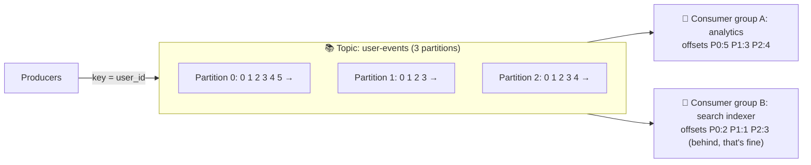

# 059 · Log-Based Streaming (Kafka)

> ⏱ 10 min · 📈 59% · 🅰️ Part A (core) · Phase 07: Async & Messaging
>
> `███████████░░░░░░░░░` 59% of the whole guide

---

## 📖 Story

The analytics team found a bug that had corrupted last week's revenue numbers. "Can we just replay last week's orders?" they asked. With an ordinary queue, those messages are gone forever. Then Maya discovered the tool I reach for most often in my own work: a log you can reread.

## 🎯 One-sentence idea

**Kafka-style systems store messages in an append-only, partitioned log that's kept for days, not deleted on read. Each consumer group tracks its own position (offset), so many consumers can read the same stream independently, in order per partition, and replay history whenever they want.**

## 🧸 Analogy

A **ship's logbook** (vs a to-do list):

- Entries are **only appended**, never erased, and numbered 0, 1, 2, 3…
- Many readers can read the same logbook. Each keeps a **bookmark** (offset) of where they're up to.
- A new reader can start **from page 1** (replay history) or from **today**.
- The logbook is so big it's split into **several volumes** (partitions). Entries about the same ship always go in the same volume, so they stay in order.

A classic queue is a **to-do list**: once a task is done, it's crossed off and gone.

## 🖼️ Visual



## 🔬 How it works

- **Topic → partitions.** Each partition is an **ordered, append-only log** on disk, replicated across brokers (a leader + followers per partition).
- **Producers** choose a partition via the **message key** (`hash(key) % partitions`), so all events for the same key (user, order) are **in order in one partition**.
- **Consumers** belong to **consumer groups**:
  - Within a group, **each partition is read by one consumer** → parallelism = number of partitions.
  - Different groups read the **same data independently** (pub/sub semantics).
- **Offsets:** each group commits "I've processed up to offset N" per partition. On restart, it resumes from there. **Replay** = reset the offset.
- **Retention:** messages are kept by time or size (e.g., 7 days) or **compacted** (keep only the latest value per key, which is great for changelogs/state).
- **Why it's so fast:** sequential disk writes, OS page cache, batching, compression, and zero-copy transfer → **millions of messages/s** per cluster.
- **Ordering guarantee:** **only within a partition**, with no global order across partitions.
- **Consumer lag** = latest offset − committed offset. It's the key health metric.
- **Ecosystem:** Kafka Connect (CDC sources and sinks), Kafka Streams/Flink (stream processing, lesson 091), Schema Registry.

## 🧩 Worked example

**Producer with a key (Python):**

```python
producer.send("order-events",
              key=str(order_id).encode(),            # same order → same partition → ordered
              value=json.dumps(event).encode())
```

**Consumer group:**

```python
consumer = KafkaConsumer("order-events", group_id="email-service",
                         enable_auto_commit=False)
for msg in consumer:
    handle(msg.value)          # must be idempotent (at-least-once)
    consumer.commit()          # commit the offset AFTER processing
```

**Partition sizing:**

```
Target: 300k msgs/s. One consumer handles ~10k msgs/s
→ need ≥ 30 consumers in the group → ≥ 30 partitions (choose 48–64 for growth)
Note: you can add partitions later, but key → partition mapping changes (it breaks per-key ordering during the transition)
```

**Replay to fix a bug:** the search indexer had a bug for 2 days. Deploy the fix → **reset its group's offsets to 2 days ago** → it re-reads and re-indexes. No other consumer is affected. ✨

## ⚖️ Trade-offs

| | Kafka-style log | Classic queue (RabbitMQ/SQS) |
|---|---|---|
| After consumption | Kept (retention) | Deleted |
| Replay | ✅ Yes | ❌ No (mostly) |
| Multiple independent readers | ✅ Consumer groups | Needs fan-out to multiple queues |
| Ordering | Per partition | Best-effort (or FIFO at low throughput) |
| Per-message routing/priority | Limited | ✅ Rich (RabbitMQ) |
| Parallelism | Capped by partition count | Add workers freely |
| Throughput | 🚀 Very high | High |

## 🌍 Real world

- **LinkedIn** created Kafka, and runs trillions of messages per day.
- **Uber, Netflix, Airbnb** use Kafka as the central nervous system for events, logs, metrics, and CDC.
- **Alternatives:** AWS Kinesis, Apache Pulsar, Redpanda, Azure Event Hubs, Google Pub/Sub.

## 📌 Cheat card

> - **Kafka = an append-only logbook + a bookmark (offset) per consumer group.**
> - **Key → partition → ordered per key.** No global order.
> - **Parallelism = partitions** (one consumer per partition per group).
> - **Retention + offsets = replay.** Compacted topics keep the latest value per key.
> - Watch **consumer lag**. Commit offsets **after** processing (at-least-once → idempotent consumers).

## 🧪 Feynman check

Explain the logbook-with-bookmarks analogy, and how a buggy consumer can "go back in time" to reprocess two days of events without bothering anyone else.

⚠️ **Common confusion:** "Adding more consumers always increases throughput." Not beyond the **number of partitions**. Extra consumers in a group sit idle.

## ⚡ Quick recall

1. How does Kafka keep all events for one user in order?
<details><summary>Answer</summary>

By using the user ID as the message key, so all of that user's events hash to the same partition, which is strictly ordered.
</details>

2. What's the max useful number of consumers in one group for a 12-partition topic?
<details><summary>Answer</summary>

12. More would be idle.
</details>

3. What is consumer lag?
<details><summary>Answer</summary>

How far behind a consumer group is: the latest offset minus the committed offset, per partition.
</details>

## 🎤 Interview practice

**Q1. "Why would you use Kafka instead of RabbitMQ/SQS?"**
<details><summary>Model answer</summary>

- **Many independent consumers** of the same events (analytics, search, notifications) without duplicating queues.
- **Replay** (reprocess after bugs, bootstrap new services from history).
- **Very high throughput** and **ordered per-key** processing.
- Event sourcing, CDC pipelines, and stream processing integration.
- Choose RabbitMQ/SQS for simple task queues, per-message routing and priorities, and delayed messages without the Kafka ops overhead.
- **Likely follow-up:** "What's hard about Kafka?" → partition planning, rebalancing pauses, ordering vs parallelism, operating the cluster (managed options help).
</details>

**Q2. "Consumer lag is growing steadily. What do you do?"**
<details><summary>Model answer</summary>

- Check whether it's **all partitions or one**. One hot partition means **key skew** (a hot key), which you fix with a better key or salting.
- All partitions: consumers are too slow → **scale consumers** (up to the partition count), **add partitions**, **batch processing**, optimize handlers, parallelize within a partition while preserving key order.
- Check downstream bottlenecks (a slow DB), and consumer rebalancing loops (session timeouts).
- **Likely follow-up:** "Can you parallelize within a partition?" → yes, with per-key worker pools inside the consumer, committing offsets only when all earlier messages are done.
</details>

> 📖 *Next, some customers get two confirmation emails, and one gets none at all.*

---

⬅️ [058 · Pub/Sub & Fan-Out](058-pub-sub-and-fan-out.md) · 🗺️ [Phase map](README.md) · ➡️ [060 · Delivery Semantics](060-delivery-semantics.md)

✅ **Safe stopping point.** Tick lesson 059 in [PROGRESS.md](../../PROGRESS.md).
