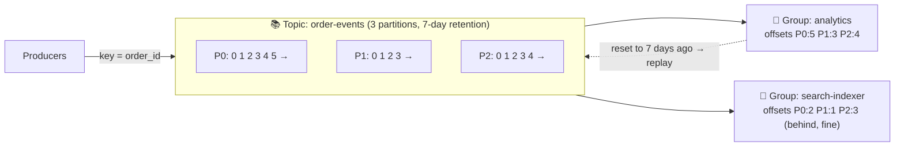

# 059 · Log-Based Streaming (Kafka)

> ⏱ 10 min · 📈 59% · 🅰️ Part A (core) · Phase 07: Async & Messaging
>
> `███████████░░░░░░░░░` 59% of the whole guide

---

## 📖 Story

Monday morning, the analytics dashboard says Pantry's revenue **dropped 31%** last week. The investors' email is already drafted.

It's a lie. A bug in the analytics consumer has been **double-counting refunds** for seven days. The fix is a two-line change.

But fixing the code doesn't fix the **numbers**. To recompute last week, analytics needs last week's order events, all **4.2 million** of them. And the queue did exactly what queues do: the moment each message was acknowledged, it was **deleted**. Gone, like chalk wiped off a blackboard.

Maya stares at the empty queue, imagining an alternative: a stream where messages **stay**, where any consumer can **rewind** to any point in time, and where new services can **replay history** from day one.

Then she discovered the tool I reach for most often in my own work: **a log you can reread.**

## 🎯 One-sentence idea

**Kafka-style systems keep messages in an append-only, partitioned log retained for days rather than deleted on read, and each consumer group tracks its own offset, so many consumers can read the same stream independently, in order per partition, and replay history whenever they need to.**

## 🧸 Analogy

A **ship's logbook**, not a to-do list:

- Entries are **only appended**, never erased, and numbered 0, 1, 2…
- Every reader keeps their own **bookmark** (offset).
- A new reader can start **from page 1** or from **today**.
- It's split into **volumes** (partitions). Every entry about the same ship goes into the same volume, so it stays in order.

## 🖼️ Visual

*Diagram brief:* three parallel conveyor-belt logs (partitions) with numbered slots. Two reader groups hold bookmarks at different positions on each belt. One group's bookmarks rewind with a curved arrow, labelled "replay".



## 🔬 How it works

- **Topic → partitions:** each partition is an **ordered, append-only log** on disk, replicated (a leader + followers, an **ISR** set). The producer's **key** picks the partition (`hash(key) % P`), so **all events for one order stay in order**. There is **no global order** across partitions.
- **Consumer groups:** within a group, **each partition is read by exactly one consumer** → **max parallelism = partition count**. Different groups read the **same data independently** (pub/sub for free).
- **Offsets = bookmarks:** a group commits "processed up to N" per partition and resumes there after a restart. **Replay** = reset the offsets. **Commit after processing** → at-least-once → idempotent consumers.
- **Retention:** keep data by time or size (e.g. 7 days), or use **log compaction** (keep only the latest value per key: perfect for changelogs, CDC, and state).
- **Why it's so fast:** sequential appends, OS page cache, batching, compression, and **zero-copy** sendfile → **millions of messages/s** per cluster. **Consumer lag** (latest − committed offset) is the key health signal.

## 🧩 Worked example

```python
producer.send("order-events",
              key=str(order_id).encode(),           # same order → same partition → ordered
              value=json.dumps(event).encode())

consumer = KafkaConsumer("order-events", group_id="analytics", enable_auto_commit=False)
for msg in consumer:
    upsert_revenue(msg.value)       # idempotent upsert keyed by event_id
    consumer.commit()               # commit AFTER processing
```

**Maya's replay:**

```bash
# deploy the fix, then rewind ONLY the analytics group by 7 days
kafka-consumer-groups --group analytics --topic order-events \
  --reset-offsets --to-datetime 2026-09-24T00:00:00.000 --execute
```

4.2M events re-processed in **~6 minutes** (at ~12k msg/s), the numbers corrected, and **no other consumer noticed**. ✨

**Partition sizing:**

```
Target 300k msg/s; one consumer ≈ 10k msg/s → ≥ 30 consumers → ≥ 30 partitions (choose 48–64)
Adding partitions later changes key → partition mapping (per-key order breaks across the transition)
```

## ⚖️ Trade-offs

| | Kafka-style log | Classic queue (SQS/RabbitMQ) |
|---|---|---|
| After consumption | Kept (retention) | Deleted |
| Replay | ✅ | ❌ (mostly) |
| Many independent readers | ✅ Consumer groups | Needs fan-out queues |
| Ordering | Per partition | Best-effort (or FIFO, slowly) |
| Per-message routing and priority | Limited | ✅ Rich |
| Parallelism | Capped by partitions | Add workers freely |

## 🌍 Real world

- **LinkedIn** created Kafka, and now processes **trillions** of messages a day.
- **Uber, Netflix, and Airbnb** use Kafka as the nervous system for events, logs, metrics, and CDC.
- **Alternatives:** AWS Kinesis, Apache Pulsar, Redpanda, Azure Event Hubs.

## 📌 Cheat card

> - **Kafka = an append-only logbook + a bookmark (offset) per consumer group.**
> - **Key → partition → ordered per key.** No global order.
> - **Parallelism = partitions.**
> - **Retention + offsets = replay.** **Compaction** keeps the latest per key.
> - Watch **consumer lag**. **Commit after processing.**

## 🧪 Feynman check

Explain the logbook with bookmarks, and how the buggy analytics consumer "went back in time" without bothering anyone else.

⚠️ **Common confusion:** "More consumers always means more throughput." Not beyond the **partition count**: in a 12-partition topic, the 13th consumer in a group sits **idle**.

## ⚡ Quick recall

1. How does Kafka keep all events for one order in sequence?
<details><summary>Reveal Answer</summary>

By using the order ID as the message key, so every event for it hashes to the same partition, which is strictly ordered.
</details>

2. What's the max useful number of consumers in one group for a 12-partition topic?
<details><summary>Reveal Answer</summary>

12. Any more sit idle.
</details>

3. What is consumer lag?
<details><summary>Reveal Answer</summary>

How far behind a group is: the latest offset minus the committed offset, per partition.
</details>

## 🎤 Interview practice

**Q. "Why choose Kafka over SQS/RabbitMQ? And consumer lag is growing steadily. What do you do?"**
<details><summary>Model answer</summary>

- **Choose Kafka when you need:**
  - Many **independent consumers** of the same events.
  - **Replay** (bug fixes, bootstrapping new services, reprocessing).
  - **Very high throughput** with **per-key ordering**.
  - CDC pipelines, event sourcing, and stream processing (Flink, Kafka Streams).
- **Choose SQS/RabbitMQ when you need:** simple task queues, per-message routing and priority, delayed messages, and minimal ops.
- **Kafka's costs:** partition planning, rebalance pauses, the ordering vs parallelism tension, and cluster operations (managed services help).
- **Growing lag, the diagnosis:**
  - **One partition lagging** → **key skew** (a hot key). Re-key, or salt the hot key.
  - **All partitions lagging** → consumers are too slow:
    - Scale consumers up to the partition count, and **add partitions** if needed.
    - **Batch** writes downstream and optimize the handler.
    - Check the **downstream bottleneck** (a slow DB).
    - Watch for **rebalance storms** (`max.poll.interval.ms` exceeded by slow batches).
  - **Parallelize within a partition** with per-key worker pools. Commit an offset only when **all** earlier messages in that partition are done.
- **Likely follow-up:** "Can you replay safely?" → only if consumers are **idempotent** (upserts keyed by event ID), otherwise replay duplicates side effects.
</details>

## 📖 Teaser

> 📖 *Replays work, but some customers now receive two confirmation emails, and one receives none at all, and Maya has to face what "delivered" really means.*

---

⬅️ [058 · Pub/Sub & Fan-Out](058-pub-sub-and-fan-out.md) · 🗺️ [Phase map](README.md) · ➡️ [060 · Delivery Semantics](060-delivery-semantics.md)

✅ **Safe stopping point.** Tick lesson 059 in [PROGRESS.md](../../PROGRESS.md).
