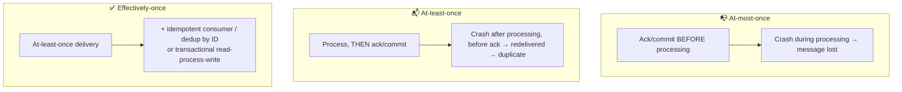

# 060 · Delivery Semantics: At-Most, At-Least, "Exactly" Once

> ⏱ 9 min · 📈 60% · 🅰️ Part A (core) · Phase 07: Async & Messaging
>
> `████████████░░░░░░░░` 60% of the whole guide

---

## 📖 Story

A worker crashes after sending an email but before marking it done, so the customer gets it twice. Another worker marks a message done *before* crashing, so that customer gets nothing. Maya learns the three promises a messaging system can make, and which one to trust.

## 🎯 One-sentence idea

**Messaging systems can promise at-most-once (may lose messages, never duplicates), at-least-once (never loses, may duplicate), or "exactly-once" (which in practice means at-least-once delivery plus idempotent or transactional processing, so the effect happens once).**

## 🧸 Analogy

Sending a **birthday card** by mail:

- 📭 **At-most-once:** you post it **once** and never check. It might get lost, and you'll never know. But the friend will never get two.
- 📬📬 **At-least-once:** you keep sending it **until your friend confirms**. If their "thanks!" text gets lost, you send **another**. They'll definitely get it, maybe twice.
- ✅ **Exactly-once (effectively):** you keep sending until confirmed, **and** your friend **ignores duplicates** because the cards are numbered ("I already have card #17").

## 🖼️ Visual



## 🔬 How it works

- **The key question: when do you acknowledge (or commit the offset)?**
  - **Before** processing → **at-most-once** (a crash loses the message).
  - **After** processing → **at-least-once** (a crash before the ack → redelivery → a duplicate).
- **Why true exactly-once *delivery* is impossible in general:** the sender can't distinguish "the message was lost" from "the ack was lost" (the Two Generals problem). So it must either risk loss or risk duplicates.
- **How systems get "exactly-once" effects:**
  - **Idempotent consumers:** dedupe by message ID, unique constraints, conditional updates (lesson 055).
  - **Transactional processing:** store the result **and** the consumed offset/message ID in the **same transaction** (e.g., in your DB).
  - **Kafka exactly-once semantics (EOS):** an idempotent producer + transactions that atomically write the output messages and commit the input offsets, *within Kafka*. External side effects (emails, payments) still need idempotency.
- **Producer side:** retries after a timeout can create duplicates too, so use an **idempotent producer** (sequence numbers), or include an event ID that consumers dedupe on.
- **Which to choose:**
  - **At-most-once:** metrics, logs, telemetry, real-time location pings (the next update replaces it).
  - **At-least-once + idempotency:** almost everything important (orders, payments, emails, inventory). **This is the default answer.**

## 🧩 Worked example

**At-least-once consumer with transactional dedup (Postgres):**

```python
def handle(msg):
    with db.transaction():
        inserted = db.execute(
            "INSERT INTO processed_messages(id) VALUES (%s) ON CONFLICT DO NOTHING",
            msg.id).rowcount
        if inserted == 0:
            return                      # duplicate → already applied, skip
        db.execute("UPDATE accounts SET balance = balance + %s WHERE id = %s",
                   msg.amount, msg.account_id)
    consumer.commit(msg)                # ack after the DB commit → at-least-once, effect once ✅
```

**The failure timeline this protects against:**

```
1. Consumer processes message #88 (balance +$50) and commits the DB transaction
2. 💥 crashes before acking the broker
3. Broker redelivers #88
4. INSERT processed_messages(88) → conflict → skip → balance stays correct ✅
```

**Kafka read-process-write with EOS (conceptual):**

```
begin transaction
  read from input topic
  write results to output topic
  send input offsets to the transaction
commit transaction   → outputs + offsets become visible atomically
```

## ⚖️ Trade-offs

| Semantics | Loss? | Duplicates? | Cost | Use for |
|---|---|---|---|---|
| At-most-once | ⚠️ Possible | ❌ Never | Cheapest | Metrics, telemetry, presence |
| At-least-once | ❌ Never | ⚠️ Possible | Retries | Default for business events |
| Effectively-once | ❌ | ❌ (effect) | Idempotency storage / transactions | Money, orders, inventory |

## 🌍 Real world

- **SQS standard, RabbitMQ, Kafka (default)** → at-least-once.
- **Kafka EOS** (since 0.11), used by Kafka Streams, Flink sinks, and others.
- **Stripe, payment networks** → idempotency keys make retries safe end to end.
- **UDP metrics (StatsD)** → at-most-once by design.

## 📌 Cheat card

> - **"Most may lose, least may duplicate, exactly is a myth (without idempotency)."**
> - **Ack before processing → at-most-once. Ack after → at-least-once.**
> - **Default: at-least-once + idempotent consumers = effectively-once.**
> - Dedupe with **message IDs + unique constraints**, in the **same transaction** as the effect.
> - External side effects (email, payment) need their **own idempotency keys**.

## 🧪 Feynman check

Explain the birthday-card analogy, and why "exactly-once delivery" is impossible while "exactly-once effect" is achievable.

⚠️ **Common confusion:** "Kafka has exactly-once, so my whole pipeline is exactly-once." Kafka EOS covers Kafka-to-Kafka processing. Writes to external databases, emails, and API calls need idempotency or transactional outbox/inbox patterns.

## ⚡ Quick recall

1. If a consumer commits its offset before processing and then crashes, what happens?
<details><summary>Answer</summary>

The message is lost (at-most-once).
</details>

2. Why can't a network guarantee exactly-once delivery?
<details><summary>Answer</summary>

The sender can't tell whether the message or the acknowledgement was lost, so it must either resend (risking duplicates) or not (risking loss).
</details>

3. What's the standard recipe for "exactly-once" business effects?
<details><summary>Answer</summary>

At-least-once delivery + idempotent processing (dedupe by message ID, ideally in the same transaction as the state change).
</details>

## 🎤 Interview practice

**Q1. "Design a system that credits user wallets from payment events delivered by Kafka. Credits must never be doubled or lost."**
<details><summary>Model answer</summary>

- **At-least-once** consumption (commit offsets after the DB commit).
- In one DB transaction: insert the `payment_event_id` into a **unique** `processed_events` table, **and** insert a ledger entry and update the balance. Duplicates hit the unique constraint and are skipped.
- **Ledger** entries are append-only, with unique references, and balances are derived or verified.
- Producer: idempotent (event IDs are stable across retries).
- Reconciliation job compares against the payment provider's records.
- **Likely follow-up:** "What if the DB is down?" → stop consuming (don't commit offsets), and the backlog waits in Kafka (retention covers the outage).
</details>

**Q2. "For a live location-tracking feature, which delivery semantics would you use?"**
<details><summary>Model answer</summary>

- **At-most-once** (or best-effort) for location pings: a newer update arrives within seconds, so retrying stale positions is pointless.
- Use UDP or MQTT QoS 0, or just overwrite the latest position in Redis (idempotent, and the latest one wins).
- But **trip start/end events** (billing) must be at-least-once + idempotent.
- **Likely follow-up:** "How do you handle out-of-order pings?" → include timestamps or sequence numbers, and ignore older ones.
</details>

> 📖 *Next time: New Year's Eve arrives, and orders pour in faster than the kitchens can handle.*

---

⬅️ [059 · Log-Based Streaming](059-log-based-streaming.md) · 🗺️ [Phase map](README.md) · ➡️ [✅ Checkpoint 60%](checkpoint-60.md)

✅ **Safe stopping point.** Tick lesson 060 in [PROGRESS.md](../../PROGRESS.md), then do the checkpoint!
