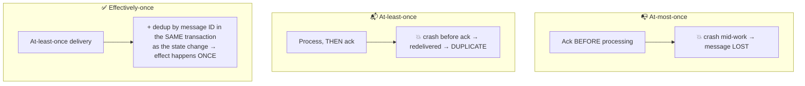

# 060 · Delivery Semantics: At-Most, At-Least, "Exactly" Once

> ⏱ 9 min · 📈 60% · 🅰️ Part A (core) · Phase 07: Async & Messaging
>
> `████████████░░░░░░░░` 60% of the whole guide

---

## 📖 Story

Two bug reports, one morning, and they look like mirror images.

**Report one:** a customer received the cook's payout confirmation **twice**. The worker had sent the email, and then, a hair's breadth before telling the broker *"done"*, it was OOM-killed. The broker, never hearing "done", handed the message to another worker, who sent it again.

**Report two:** a cook's **payout notification never arrived at all**. A different worker had been written to say *"done"* **first**, then do the work. It said "done", started sending, and crashed. The broker, satisfied, deleted the message. **Gone.**

One worker acknowledged too late, the other too early. One duplicated, the other vanished.

Maya realizes there's no third option hiding where messages arrive exactly once by magic.

I'll show you the three promises a messaging system can make, and the one I'd trust with your customers' money.

## 🎯 One-sentence idea

**Messaging systems can promise at-most-once (may lose, never duplicates), at-least-once (never loses, may duplicate), or "exactly-once", which in practice means at-least-once delivery plus idempotent or transactional processing so the *effect* happens once.**

## 🧸 Analogy

A **birthday card** in the post:

- 📭 **At-most-once:** post it **once** and never check. It might get lost, but never arrives twice.
- 📬📬 **At-least-once:** keep posting it **until your friend confirms**. If their "thanks!" text is lost, you post another, so they might get two.
- ✅ **Effectively-once:** keep posting until confirmed, and your friend **ignores duplicates** because the cards are numbered ("I already have card #17").

## 🖼️ Visual

*Diagram brief:* three lanes, each with a timeline showing exactly *where* the ack sits relative to the work and *where* the crash happens, with the outcome stamped at the end: LOST, DUPLICATE, or ONCE.



## 🔬 How it works

- **Everything hinges on *when* you ack** (or commit the offset). Ack **before** processing → **at-most-once**. Ack **after** → **at-least-once**.
- **Exactly-once *delivery* is impossible in general.** The sender can't tell "the message was lost" from "the ack was lost" (the **Two Generals problem**), so it must choose between risking loss and risking duplicates.
- **Exactly-once *effect* is achievable:** **idempotent consumers** (dedupe by message ID, unique constraints, conditional updates, lesson 055), or **transactional processing** that stores the result **and** the consumed message ID/offset **in one transaction**.
- **Kafka EOS** combines an idempotent producer (sequence numbers) with transactions that atomically write outputs and commit input offsets, **within Kafka**. External side effects (emails, payments, other DBs) still need their own idempotency.
- **Pick per data:** **at-most-once** for metrics, telemetry, and location pings (the next one replaces it). **At-least-once + idempotency** for everything that matters. **That's the default answer.**

## 🧩 Worked example

**Wallet credits, effectively-once (Postgres inbox):**

```python
def handle(msg):
    with db.transaction():
        inserted = db.execute(
            "INSERT INTO processed_messages(id) VALUES (%s) ON CONFLICT DO NOTHING",
            msg.id).rowcount
        if inserted == 0:
            return                           # duplicate → already applied
        db.execute("INSERT INTO ledger(account_id, amount, ref) VALUES (%s,%s,%s)",
                   msg.cook_id, msg.amount, msg.id)
    consumer.commit(msg)                     # ack AFTER the DB commit
```

```
1. Worker applies message #88 (+£50) and commits the DB transaction
2. 💥 crash before the broker ack
3. Broker redelivers #88
4. INSERT processed_messages(88) → conflict → skip → balance still correct ✅
```

**Kafka read-process-write (EOS):** `begin txn → consume → produce outputs → sendOffsetsToTransaction → commit`. Outputs and offsets become visible **atomically**.

## ⚖️ Trade-offs

| Semantics | Loss? | Duplicates? | Cost | Use for |
|---|---|---|---|---|
| At-most-once | ⚠️ Possible | ❌ Never | Cheapest | Metrics, telemetry, presence |
| At-least-once | ❌ Never | ⚠️ Possible | Retries | Default for business events |
| Effectively-once | ❌ | ❌ (in effect) | Dedup storage, transactions | Money, orders, inventory |

## 🌍 Real world

- **SQS standard, RabbitMQ, and Kafka (by default)** are at-least-once.
- **Kafka EOS** (since 0.11) underpins Kafka Streams and Flink's exactly-once sinks.
- **Stripe** makes payment retries safe end to end with idempotency keys.
- **StatsD over UDP** is at-most-once by design.

## 📌 Cheat card

> - **"Most may lose, least may duplicate, exactly is a myth (without idempotency)."**
> - **Ack before → at-most-once. Ack after → at-least-once.**
> - **Default: at-least-once + idempotent consumers = effectively-once.**
> - Dedupe in the **same transaction** as the effect.
> - External effects need their **own idempotency keys**.

## 🧪 Feynman check

Explain the numbered birthday cards, and why "exactly-once delivery" is impossible while "exactly-once *effect*" is perfectly achievable.

⚠️ **Common confusion:** "Kafka has exactly-once, so my whole pipeline is exactly-once." Kafka EOS covers **Kafka → Kafka** processing. The moment your consumer writes to Postgres, sends an email, or calls Stripe, you're outside its guarantee, and you need idempotency or the outbox/inbox patterns.

## ⚡ Quick recall

1. A consumer commits its offset before processing and then crashes. What happens?
<details><summary>Reveal Answer</summary>

The message is lost (at-most-once).
</details>

2. Why can't a network guarantee exactly-once delivery?
<details><summary>Reveal Answer</summary>

The sender can't tell whether the message or the acknowledgement was lost, so it must either resend (risking duplicates) or not (risking loss).
</details>

3. What's the standard recipe for exactly-once business effects?
<details><summary>Reveal Answer</summary>

At-least-once delivery + idempotent processing, deduplicating by message ID in the same transaction as the state change.
</details>

## 🎤 Interview practice

**Q. "Credit wallets from payment events delivered by Kafka so credits are never doubled or lost. Also: what semantics would you use for live courier location pings?"**
<details><summary>Model answer</summary>

- **Wallet credits:**
  - **At-least-once** consumption: commit offsets **after** the DB transaction commits.
  - **One DB transaction:** insert `payment_event_id` into a **unique** `processed_events` table, append a **ledger entry** (unique `ref`), and update or derive the balance. Duplicates hit the unique constraint and are skipped.
  - **Producer:** idempotent producer, with **stable event IDs** across retries.
  - **DB outage:** stop consuming (don't commit). The backlog waits safely in Kafka within retention.
  - **Safety net:** nightly **reconciliation** against the payment provider's settlement data.
- **Courier pings:**
  - **At-most-once / best-effort** (UDP, MQTT QoS 0, or WebSocket without acks). A newer ping arrives within seconds, so retrying a stale position is wasted work.
  - Store as **overwrite-latest** in Redis (idempotent: the newest timestamp wins), and **ignore out-of-order** pings by sequence number or timestamp.
  - **But** trip start/end events drive **billing**, so they're at-least-once + idempotent.
- **Likely follow-up:** "Where exactly do you put the dedup check, before or after the side effect?" → **in the same transaction** as the side effect when it's a DB write. For external calls, pass an idempotency key to the provider and record the outcome.
</details>

## 📖 Teaser

> 📖 *Messages are honest now, and then New Year's Eve arrives, orders pour in three times faster than kitchens can cook, and the queue starts growing without end.*

---

⬅️ [059 · Log-Based Streaming](059-log-based-streaming.md) · 🗺️ [Phase map](README.md) · ➡️ [✅ Checkpoint 60%](checkpoint-60.md)

✅ **Safe stopping point.** Tick lesson 060 in [PROGRESS.md](../../PROGRESS.md), then do the checkpoint!
