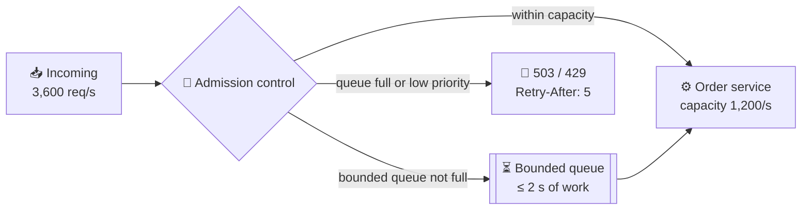

# 061 · Backpressure & Load Shedding

> ⏱ 9 min · 📈 61% · 🅰️ Part A (core) · Phase 07: Async & Messaging
>
> `████████████░░░░░░░░` 61% of the whole guide

---

## 📖 Story

New Year's Eve, 11:15 p.m. Orders arrive at **3,600 a second**. Pantry can process **1,200**.

The request queue doesn't complain. It just **grows**: 10,000… 100,000… **400,000** waiting requests. Memory climbs like floodwater in a sealed room. A new order now waits **five minutes** to be touched.

But every phone that sent those requests gave up after **10 seconds**. The customers have long since closed the app. So Pantry's servers are working flat out, sweating, at 100% CPU, **cooking orders for people who have already left the restaurant**.

Throughput: maxed. **Goodput** (orders that actually reach a waiting customer): **almost zero**.

At 11:31 p.m. the order service runs out of memory and dies. Its replacement inherits the flood and dies in four minutes.

It took me years to learn what Maya learned that night: **sometimes "not now" is the kindest answer.**

## 🎯 One-sentence idea

**When work arrives faster than a system can handle, it must either push back ("slow down": backpressure) or deliberately drop some work ("not now": load shedding), or queues grow without limit, latency explodes, and everything collapses.**

## 🧸 Analogy

A **popular nightclub**:

- 🚪 **Backpressure:** the bouncer says "**wait in line**" when the club is full.
- 🙅 **Load shedding:** when even the line is too long, "**not tonight, try later**."
- 🎫 **Priority:** VIPs (checkout, login) still get in, and casual walk-ins are turned away first.
- No bouncer → everyone squeezes in, nobody can move, and **the night is ruined for everyone** (congestion collapse).

## 🖼️ Visual

*Diagram brief:* a funnel with a gate. Traffic within capacity flows straight through. A small bounded waiting area holds a short line. Overflow and low-priority traffic bounce off a "503 + Retry-After" wall.



## 🔬 How it works

- **The physics:** if arrivals exceed capacity long enough, an **unbounded queue** grows forever. Memory runs out, and wait time passes every client timeout, so **all the work becomes waste**. Measure **goodput** (useful completions), not throughput.
- **Backpressure** pushes "slow down" **upstream**: **bounded buffers** (block or reject when full), **flow control** (TCP windows, HTTP/2 and gRPC flow control, reactive `request(n)`), and **pull-based consumers** (Kafka) that naturally take only what they can handle.
- **Load shedding** drops work **early and cheaply**: reject with **503/429 + `Retry-After`** on CPU, concurrency, or **queue-time** thresholds. **Shed by priority** (analytics, prefetch, and bots first, checkout last), and **drop requests past their deadline** (**deadline propagation**). Some systems serve **LIFO under overload**, because the oldest requests have already timed out.
- **Concurrency limits:** cap in-flight requests per service, statically or **adaptively** (TCP-congestion-style algorithms like Netflix's concurrency-limits), so the system stays at the knee of the latency curve.
- **Degrade gracefully, and make clients cooperate:** serve cached or partial results, switch off expensive features, and require clients to honour `Retry-After` and back off **with jitter** (lesson 063) instead of retry-storming.

## 🧩 Worked example

**The unbounded disaster:**

```
Capacity 1,200/s, arrivals 3,600/s → backlog grows 2,400/s
After 3 min: 432,000 queued → wait ≈ 432,000 ÷ 1,200 = 360 s
Client timeout = 10 s → ~100% of completed work is for clients who already left. Goodput ≈ 0.
```

**Bounded + shed:**

```
Queue cap = 2,400 (≈ 2 s of work). Excess → immediate 503 + Retry-After with jitter.
→ ~1,200 orders/s succeed in ≤ 2 s; the rest get a fast, honest "try again in a few seconds."
→ Goodput ≈ 1,200/s ✅, memory flat, no crash.
```

```python
def admit(req):
    load = inflight / MAX_INFLIGHT
    if req.remaining_deadline_ms < EST_COST_MS: return reject(504)     # can't finish in time
    if load < 0.80:                              return True
    if load < 0.95 and req.priority >= 1:        return True            # important traffic
    if req.priority == 2:                        return True            # checkout/login always try
    return reject(503, retry_after=jittered(5))
```

## ⚖️ Trade-offs

| Maya's choice | What she gains | What she pays |
|---|---|---|
| Bounded queues | Flat memory, bounded latency | Producers block or see errors |
| Load shedding | High goodput under overload | Some users get "try later" |
| Priority shedding | Critical flows survive | Traffic must be classified |
| Adaptive concurrency limits | Self-tuning protection | Complexity, signal quality |
| Graceful degradation | Users still get *something* | Reduced features |

## 🌍 Real world

- The **Google SRE book** chapters "Handling Overload" and "Addressing Cascading Failures" describe criticality-based shedding.
- **Netflix** uses adaptive concurrency limits and prioritized shedding to keep **playback** working while dropping less important traffic.
- **Amazon** sheds on queue time and caps retries with token buckets.

## 📌 Cheat card

> - **Arrivals > capacity ⇒ something must give. Choose what.**
> - **Backpressure = "slow down". Shedding = "not now" (503/429 + Retry-After).**
> - **Never** put unbounded queues on the request path.
> - **Shed low priority first. Drop work past its deadline.**
> - Track **goodput**, not throughput.

## 🧪 Feynman check

Explain the nightclub bouncer, and why letting *everyone* in ruins the night for *everyone*.

⚠️ **Common confusion:** "Rejecting requests is failure, so queue everything." Queueing beyond what can be served in time just converts fast errors into **slow timeouts plus wasted work**. A quick, honest "try later" is kinder to customers and to the system.

## ⚡ Quick recall

1. What's the difference between backpressure and load shedding?
<details><summary>Reveal Answer</summary>

Backpressure signals upstream to slow down or wait (bounded buffers, flow control). Load shedding deliberately rejects excess work.
</details>

2. Why are unbounded queues dangerous?
<details><summary>Reveal Answer</summary>

Under sustained overload they grow without limit, exhaust memory, and push waits past client timeouts, so all the work is wasted.
</details>

3. What is deadline propagation?
<details><summary>Reveal Answer</summary>

Passing the remaining time budget along the call chain, so downstream services skip work that can't finish in time.
</details>

## 🎤 Interview practice

**Q. "During a flash sale, checkout becomes unresponsive for everyone, and threads pile up waiting on a slow payment dependency. Design for both."**
<details><summary>Model answer</summary>

- **At the edge:**
  - A **virtual waiting room**: users get a place in line and are admitted at the rate the backend can absorb.
  - **Per-user rate limits**, with bots blocked at the WAF.
- **Priority:**
  - **Checkout and payment** are critical. Browsing comes next. Recommendations and analytics come last.
  - Shed from the bottom up, and serve product pages from the **CDN/cache**.
- **Admission control per service:**
  - **Bounded concurrency** and **bounded queues** (a couple of seconds of work at most).
  - Fast **503 + `Retry-After`**, and clients back off **with jitter**.
- **Deadlines:** propagate the client's remaining budget, so services **refuse work they can't finish in time**.
- **The slow dependency (thread exhaustion):**
  - Without protection, every thread blocks on payments and the service stops serving *everything*: a **cascading failure**.
  - Fix it with **tight timeouts**, a **circuit breaker** (fail fast while payments are sick), and **bulkheads** (a separate, small pool for payment calls, lesson 064).
  - Return a clear **"payment temporarily unavailable, your cart is saved"**.
- **Before the sale:** pre-scale, and put inventory decrements on an atomic fast path (lesson 098).
- **Likely follow-up:** "What does the breaker return when open?" → a cached or default response, or a fast error, depending on criticality. Never a 30-second hang.
</details>

## 📖 Teaser

> 📖 *The bouncer holds the line, but one night an order is saved to the database, the server crashes a heartbeat later, and the "OrderPlaced" announcement never reaches the kitchen.*

---

⬅️ [✅ Checkpoint 60%](checkpoint-60.md) · 🗺️ [Phase map](README.md) · ➡️ [062 · Event-Driven Architecture & Outbox](062-event-driven-and-outbox.md)

✅ **Safe stopping point.** Tick lesson 061 in [PROGRESS.md](../../PROGRESS.md).
