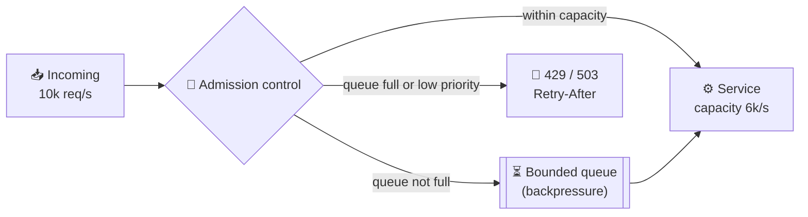

# 061 · Backpressure & Load Shedding

> ⏱ 9 min · 📈 61% · 🅰️ Part A (core) · Phase 07: Async & Messaging
>
> `████████████░░░░░░░░` 61% of the whole guide

---

## 📖 Story

New Year's Eve. Orders arrive three times faster than Pantry can process them. The queue grows, memory fills, response times hit two minutes, and customers who gave up long ago still clog the line. Maya learns that sometimes "not now" is the kindest answer.

## 🎯 One-sentence idea

**When work arrives faster than a system can handle it, it must either push back ("slow down": backpressure) or deliberately drop some work ("not now": load shedding). Otherwise queues grow without limit, latency explodes, and everything falls over.**

## 🧸 Analogy

A **popular nightclub**:

- 🚪 **Backpressure:** the bouncer says "**wait in line**" when the club is full. The line outside grows, but the inside stays comfortable.
- 🙅 **Load shedding:** when even the line is too long, the bouncer tells newcomers "**not tonight, try later**." Some people are disappointed, but the club doesn't become a dangerous crush.
- 🎫 **Priority:** VIPs (paying customers, critical requests) still get in. Casual walk-ins are turned away first.

Without a bouncer, everyone squeezes in, nobody can move, and **the whole night is ruined for everyone** (congestion collapse).

## 🖼️ Visual



## 🔬 How it works

- **The core problem:** if arrival rate > processing rate for long enough, **unbounded queues** grow forever → memory exhaustion, and latency so high every request times out anyway (the client has already given up, so the work is wasted).
- **Backpressure (push back upstream):**
  - **Bounded queues/buffers:** when full, producers block or get rejected.
  - **Flow control:** TCP windows, gRPC/HTTP/2 flow control, reactive streams (`request(n)`), Kafka consumers pulling at their own pace (a pull model is natural backpressure).
  - Propagates "slow down" **to the source**, so upstream services reduce their rate.
- **Load shedding (drop work deliberately):**
  - Reject early with **503/429 + Retry-After** when overloaded (CPU, concurrency, or queue-time thresholds).
  - **Prioritize:** shed low-value work first (analytics, prefetch, bots) and keep critical work (checkout, login).
  - **Drop stale work:** if a request has waited longer than its deadline, don't process it (**deadline propagation**).
  - **LIFO under overload** (serve the newest requests first, since the oldest have probably timed out already) is used by some systems.
- **Concurrency limits:** cap in-flight requests per service (static or **adaptive**, like TCP congestion control: Netflix's concurrency-limits library).
- **Graceful degradation:** serve cached or partial results, disable expensive features ("recommendations unavailable"), and lower quality (smaller images).
- **Clients must cooperate:** respect `Retry-After`, back off with **jitter** (lesson 063), and don't retry-storm.

## 🧩 Worked example

**Unbounded queue disaster:**

```
Capacity: 1,000 req/s. Arrivals: 1,200 req/s for 10 minutes
Backlog grows 200/s → after 10 min = 120,000 queued
Wait time for a new request = 120,000 / 1,000 = 120 s → every client (timeout 5 s) has given up
→ 100% of the work done is wasted, while the system looks "busy". Goodput → 0.
```

**Bounded queue + shedding:**

```
Queue max = 2,000 (≈ 2 s of work)
Arrivals above capacity → queue fills → then 503 for the excess 200 req/s
Result: ~1,000 req/s succeed with ≤ 2 s latency, and ~17% get a fast 503 → goodput stays ~1,000/s ✅
```

**Priority shedding in middleware (sketch):**

```python
def admit(req):
    load = inflight / MAX_INFLIGHT
    if load < 0.8:                       return True
    if load < 0.95 and req.priority >= 1: return True   # keep important traffic
    if req.priority == 2:                return True    # critical (checkout/login) always tries
    return False                                        # shed: 503 + Retry-After
```

**Deadline propagation:**

```
Client deadline 2 s → gateway passes "deadline = now + 1.9 s" → service A → B
B sees only 50 ms left, but needs 200 ms → fail fast instead of doing wasted work
```

## ⚖️ Trade-offs

| Technique | Gain | Cost |
|---|---|---|
| Bounded queues | Protects memory and latency | Producers block or get errors |
| Load shedding | Keeps goodput high under overload | Some users get errors |
| Priority shedding | Protects critical flows | Must classify traffic |
| Adaptive concurrency limits | Self-tuning | More complex, needs good signals |
| Graceful degradation | Users get *something* | Reduced features |

## 🌍 Real world

- **Google SRE** book: "handling overload" and "addressing cascading failures" chapters. Load shedding and criticality levels are standard at Google.
- **Netflix** uses adaptive concurrency limits and prioritized shedding (keeping playback working while shedding less important traffic).
- **Amazon** uses admission control and shedding based on queue time, with retries capped by tokens.

## 📌 Cheat card

> - **Arrivals > capacity → something must give. Choose what.**
> - **Backpressure = "wait / slow down". Shedding = "not now" (503/429 + Retry-After).**
> - **Never use unbounded queues** on the request path.
> - **Shed low-priority first. Drop requests past their deadline.**
> - Measure **goodput** (useful completed work), not just throughput.

## 🧪 Feynman check

Explain the nightclub-bouncer analogy, and why letting *everyone* in makes the night worse for *everyone*.

⚠️ **Common confusion:** "Rejecting requests is a failure, so we should queue everything." Queueing beyond what can be served in time just converts errors into **timeouts plus wasted work**. A fast, honest "try later" is kinder to users and to the system.

## ⚡ Quick recall

1. What's the difference between backpressure and load shedding?
<details><summary>Answer</summary>

Backpressure signals upstream to slow down or wait (bounded buffers, flow control). Load shedding deliberately rejects excess work.
</details>

2. Why are unbounded queues dangerous?
<details><summary>Answer</summary>

They grow without limit under sustained overload, exhausting memory and pushing wait times past client timeouts, so all the work gets wasted.
</details>

3. What is deadline propagation?
<details><summary>Answer</summary>

Passing the remaining time budget along the call chain, so downstream services can skip work that can't finish in time.
</details>

## 🎤 Interview practice

**Q1. "During a flash sale, the checkout service becomes unresponsive for everyone. How do you design for this?"**
<details><summary>Model answer</summary>

- **Admission control** at the gateway: a virtual waiting room or queue for the sale (users get a place in line), plus rate limits per user.
- **Prioritize** checkout and payment over browsing and recommendations, and shed non-critical traffic first.
- **Bounded concurrency** per service, fast 503s with `Retry-After`, and clients back off with jitter.
- **Degrade:** serve product pages from the CDN/cache, and turn off expensive features.
- **Pre-scale** capacity, and put inventory decrements behind an atomic, fast path (lesson 098).
- **Likely follow-up:** "What's a virtual waiting room?" → users are queued at the edge and admitted at the rate the backend can handle (like Ticketmaster or Queue-it).
</details>

**Q2. "A downstream service is slow, and our service's threads all block waiting on it. What happens, and how do you prevent it?"**
<details><summary>Model answer</summary>

- **Thread and connection pool exhaustion**, so our service stops serving *everything*, including requests that don't need that dependency (a cascading failure).
- Prevent it with **timeouts**, **circuit breakers** (fail fast when the dependency is unhealthy), **bulkheads** (separate pools per dependency), **concurrency limits**, and **load shedding** (lessons 063–064).
- Propagate deadlines so no one waits longer than the user will.
- **Likely follow-up:** "What do you return when the breaker is open?" → a cached or default response, or a fast error, depending on criticality.
</details>

> 📖 *Next time: An order was saved, but its announcement never reached the kitchen.*

---

⬅️ [✅ Checkpoint 60%](checkpoint-60.md) · 🗺️ [Phase map](README.md) · ➡️ [062 · Event-Driven Architecture & Outbox](062-event-driven-and-outbox.md)

✅ **Safe stopping point.** Tick lesson 061 in [PROGRESS.md](../../PROGRESS.md).
