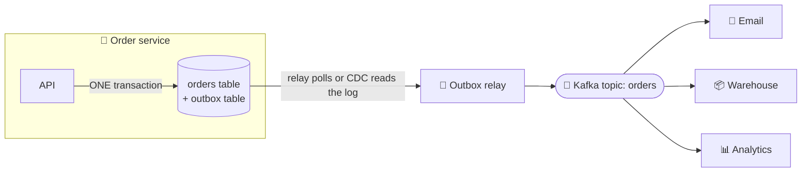

# 062 · Event-Driven Architecture & the Transactional Outbox

> ⏱ 10 min · 📈 62% · 🅰️ Part A (core) · Phase 07: Async & Messaging
>
> `████████████░░░░░░░░` 62% of the whole guide

---

## 📖 Story

An order was saved to the database, and then the server crashed before it could announce "OrderPlaced." The kitchen never heard about it, and a customer waited two hours for food that was never cooked. I've debugged this bug at 2 am. Maya needed the save and the announcement to be inseparable.

## 🎯 One-sentence idea

**In an event-driven architecture, services announce facts ("OrderPlaced") and other services react on their own. The transactional outbox pattern makes sure a service's database change and its event are never out of sync, by saving the event in the same database transaction and publishing it afterwards.**

## 🧸 Analogy

A **school announcement board**:

- The office doesn't phone every teacher individually. It **pins a notice** ("School closes early Friday"). Each teacher, the bus company, and the cafeteria **react in their own way**. That's event-driven.

The **outbox** problem: the secretary updates the **official calendar** and then walks to pin the notice. What if they **trip on the way** (a crash)? The calendar says "closing early," but nobody was told. 😬

The fix: the secretary writes the notice into an **"outbox tray" on the same desk, at the same moment** as updating the calendar (one transaction). A **runner** checks the tray regularly and pins every notice to the board. Even after a trip, the notice is waiting in the tray.

## 🖼️ Visual



## 🔬 How it works

- **Event-driven architecture (EDA):**
  - Services publish **domain events** (facts), and others **subscribe** and react. Producers don't call consumers directly.
  - ✅ Loose coupling, easy extension (new subscribers), natural audit trail, and async resilience.
  - ❌ Eventual consistency, harder end-to-end visibility ("what happens after OrderPlaced?"), and event schema governance.
  - **Choreography** (everyone reacts to events, with no central brain) vs **orchestration** (a coordinator tells services what to do, like a saga orchestrator, lesson 088).
- **The dual-write problem:** a service must (1) update its DB **and** (2) publish an event. These are two different systems, and there's no shared transaction:
  - DB commit ✅ → crash → event ❌ → others never learn about it.
  - Publish ✅ → DB commit fails ❌ → others act on something that didn't happen.
- **Transactional outbox:**
  1. In the **same DB transaction** as the business change, insert the event into an `outbox` table.
  2. A **relay** publishes outbox rows to the broker, and marks them sent (or deletes them).
     - **Polling publisher:** `SELECT ... FROM outbox WHERE sent = false ORDER BY id LIMIT 100`.
     - **CDC (log tailing):** Debezium reads the DB's WAL/binlog and streams the outbox inserts to Kafka (lower latency, and less load on the DB).
  3. Delivery is **at-least-once**, so consumers must be **idempotent** (use the event ID).
- **Inbox pattern (the consumer side):** record processed event IDs in the consumer's DB transaction, for dedup (lesson 060).
- **Event design:** past tense, immutable, with a unique ID, type, version, timestamp, and entity ID (the partition key). Decide between **thin events** (IDs only, and consumers fetch the details) and **fat events** (carry the state, so consumers don't need to call back).

## 🧩 Worked example

**Outbox in SQL:**

```sql
BEGIN;
  INSERT INTO orders (id, user_id, total, status) VALUES ('o_123', 'u_42', 4599, 'PLACED');
  INSERT INTO outbox (id, aggregate_id, type, payload, created_at)
  VALUES ('evt_9f1', 'o_123', 'OrderPlaced',
          '{"order_id":"o_123","user_id":"u_42","total_cents":4599}', now());
COMMIT;   -- both or neither ✅
```

**Polling relay:**

```python
while True:
    rows = db.query("SELECT * FROM outbox WHERE published_at IS NULL ORDER BY created_at LIMIT 500 FOR UPDATE SKIP LOCKED")
    for r in rows:
        kafka.send("orders", key=r.aggregate_id, value=r.payload, headers={"event_id": r.id})
    kafka.flush()
    db.execute("UPDATE outbox SET published_at = now() WHERE id = ANY(%s)", [r.id for r in rows])
    sleep(0.1)
```

A crash between `send` and `UPDATE` → re-sent later → a **duplicate** → consumers dedupe by `event_id`. ✅

**Choreography example (order flow):**

```
OrderPlaced      → Payment service charges → PaymentSucceeded
PaymentSucceeded → Inventory reserves     → StockReserved
StockReserved    → Shipping creates label → OrderShipped
PaymentFailed    → Order service cancels  → OrderCancelled
```

## ⚖️ Trade-offs

| Choice | Gain | Cost |
|---|---|---|
| Event-driven (choreography) | Decoupled, extensible | Hard to see the whole flow, cyclic dependencies risk |
| Orchestration | Clear flow, central error handling | The orchestrator couples services |
| Outbox (polling) | Simple, works with any DB | Polling load, a bit of latency |
| Outbox (CDC) | Low latency, no polling | Debezium/Kafka Connect infrastructure |
| Fat events | Consumers self-sufficient | Bigger messages, schema coupling |
| Thin events | Small, flexible | Consumers call back (load, and a possible race with later changes) |

## 🌍 Real world

- **Debezium's outbox event router** is a standard way to implement CDC-based outbox with Kafka.
- **Uber, Netflix, Zalando** publish domain events for inter-service communication.
- **Microservices patterns** (Chris Richardson) popularized outbox, inbox, and sagas.

## 📌 Cheat card

> - **Events = past-tense facts. Services react independently.**
> - **Dual-write problem:** DB + broker can't commit together → **outbox**.
> - **Outbox:** write the event row in the **same transaction**, then a relay (**polling or CDC**) publishes it.
> - **At-least-once** → consumers **dedupe by event_id** (inbox).
> - **Choreography** (react to events) vs **orchestration** (a coordinator gives commands).

## 🧪 Feynman check

Explain the secretary who might trip between updating the calendar and pinning the notice, and how the outbox tray fixes it.

⚠️ **Common confusion:** "Just publish the event right after the DB commit, since crashes are rare." At scale, rare events happen daily, and a lost `PaymentSucceeded` means a paid order that never ships. The outbox makes it **guaranteed**.

## ⚡ Quick recall

1. What is the dual-write problem?
<details><summary>Answer</summary>

Updating a database and publishing a message are two separate operations without a shared transaction, so a crash between them leaves them inconsistent.
</details>

2. How does the outbox pattern solve it?
<details><summary>Answer</summary>

The event is written to an outbox table in the same DB transaction as the business change, and a separate relay reliably publishes it afterwards.
</details>

3. Choreography vs orchestration?
<details><summary>Answer</summary>

Choreography: services react to each other's events with no central controller. Orchestration: a coordinator explicitly directs each step.
</details>

## 🎤 Interview practice

**Q1. "How do you make sure the search index and the email service learn about every new product, even if the product service crashes?"**
<details><summary>Model answer</summary>

- The product service writes the product row **and** a `ProductCreated` outbox row in one transaction.
- **Debezium** tails the WAL and publishes the outbox events to Kafka (or a polling relay does).
- The search indexer and the email service consume with idempotent handlers (dedupe by event_id, upsert by product_id).
- If anything crashes, events stay in the outbox or Kafka and are delivered when it recovers.
- **Likely follow-up:** "What about ordering?" → key by product_id, so a product's events stay ordered in one partition.
</details>

**Q2. "When would you choose orchestration over choreography?"**
<details><summary>Model answer</summary>

- **Orchestration** when a business process has many steps, complex branching, timeouts, and compensations (order fulfilment, loan approval): a central orchestrator (Temporal, Step Functions, a saga orchestrator) makes the flow explicit and debuggable.
- **Choreography** for simple, loosely related reactions (send an email on signup, update analytics), where adding subscribers without coordination is the point.
- Many systems use both: orchestration inside a bounded context, and events between contexts.
- **Likely follow-up:** "What's the risk of choreography at scale?" → an "event spaghetti" where no one understands the full flow, and cyclic event chains.
</details>

> 📖 *Chapter 8 is next. It's the night everything goes down.*

---

⬅️ [061 · Backpressure & Load Shedding](061-backpressure-and-load-shedding.md) · 🗺️ [Phase map](README.md) · ➡️ [063 · Timeouts & Retries](../08-reliability-ops/063-timeouts-and-retries.md)

✅ **Safe stopping point.** Tick lesson 062 in [PROGRESS.md](../../PROGRESS.md). 🎉 **Phase 07 complete!** Review the [cheatsheet](CHEATSHEET.md) and [interview bank](INTERVIEW-QUESTIONS.md).
