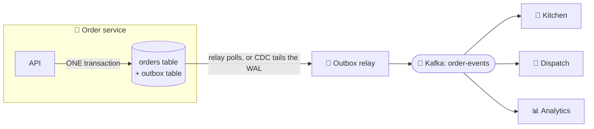

# 062 · Event-Driven Architecture & the Transactional Outbox

> ⏱ 10 min · 📈 62% · 🅰️ Part A (core) · Phase 07: Async & Messaging
>
> `████████████░░░░░░░░` 62% of the whole guide

---

## 📖 Story

The order service runs two lines of code, one after the other:

```python
db.commit(order)                 # ✅ saved
kafka.publish("OrderPlaced")     # 💥 the pod is evicted between these two lines
```

The order sits in the database, **paid**. But the announcement, *"OrderPlaced!"*, never leaves the building. The kitchen never hears about it. Dispatch never assigns a courier.

The customer waits. 7:30. 8:00. 8:45. **Two hours** of staring at a tracking page frozen on *"Order received"* for food that **was never cooked**.

Maya reruns the timeline in her head, and it chills her: it can happen the other way, too. Publish first, then the commit fails, and the kitchen cooks an order **that doesn't exist**.

Two systems, two writes, and no transaction that spans both.

I've debugged this exact bug at 2 a.m. Maya needs the save and the announcement to be **inseparable**.

## 🎯 One-sentence idea

**In an event-driven architecture, services announce facts and others react on their own, and the transactional outbox keeps a service's database change and its event in lockstep by saving the event in the same transaction and publishing it afterwards.**

## 🧸 Analogy

A **school office**: instead of phoning every teacher, the secretary **pins a notice** to the board, and everyone reacts in their own way (event-driven).

The danger: the secretary updates the **official calendar**, then **trips** on the way to the board. 😬

The fix: write the notice into an **outbox tray on the same desk, at the same moment** as the calendar change. A **runner** empties the tray onto the board. Even after a trip, the notice waits safely in the tray.

## 🖼️ Visual

*Diagram brief:* inside the order service, one transaction box wraps both the `orders` row and the `outbox` row. Outside it, a relay (a poller, or a CDC tap on the database log) carries outbox rows to Kafka, which fans out to consumers.



## 🔬 How it works

- **Event-driven architecture:** services publish **domain events** (facts) and others **subscribe**. You get loose coupling, easy extension, and an audit trail, and you pay with eventual consistency, flows that are harder to see, and schema governance. The styles are **choreography** (everyone reacts, no central brain) and **orchestration** (a coordinator issues commands, lesson 088).
- **The dual-write problem:** a DB commit and a broker publish are **two systems with no shared transaction**. Commit then crash = a lost event. Publish then a failed commit = a phantom event.
- **Transactional outbox:**
  1. Insert the event into an **`outbox` table in the same DB transaction** as the business change.
  2. A **relay** publishes the outbox rows: a **polling publisher** (`FOR UPDATE SKIP LOCKED`) or **CDC log tailing** (Debezium reads the WAL, giving lower latency and no polling load).
  3. Mark the rows sent, or delete them.
- **At-least-once by design:** the relay can crash after publishing but before marking a row sent, so it **re-sends**. Consumers dedupe by `event_id` using an **inbox** table (lesson 060).
- **Event design:** past tense, immutable, with an **ID, type, version, timestamp**, and the **entity ID as the partition key**. Choose **thin events** (IDs only, consumers call back) or **fat events** (carry the state, consumers are self-sufficient).

## 🧩 Worked example

```sql
BEGIN;
  INSERT INTO orders (id, user_id, total, status) VALUES ('o_123', 'u_42', 4599, 'PLACED');
  INSERT INTO outbox (id, aggregate_id, type, payload, created_at)
  VALUES ('evt_9f1', 'o_123', 'OrderPlaced',
          '{"order_id":"o_123","user_id":"u_42","total_cents":4599}', now());
COMMIT;   -- both or neither ✅
```

```python
while True:
    rows = db.query("""SELECT * FROM outbox WHERE published_at IS NULL
                       ORDER BY created_at LIMIT 500 FOR UPDATE SKIP LOCKED""")
    for r in rows:
        kafka.send("order-events", key=r.aggregate_id, value=r.payload,
                   headers={"event_id": r.id})
    kafka.flush()
    db.execute("UPDATE outbox SET published_at = now() WHERE id = ANY(%s)", [r.id for r in rows])
    sleep(0.1)
```

A crash between `flush` and `UPDATE` → those events are re-sent → consumers skip them by `event_id`. ✅ **Maya's two-hour ghost order can no longer happen.**

**Choreographed order flow:**

```
OrderPlaced      → Payment charges     → PaymentSucceeded
PaymentSucceeded → Kitchen accepts     → OrderAccepted
OrderAccepted    → Dispatch assigns    → CourierAssigned
PaymentFailed    → Order cancels       → OrderCancelled
```

## ⚖️ Trade-offs

| Maya's choice | What she gains | What she pays |
|---|---|---|
| Choreography | Decoupled, extensible | Hard to see the whole flow, cycles |
| Orchestration | An explicit flow, central error handling | The coordinator couples services |
| Polling outbox | Works with any DB, simple | Polling load, ~100 ms latency |
| CDC outbox | Low latency, no polling | Debezium/Kafka Connect to run |
| Fat events | Self-sufficient consumers | Bigger messages, schema coupling |
| Thin events | Small, flexible | Callbacks: more load, and races with later changes |

## 🌍 Real world

- **Debezium's outbox event router** is the standard CDC-based outbox for Kafka.
- **Uber, Netflix, and Zalando** publish domain events between services.
- **Chris Richardson's microservices patterns** popularized outbox, inbox, and sagas.

## 📌 Cheat card

> - **Events = past-tense facts. Services react independently.**
> - **Dual write (DB + broker) can't be atomic → outbox.**
> - **Outbox:** the event row in the **same transaction**, then a relay (**poll or CDC**) publishes it.
> - **At-least-once** → consumers **dedupe by event_id** (inbox).
> - **Choreography** (react) vs **orchestration** (command).

## 🧪 Feynman check

Explain the secretary who might trip between the calendar and the notice board, and how the outbox tray makes the trip harmless.

⚠️ **Common confusion:** "Just publish right after the commit, since crashes are rare." At Pantry's scale "rare" means **several times a day**, and one lost `PaymentSucceeded` is a paid order that never ships. The outbox turns "usually" into "**guaranteed**."

## ⚡ Quick recall

1. What is the dual-write problem?
<details><summary>Reveal Answer</summary>

Updating a database and publishing a message are separate operations with no shared transaction, so a crash between them leaves them inconsistent.
</details>

2. How does the outbox pattern solve it?
<details><summary>Reveal Answer</summary>

The event is written to an outbox table in the same DB transaction as the business change, and a relay reliably publishes it afterwards.
</details>

3. What's the difference between choreography and orchestration?
<details><summary>Reveal Answer</summary>

Choreography: services react to each other's events with no central controller. Orchestration: a coordinator explicitly directs each step.
</details>

## 🎤 Interview practice

**Q. "Guarantee that the search index and the email service learn about every new product even if the product service crashes, and tell me when you'd switch from choreography to orchestration."**
<details><summary>Model answer</summary>

- **Guaranteed propagation:**
  - The product service writes the `products` row **and** a `ProductCreated` outbox row **in one transaction**.
  - **Debezium** tails the WAL (or a polling relay runs) and publishes to Kafka, **keyed by `product_id`**, so each product's events stay ordered.
  - Consumers are **idempotent**: the search indexer upserts by `product_id` and dedupes by `event_id`, and the email service records `sent(event_id)`.
  - Crashes anywhere just delay delivery. Events wait in the outbox or in Kafka and flow on recovery.
  - Monitor **outbox age** (oldest unpublished row) and consumer lag.
- **Choreography → orchestration when:**
  - The process has **many steps, branching, timeouts, and compensations** (order fulfilment, refunds, loan approval).
  - A **central orchestrator** (Temporal, Step Functions, a saga orchestrator) makes the flow explicit, debuggable, and testable.
  - Keep **choreography** for simple, loosely related reactions where adding subscribers freely *is* the point.
  - It's common to use both: **orchestration inside a bounded context, events between contexts**.
- **Risk of choreography at scale:** "event spaghetti". No one can answer "what happens after `OrderPlaced`?", and cyclic event chains appear. Mitigate with event catalogues and tracing.
- **Likely follow-up:** "Polling or CDC?" → polling for simplicity and low volume. CDC for low latency and high volume without hammering the DB.
</details>

## 📖 Teaser

> 📖 *Chapter 8 is next. It's a Friday night, the dinner rush is peaking, and one slow payment provider is about to pull every Pantry service down with it.*

---

⬅️ [061 · Backpressure & Load Shedding](061-backpressure-and-load-shedding.md) · 🗺️ [Phase map](README.md) · ➡️ [063 · Timeouts & Retries](../08-reliability-ops/063-timeouts-and-retries.md)

✅ **Safe stopping point.** Tick lesson 062 in [PROGRESS.md](../../PROGRESS.md). 🎉 **Phase 07 complete!** Review the [cheatsheet](CHEATSHEET.md) and [interview bank](INTERVIEW-QUESTIONS.md).
