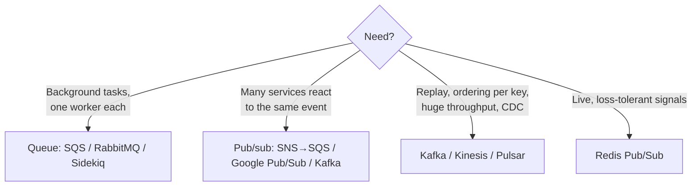

# 📌 Phase 07 Cheatsheet: Async & Messaging

## 🧠 Core ideas

| # | Idea in one line |
|---|---|
| 056 | **Sync = phone call, async = voicemail.** Keep sync only what the user must wait for. |
| 057 | **Queue = ticket rail**: one worker per message, ack, visibility timeout, DLQ. |
| 058 | **Pub/sub = YouTube channel**: every subscriber gets a copy. Topic → a queue per service. |
| 059 | **Kafka = logbook + bookmarks**: partitions, key ordering, consumer groups, replay. |
| 060 | **At-most / at-least / effectively-once.** Default: at-least-once + idempotency. |
| 061 | **Backpressure ("wait") + load shedding ("not now").** Never use unbounded queues. |
| 062 | **Events = facts. Outbox** solves the dual-write problem. Choreography vs orchestration. |

## 🔢 Numbers

```
Kafka: ~100k–1M+ msgs/s per broker · parallelism = partitions
SQS visibility timeout: set > max processing time · long polling 20 s
Idempotency / dedup retention: longer than the max redelivery window (hours–days)
Worker count ≈ arrival rate × processing time (Little's Law) + headroom
```

## 🪄 Tricks

- **"Most may lose, least may duplicate, exactly is a myth."**
- **Ack/commit AFTER processing.** Dedupe by **event_id**.
- **Key = the entity ID** → per-entity ordering in Kafka / FIFO groups.
- **Queue depth + oldest message age** = the worker health signals. **Consumer lag** for Kafka.
- **202 Accepted + job ID** for long work.
- **Goodput > throughput.** Fast 503s beat slow timeouts.

## 🗺️ Which messaging tool?



## ⚠️ Top mistakes

- Non-idempotent consumers on at-least-once queues.
- Publishing events outside the DB transaction (a dual write).
- Redis Pub/Sub for business-critical events.
- More consumers than partitions ("why isn't it faster?").
- Unbounded in-memory queues on the request path.
- Retry storms without backoff or jitter.

---

🗺️ [Phase map](README.md) · 🎤 [Interview questions](INTERVIEW-QUESTIONS.md)
