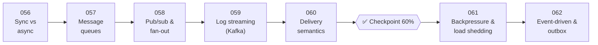

# 📬 Phase 07: Async & Messaging

> **Lessons 056–062 · 56% → 62% · 🅰️ Part A (core)**
> By the end of this phase you'll **decouple systems** with queues, pub/sub, and event streams, absorb traffic spikes, and move data reliably between services.

## 📖 Chapter 7: The Dinner Rush

Every evening, orders pour in all at once, and every checkout waits on a chain of slow side-tasks. In this chapter, Maya learns to say "I'll do that later, reliably": queues, announcements that many teams can hear, replayable logs, honest delivery promises, polite refusal under overload, and events that can never be lost.

## 🗺️ Phase map

| # | Lesson | ⏱ | One-line idea |
|---|---|---|---|
| 056 | [Sync vs async communication](056-sync-vs-async.md) | 8 min | Wait for the answer, or leave a note and move on |
| 057 | [Message queues](057-message-queues.md) | 9 min | A to-do list between services that absorbs spikes |
| 058 | [Pub/sub & fan-out](058-pub-sub-and-fan-out.md) | 8 min | One event, many independent listeners |
| 059 | [Log-based streaming (Kafka)](059-log-based-streaming.md) | 10 min | An append-only log you can replay |
| 060 | [Delivery semantics](060-delivery-semantics.md) | 9 min | At-most, at-least, and "exactly" once |
| ✅ | [Checkpoint 60%](checkpoint-60.md) | 15 min | 🎉 Level-up! |
| 061 | [Backpressure & load shedding](061-backpressure-and-load-shedding.md) | 9 min | Say "slow down" or "not now" before you drown |
| 062 | [Event-driven architecture & outbox](062-event-driven-and-outbox.md) | 10 min | Services react to facts, reliably published |

📌 [Phase cheatsheet](CHEATSHEET.md) · 🎤 [Phase interview questions](INTERVIEW-QUESTIONS.md)

⬅️ Previous phase: [06 Scaling data](../06-scaling-data/README.md) · ➡️ Next phase: [08 Reliability, security & ops](../08-reliability-ops/README.md)
