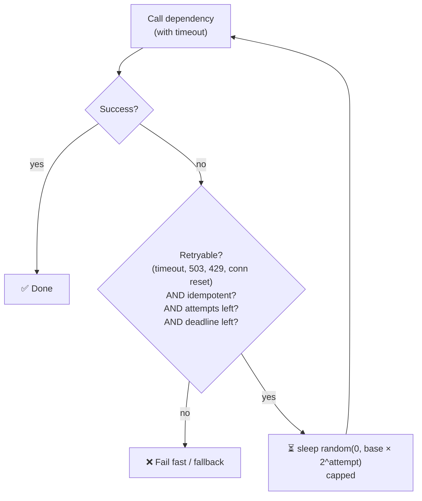

# 063 · Timeouts & Retries (Exponential Backoff + Jitter)

> ⏱ 9 min · 📈 63% · 🅰️ Part A (core) · Phase 08: Reliability, Security & Ops
>
> `████████████░░░░░░░░` 63% of the whole guide

---

## 📖 Story

At 9 pm, the payment provider gets slow. Pantry's servers wait patiently (forever), and retry instantly (over and over). Within minutes, the whole site freezes, and **Priya**, Pantry's new on-call engineer, is woken by her pager. The post-mortem the next day begins with two words: *timeouts* and *retries*.

## 🎯 One-sentence idea

**Every network call needs a timeout (never wait forever), and retries should only happen for safe, transient failures, spaced out with exponentially growing, randomized delays (backoff + jitter), so retries help instead of stampeding a struggling service.**

## 🧸 Analogy

Calling a busy **customer support line**:

- ⏲️ **Timeout:** you don't hold forever. After 5 minutes you hang up and do something else.
- 🔁 **Naive retry:** you redial **instantly, over and over**. So does everyone else. The line gets **even more jammed**.
- 📈 **Exponential backoff:** you wait 1 min, then 2, then 4, then 8… giving them time to recover.
- 🎲 **Jitter:** everyone waits a **slightly random** amount, so a thousand callers don't all redial at exactly the same second.

## 🖼️ Visual

```
Retries without jitter (everyone synchronized):     With backoff + full jitter:
t=1s  ████████████ (1000 retries)                   t=0–1s   ██ ▌█ ██ ▌ █
t=2s  ████████████                                  t=0–2s    ▌█  ██ ▌ █ ▌
t=4s  ████████████  ← waves of load                 t=0–4s   ▌  █ ▌  █  ▌ █ ← spread out, smooth
```



## 🔬 How it works

- **Timeouts:**
  - **Connect timeout** (short, e.g., 100 ms–1 s) + **request/read timeout** (based on the dependency's p99.9 plus a margin).
  - **No timeout = infinite wait** → threads pile up → **cascading failure**.
  - **Deadline propagation:** pass the remaining time budget downstream (gRPC deadlines). Inner calls get less time than outer calls.
- **What to retry:**
  - ✅ **Transient** errors: timeouts, connection resets, `503`, `429` (respect `Retry-After`), leader-election blips.
  - ❌ **Permanent** errors: `400`, `401`, `403`, `404`, validation failures.
  - ⚠️ **Only idempotent operations** (or ones with idempotency keys, lesson 055).
- **Exponential backoff:** `delay = base × 2^attempt`, capped (e.g., 100 ms, 200, 400, 800… max 10 s).
- **Jitter:** randomize the delay. **Full jitter** `sleep(random(0, min(cap, base × 2^attempt)))` spreads the retries best.
- **Limit retries:** a max of 2–3 attempts. **Retry budgets** (e.g., retries ≤ 10% of requests) stop retry storms from multiplying load.
- **Retry amplification:** if each of 3 layers retries 3×, one user request can become **3³ = 27** calls to the bottom service. **Retry at one layer only** (usually the edge or the caller closest to the failure).
- **Hedged requests:** for reads, send a second request if the first hasn't answered by the p95. Cuts tail latency, costs some extra load (lesson 003).

## 🧩 Worked example

**Full-jitter retry helper (Python):**

```python
import random, time

RETRYABLE = {408, 429, 500, 502, 503, 504}

def call_with_retries(fn, max_attempts=3, base=0.1, cap=5.0, deadline=None):
    for attempt in range(max_attempts):
        try:
            return fn(timeout=1.0)                 # always a timeout!
        except TransientError as e:
            if attempt == max_attempts - 1:
                raise
            delay = random.uniform(0, min(cap, base * 2 ** attempt))   # full jitter
            if getattr(e, "retry_after", None):
                delay = max(delay, e.retry_after)                       # respect the server's hint
            if deadline and time.time() + delay > deadline:
                raise                                                   # don't exceed the caller's budget
            time.sleep(delay)
```

**Timeout budget across layers:**

```
User-facing SLA: 2 s
Gateway timeout: 1.8 s → Service A: 1.5 s → Service B: 600 ms → DB query: 300 ms
Rule: inner timeouts < outer timeouts, so the caller never gives up before its callee does
```

**Retry amplification:**

```
Gateway (3 tries) → API (3 tries) → DB client (3 tries) = up to 27 DB calls per user click 😱
Fix: retries only at the API layer + a retry budget + a circuit breaker
```

## ⚖️ Trade-offs

| Choice | Gain | Cost |
|---|---|---|
| Short timeouts | Fail fast, free up resources | False failures if set below normal latency |
| Long timeouts | Fewer false failures | Resource pile-up, slow failure detection |
| More retries | Survive blips | Load amplification, longer tail |
| Backoff + jitter | Smooth recovery | Added latency on failure |
| Hedging | Lower tail latency | ~5% extra load |

## 🌍 Real world

- **AWS Architecture Blog, "Exponential Backoff and Jitter"**: the classic analysis showing full jitter works best.
- **AWS SDKs, gRPC, Envoy, Polly (.NET), resilience4j** all provide retries with backoff and jitter.
- **Google SRE:** retry budgets and per-request retry limits to avoid retry storms.

## 📌 Cheat card

> - **Every remote call gets a timeout.** Inner < outer. Propagate **deadlines**.
> - **Retry only transient errors, only idempotent operations, at most 2–3 times.**
> - **Exponential backoff + full jitter:** `random(0, min(cap, base × 2^n))`.
> - **Retry at one layer**, and use **retry budgets** to avoid 27× amplification.
> - Respect **`Retry-After`** on 429/503.

## 🧪 Feynman check

Explain the support-line analogy, and why everybody redialing at *exactly* the same moment is worse than everybody redialing at slightly random times.

⚠️ **Common confusion:** "Retries make systems more reliable." They help with **brief blips**. During real overload, retries **add load** and prolong the outage. That's why you need backoff, budgets, and circuit breakers (lesson 064).

## ⚡ Quick recall

1. Why add jitter to backoff?
<details><summary>Answer</summary>

To desynchronize clients so their retries don't arrive in waves that hammer the recovering service at the same instant.
</details>

2. Which errors should NOT be retried?
<details><summary>Answer</summary>

Permanent client errors (400, 401, 403, 404, validation errors), and non-idempotent operations without idempotency keys.
</details>

3. How can retries amplify load 27×?
<details><summary>Answer</summary>

Three layers each retrying 3 times multiply: 3 × 3 × 3 = 27 attempts at the bottom service per original request.
</details>

## 🎤 Interview practice

**Q1. "A dependency had a 30-second blip, but our service was down for 20 minutes. What happened?"**
<details><summary>Model answer</summary>

- Likely a **retry storm / metastable failure**: clients retried aggressively without jitter, so the load stayed above capacity after the blip. Queues filled, timeouts caused more retries, and the system couldn't recover by itself.
- Also possible: **no timeouts**, so threads were stuck, pools were exhausted, and it cascaded.
- Fixes: timeouts + deadlines, exponential backoff with jitter, retry budgets, circuit breakers, load shedding, and bounded queues.
- **Likely follow-up:** "How would you get out of it in the moment?" → shed load (rate limit at the edge), disable retries via a flag, scale up, and let queues drain.
</details>

**Q2. "How do you choose a timeout value for a call to the payments service?"**
<details><summary>Model answer</summary>

- Look at the dependency's **latency distribution** (p99/p99.9), and set the timeout slightly above it (e.g., p99.9 × 1.5).
- It must fit within the **caller's own deadline** (the user-facing SLO), minus the time for other steps.
- Payments aren't idempotent by default, so retry only with an **idempotency key**. On a timeout, check the status rather than blindly re-charging.
- **Likely follow-up:** "What if p99.9 is 10 s?" → make the operation async (202 + a status check), or fix the dependency. Don't hold user requests for 10 s.
</details>

> 📖 *Next time: Why did a slow *recommendations* service take down *checkout*?*

---

⬅️ [062 · Event-Driven & Outbox](../07-async-messaging/062-event-driven-and-outbox.md) · 🗺️ [Phase map](README.md) · ➡️ [064 · Circuit Breakers & Bulkheads](064-circuit-breakers-and-bulkheads.md)

✅ **Safe stopping point.** Tick lesson 063 in [PROGRESS.md](../../PROGRESS.md).
