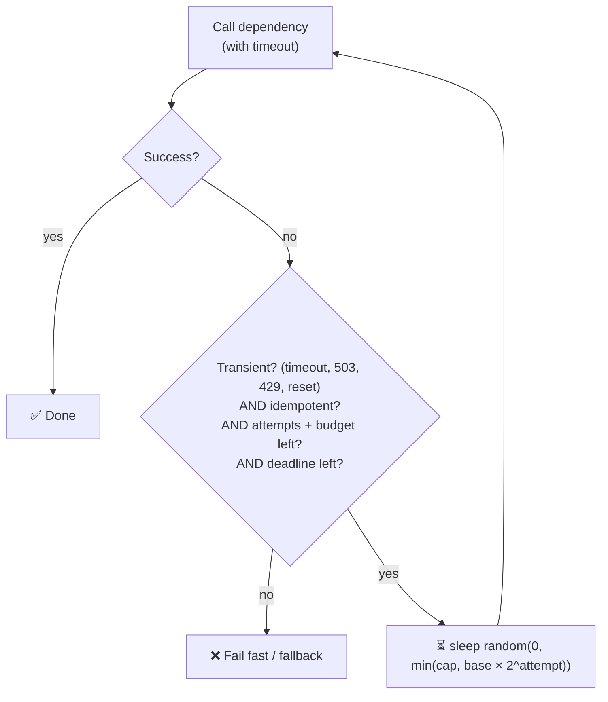

# 063 · Timeouts & Retries (Exponential Backoff + Jitter)

> ⏱ 9 min · 📈 63% · 🅰️ Part A (core) · Phase 08: Reliability, Security & Ops
>
> `████████████░░░░░░░░` 63% of the whole guide

---

## 📖 Story

Friday, 9:02 p.m. Maya is on call. The payment provider starts to **wobble**: not down, just slow. Responses that took 200 ms now take **40 seconds**.

Pantry's servers **wait**. Patiently. Forever. Nobody ever set a timeout. Every thread that calls payments is frozen mid-sentence, like a row of people holding phones to their ears, listening to hold music.

Then the retry logic kicks in: **instantly, again, and again**. Three layers of code each retry three times. Each stuck checkout becomes **27 calls** hammering a provider that's already gasping. By 9:09, every thread pool in Pantry is full. Menus won't load. Login won't load. **Everything** is frozen, because of one slow dependency.

The provider recovers at 9:10. Pantry doesn't recover until **9:31**, still drowning in its own retry storm.

Maya's pager wakes her at 9:03 and she doesn't sleep until 2 a.m. The post-mortem opens with two words I want you to remember forever: **timeouts** and **retries**.

## 🎯 One-sentence idea

**Every network call needs a timeout so it never waits forever, and retries should only happen for safe, transient failures, spaced out with exponentially growing, randomized delays (backoff + jitter), so retries help a struggling service instead of stampeding it.**

## 🧸 Analogy

Calling a busy **support line**:

- ⏲️ **Timeout:** you don't hold forever. After 5 minutes you hang up.
- 🔁 **Naive retry:** you redial **instantly, over and over**, and so does everyone else. The line jams harder.
- 📈 **Backoff:** you wait 1 min, then 2, then 4…
- 🎲 **Jitter:** everyone waits a **slightly random** time, so a thousand callers don't redial at the same second.

## 🖼️ Visual

*Diagram brief:* on the left, retries without jitter arrive in tall synchronized waves that crash into the service. On the right, jittered retries form a low, even drizzle. Below, a decision flow decides whether a failure deserves a retry at all.

```
No jitter (synchronized waves):            Backoff + full jitter:
t=1s  ████████████ (1000 retries)          t=0–1s   ██ ▌█ ██ ▌ █
t=2s  ████████████                         t=0–2s    ▌█  ██ ▌ █ ▌
t=4s  ████████████  ← hammer               t=0–4s   ▌  █ ▌  █  ▌ █ ← smooth
```



## 🔬 How it works

- **Timeouts everywhere:** a short **connect** timeout (100 ms–1 s) plus a **request** timeout set from the dependency's **p99.9 + margin**. No timeout = threads pile up = a **cascading failure**. Propagate **deadlines** downstream, so **inner timeouts are always shorter than outer ones**.
- **Retry only what's safe:** transient errors (timeouts, connection resets, `503`, `429` + `Retry-After`) on **idempotent** operations or ones with **idempotency keys** (lesson 055). Never retry `400/401/403/404` or validation failures.
- **Exponential backoff + full jitter:** `sleep(random(0, min(cap, base × 2^attempt)))`, e.g. base 100 ms, cap 5–10 s, **2–3 attempts max**. Full jitter desynchronizes clients best.
- **Kill amplification:** retries multiply across layers (3 × 3 × 3 = **27×**), so **retry at one layer only**, and add **retry budgets** (retries ≤ ~10% of requests) so retries can't snowball during real overload.
- **Hedged requests** for idempotent reads: fire a second request if the first exceeds ~p95. Big tail-latency wins for ~5% more load (lesson 003).

## 🧩 Worked example

```python
import random, time

def call_with_retries(fn, max_attempts=3, base=0.1, cap=5.0, deadline=None):
    for attempt in range(max_attempts):
        try:
            return fn(timeout=1.0)                              # ALWAYS a timeout
        except TransientError as e:
            if attempt == max_attempts - 1 or not retry_budget.allow():
                raise
            delay = random.uniform(0, min(cap, base * 2 ** attempt))   # full jitter
            delay = max(delay, getattr(e, "retry_after", 0) or 0)       # honour the server's hint
            if deadline and time.time() + delay > deadline:
                raise                                                   # don't blow the caller's budget
            time.sleep(delay)
```

**Pantry's new timeout ladder:**

```
User SLO 2 s → Gateway 1.8 s → Checkout 1.5 s → Payments client 800 ms (+ idempotency key) → DB 300 ms
Inner < outer: no caller ever abandons a callee that is still working on its behalf.
```

**Friday night, replayed:** with the payments timeout at **800 ms**, a **circuit breaker** (lesson 064), and **one** retry layer with jitter, the provider's wobble costs ~**2% of checkouts** a fast "please retry" for 8 minutes. **Menus and login never notice.**

## ⚖️ Trade-offs

| Maya's choice | What she gains | What she pays |
|---|---|---|
| Short timeouts | Fail fast, free resources | False failures if set below normal latency |
| Long timeouts | Fewer false failures | Resource pile-up, slow detection |
| More retries | Survive blips | Load amplification, longer tails |
| Backoff + jitter | Smooth recovery | Extra latency on failure |
| Hedging | Lower tail latency | ~5% extra load |

## 🌍 Real world

- The **AWS Architecture Blog's "Exponential Backoff and Jitter"** showed full jitter beating the alternatives.
- **AWS SDKs, gRPC, Envoy, Polly, and resilience4j** all ship backoff + jitter.
- **Google SRE** uses per-request retry limits and **retry budgets** to prevent metastable retry storms.

## 📌 Cheat card

> - **Every remote call gets a timeout.** Inner < outer. **Propagate deadlines.**
> - **Retry only transient errors, on idempotent operations, 2–3 times max.**
> - **Full jitter:** `random(0, min(cap, base × 2ⁿ))`.
> - **Retry at one layer** + **retry budgets** (no 27× amplification).
> - Honour **`Retry-After`**.

## 🧪 Feynman check

Explain the support line, and why everyone redialing at *exactly* the same moment is worse than everyone redialing at slightly random times.

⚠️ **Common confusion:** "Retries make systems more reliable." They smooth over **brief blips**. During **real overload**, retries **add load** and can trap a system in a **metastable failure** that outlives its cause, like Pantry's 21 extra minutes. Backoff, budgets, and breakers keep them honest.

## ⚡ Quick recall

1. Why add jitter to backoff?
<details><summary>Reveal Answer</summary>

To desynchronize clients so their retries don't arrive in waves that hammer a recovering service at the same instant.
</details>

2. Which errors should NOT be retried?
<details><summary>Reveal Answer</summary>

Permanent client errors (400, 401, 403, 404, validation failures), and non-idempotent operations without idempotency keys.
</details>

3. How can retries amplify load 27×?
<details><summary>Reveal Answer</summary>

Three layers each retrying 3 times multiply: 3 × 3 × 3 = 27 attempts at the bottom service per original request.
</details>

## 🎤 Interview practice

**Q. "A dependency had a 30-second blip, but our service stayed down for 20 minutes. Explain it, fix it, and tell me how you'd choose the payment-call timeout."**
<details><summary>Model answer</summary>

- **What happened: a metastable failure.**
  - Clients retried **aggressively, without jitter, at every layer**, so load stayed **above capacity after the blip ended**.
  - Queues filled, latency rose, more requests timed out, and more retries followed: a self-sustaining loop.
  - Missing timeouts made it worse: **stuck threads** exhausted pools and spread the failure to unrelated endpoints.
- **Escaping in the moment:** shed load at the edge (rate limits), **disable retries via a feature flag**, scale out, and let queues drain.
- **Permanent fixes:**
  - Timeouts and **deadline propagation** everywhere.
  - **Exponential backoff with full jitter**, retries at **one layer**, and **retry budgets**.
  - **Circuit breakers** + **bulkheads** (lesson 064).
  - **Bounded queues + load shedding** (lesson 061).
- **Choosing the payment timeout:**
  - Measure the dependency's **p99.9** (e.g. 600 ms), and set the timeout ≈ **p99.9 × 1.3–1.5** (~800 ms).
  - Make sure it **fits inside the caller's own deadline** after the other steps.
  - Payments aren't naturally idempotent, so retry only with an **idempotency key**. On a timeout, **query the status** before any re-attempt.
  - If the p99.9 is 10 s, don't hold users that long. Go **async** (202 + status) or fix the dependency.
- **Likely follow-up:** "Why full jitter instead of equal jitter?" → full jitter spreads retries over the whole window, minimizing collisions and total work, at the cost of occasionally retrying very soon.
</details>

## 📖 Teaser

> 📖 *Timeouts are in place, and then the "recommended for you" carousel, a nice-to-have, gets slow and somehow drags checkout, the most important page in the company, down with it.*

---

⬅️ [062 · Event-Driven & Outbox](../07-async-messaging/062-event-driven-and-outbox.md) · 🗺️ [Phase map](README.md) · ➡️ [064 · Circuit Breakers & Bulkheads](064-circuit-breakers-and-bulkheads.md)

✅ **Safe stopping point.** Tick lesson 063 in [PROGRESS.md](../../PROGRESS.md).
