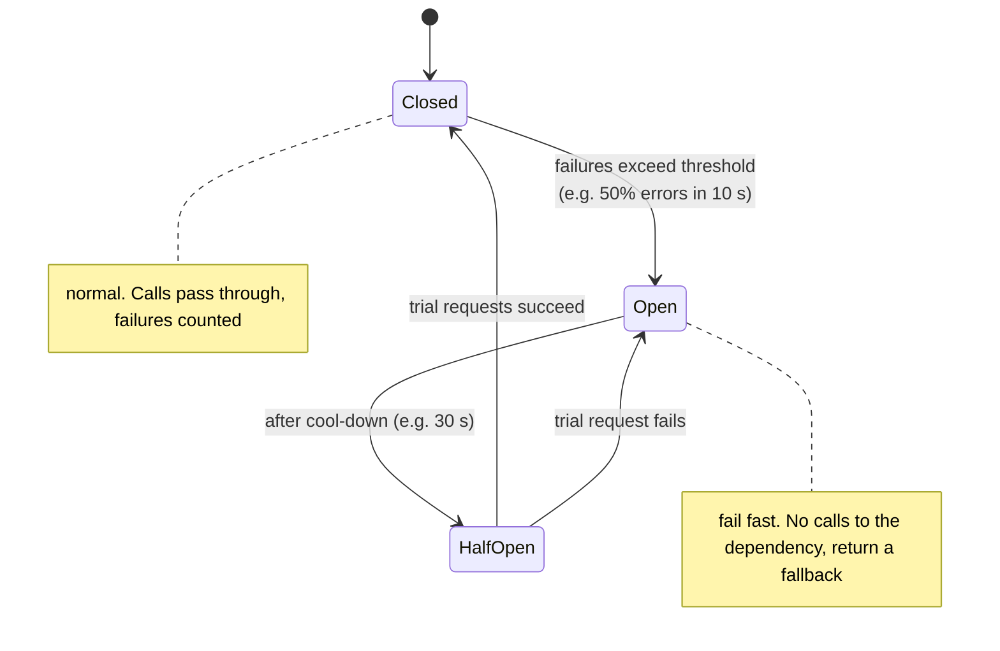
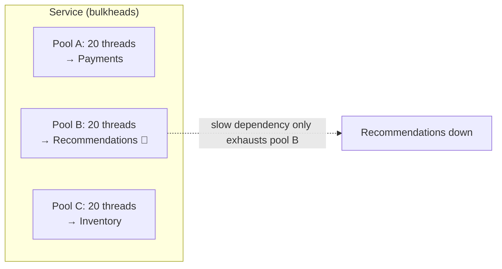

# 064 · Circuit Breakers & Bulkheads

> ⏱ 9 min · 📈 64% · 🅰️ Part A (core) · Phase 08: Reliability, Security & Ops
>
> `████████████░░░░░░░░` 64% of the whole guide

---

## 🎯 One-sentence idea

**A circuit breaker stops calling a dependency that keeps failing (it fails fast instead of waiting), and periodically tests whether it has recovered. Bulkheads isolate resources (thread pools, connections) per dependency, so one failing part can't sink the whole service.**

## 🧸 Analogy

- ⚡ **Circuit breaker = your home's electrical breaker.** When a toaster short-circuits, the breaker **trips** and cuts power to that circuit, instead of letting the wiring catch fire. Later you **flip it back on to test**. If it's fixed, great. If not, it trips again.
- 🚢 **Bulkheads = watertight compartments in a ship.** A hole in one compartment floods **only that compartment**, and the ship stays afloat. The Titanic's compartments weren't sealed high enough, and water spilled from one to the next.

## 🖼️ Visual





## 🔬 How it works

- **Circuit breaker states:**
  - **Closed:** requests flow normally. Track the error rate and slow calls in a rolling window.
  - **Open:** after crossing a threshold (e.g., ≥ 50% failures over at least 20 calls), **reject immediately** (no network call) and return a **fallback** or a fast error.
  - **Half-open:** after a cool-down, let a **few trial requests** through. Success → close. Failure → open again.
- **Why:** it stops wasting threads and time on doomed calls, **gives the dependency room to recover** (no hammering), and gives users fast feedback instead of timeouts.
- **Fallbacks:** cached data, a default value ("recommendations unavailable"), a degraded feature, or queuing the work for later.
- **Bulkheads:**
  - Separate **thread pools / connection pools / semaphores** per dependency, or per class of traffic.
  - Separate **instances or clusters** for critical vs non-critical traffic (e.g., checkout vs browsing), and per-tenant isolation.
  - A limit per dependency means a slow one exhausts only **its own** slice.
- **Combine them:** timeouts (063) + retries with backoff (063) + circuit breaker + bulkhead + fallback = the standard **resilience stack** around every remote call.

## 🧩 Worked example

**Product page with 4 dependencies:**

| Dependency | Critical? | Bulkhead | Breaker fallback |
|---|---|---|---|
| Product catalog | ✅ Yes | Pool 50 | Serve from cache, else error |
| Price & stock | ✅ Yes | Pool 50 | Cached price + "check availability" |
| Reviews | ❌ No | Pool 10 | Hide the reviews section |
| Recommendations | ❌ No | Pool 10 | Show "popular items" from a static list |

When recommendations get slow: its 10-thread pool fills → its breaker **opens** → the page renders **without** recommendations in ~50 ms, instead of timing out at 2 s. Checkout is unaffected. 🎉

**resilience4j-style config (Java):**

```java
CircuitBreakerConfig cfg = CircuitBreakerConfig.custom()
    .failureRateThreshold(50)                       // % failures to open
    .slowCallDurationThreshold(Duration.ofMillis(500))
    .slowCallRateThreshold(50)                      // slow calls count as failures too
    .minimumNumberOfCalls(20)
    .waitDurationInOpenState(Duration.ofSeconds(30))
    .permittedNumberOfCallsInHalfOpenState(5)
    .build();

Supplier<List<Item>> recs = CircuitBreaker.decorateSupplier(cb, () -> recClient.get(userId));
List<Item> items = Try.ofSupplier(recs).getOrElse(PopularItems::fallback);
```

## ⚖️ Trade-offs

| Choice | Gain | Cost |
|---|---|---|
| Circuit breaker | Fail fast, protect the dependency and the caller | Tuning thresholds, possible false trips |
| Fallbacks | Graceful degradation | Stale or partial data, and extra code paths to test |
| Bulkheads | Contain failures | Less efficient pooling (idle capacity per pool) |
| Separate clusters for critical traffic | Strong isolation | Cost |

## 🌍 Real world

- **Netflix Hystrix** popularized circuit breakers and bulkheads. Now it's **resilience4j**, **Polly**, and **Envoy/Istio outlier detection** and circuit breaking.
- **AWS cell-based architecture** = bulkheads at infrastructure scale (independent cells limit the blast radius).
- Michael Nygard's **"Release It!"** introduced these stability patterns to many engineers.

## 📌 Cheat card

> - **Breaker = the home electrical breaker:** Closed → **Open** (fail fast) → **Half-open** (test) → Closed.
> - **Bulkhead = ship compartments:** a separate pool per dependency or traffic class.
> - Always pair with a **fallback** for non-critical dependencies.
> - The resilience stack: **timeout + retry (backoff/jitter) + breaker + bulkhead + fallback**.
> - Mnemonic: **TRCB-R** (Timeouts, Retries, Circuit Breakers, Redundancy).

## 🧪 Feynman check

Explain the electrical breaker and the ship compartments, and how together they keep a shopping site's checkout working when the "recommended for you" service is broken.

⚠️ **Common confusion:** "A circuit breaker fixes the broken dependency." It doesn't. It **protects the caller** and **gives the dependency breathing room**. You still need alerts and a fix.

## ⚡ Quick recall

1. What does a circuit breaker do in the open state?
<details><summary>Answer</summary>

It rejects calls immediately without contacting the dependency, returning a fallback or a fast error.
</details>

2. What's the purpose of the half-open state?
<details><summary>Answer</summary>

To let a few trial requests through after a cool-down and check whether the dependency has recovered, before fully closing.
</details>

3. How does a bulkhead prevent cascading failure?
<details><summary>Answer</summary>

By giving each dependency its own limited pool of resources, so a slow dependency can only exhaust its own pool, not the whole service.
</details>

## 🎤 Interview practice

**Q1. "Our API gateway went down because one backend service became slow. How do you prevent this?"**
<details><summary>Model answer</summary>

- The slow backend **held all the gateway's connections and threads** → everything queued behind it (no isolation).
- Add **per-route timeouts**, **per-backend connection limits (bulkheads)**, **circuit breakers / outlier detection** per backend, and **load shedding**.
- Return fast errors or fallbacks for the broken route, and keep the others healthy.
- **Likely follow-up:** "Where do you implement this?" → in the gateway/proxy (Envoy supports circuit breaking and outlier detection) or in client libraries (resilience4j).
</details>

**Q2. "How do you pick circuit breaker thresholds?"**
<details><summary>Model answer</summary>

- Base them on the dependency's normal error and latency profile: e.g., open at ≥ 50% failures (or slow calls) over ≥ 20 calls in a 10 s window, with a cool-down of about the typical recovery time (10–60 s).
- Count **timeouts and slow calls** as failures.
- Avoid tripping on low traffic (the minimum-calls setting).
- Test in chaos experiments, and alert on breaker state changes.
- **Likely follow-up:** "Per instance or shared state?" → usually per client instance (simple, and no coordination). Aggregate the metrics centrally for visibility.
</details>

---

⬅️ [063 · Timeouts & Retries](063-timeouts-and-retries.md) · 🗺️ [Phase map](README.md) · ➡️ [065 · Redundancy & Failover](065-redundancy-and-failover.md)

✅ **Safe stopping point.** Tick lesson 064 in [PROGRESS.md](../../PROGRESS.md).
