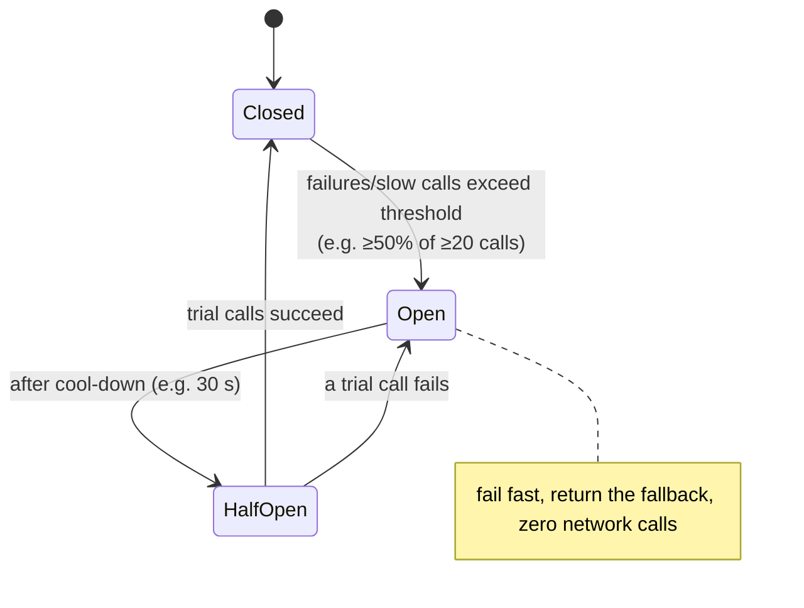
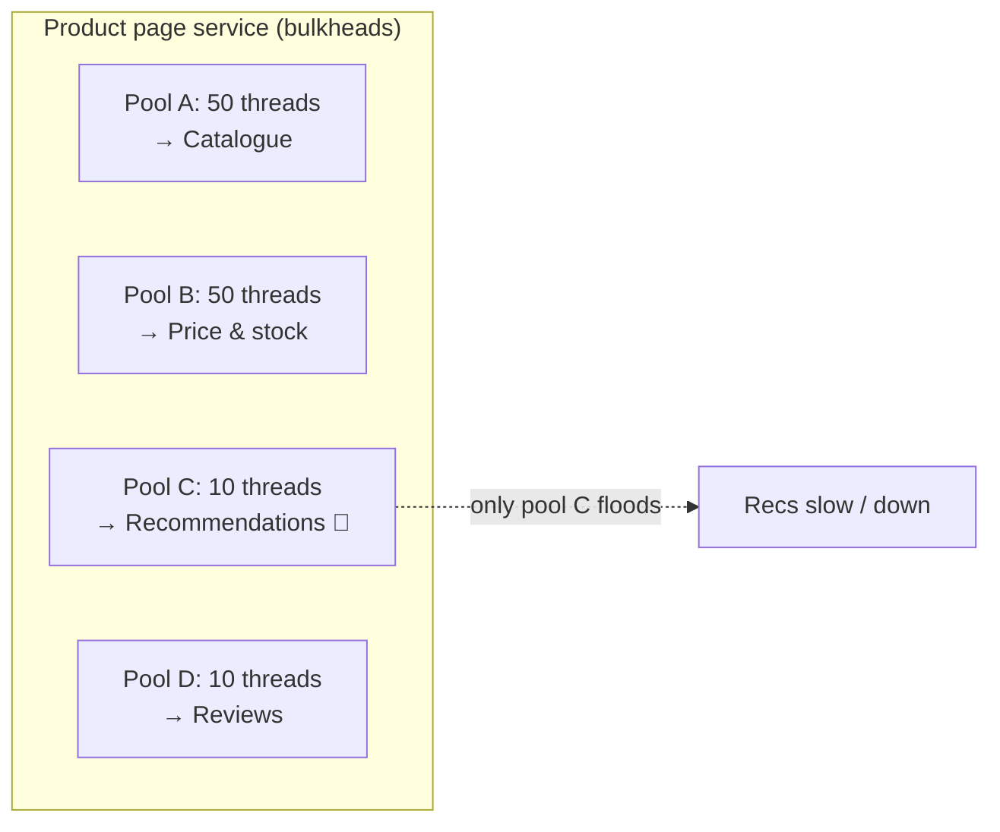

# 064 · Circuit Breakers & Bulkheads

> ⏱ 9 min · 📈 64% · 🅰️ Part A (core) · Phase 08: Reliability, Security & Ops
>
> `████████████░░░░░░░░` 64% of the whole guide

---

## 📖 Story

The **"Recommended for you"** carousel is pure garnish: a strip of pretty dish photos below the menu. Nobody *needs* it.

At 7:40 p.m. the recommendations service starts responding in **3 seconds** instead of 30 ms. A memory leak, probably.

Within four minutes, **checkout is down**.

Maya traces it like a detective following footprints. The product page server has **200 threads** in one shared pool. Every page view calls recommendations. Each call now holds a thread for 3 seconds. One by one, like seats filling in a cinema, **all 200 threads** are sitting there waiting on garnish. When a checkout request arrives, there's **no thread left** to serve it.

The least important part of the system just sank the most important part.

When Maya asked me how to stop one broken part from sinking the whole ship, I drew her the **Titanic**. I'll draw it for you too.

## 🎯 One-sentence idea

**A circuit breaker stops calling a dependency that keeps failing (it fails fast instead of waiting) and periodically tests whether it has recovered, while bulkheads isolate resources per dependency so one failing part can't sink the whole service.**

## 🧸 Analogy

- ⚡ **Circuit breaker = the electrical breaker at home.** A toaster shorts out, the breaker **trips** before the wiring burns, and later you **flip it back on to test** it.
- 🚢 **Bulkheads = watertight compartments.** A hole floods **one compartment**, not the whole ship. The Titanic's bulkheads weren't sealed high enough, and water spilled over from one to the next.

## 🖼️ Visual

*Diagram brief:* a three-state dial (Closed → Open → Half-open) next to a ship's hull divided into compartments, each wired to one dependency, with only the "Recommendations" compartment flooded.





## 🔬 How it works

- **Closed:** calls flow, and errors **and slow calls** are counted in a rolling window. **Open:** past the threshold, calls are **rejected instantly** with a **fallback**, which saves threads and gives the dependency room to recover. **Half-open:** after a cool-down, a few **trial calls** decide between closing and reopening.
- **Fallbacks:** cached data, defaults ("Popular dishes"), a hidden section, or "queue it for later." **Critical** dependencies get fast, clear errors. Non-critical ones get graceful omission.
- **Bulkheads:** separate **thread pools, connection pools, or semaphores per dependency** or per traffic class, so a slow dependency can exhaust **only its own** slice. At larger scale: separate clusters for critical vs non-critical traffic, and **cell-based** isolation per tenant or shard.
- **The resilience stack around every remote call:** **timeout → retry (backoff + jitter, budgeted) → circuit breaker → bulkhead → fallback**.
- **Operate it:** count timeouts and slow calls as failures, require a **minimum call volume** before tripping, alert on breaker **state changes**, and test with **chaos experiments**.

## 🧩 Worked example

| Dependency | Critical? | Bulkhead | When the breaker is open |
|---|---|---|---|
| Catalogue | ✅ | 50 | Serve from cache, else a 503 |
| Price & stock | ✅ | 50 | Cached price + "confirm at checkout" |
| Reviews | ❌ | 10 | Hide the reviews section |
| Recommendations | ❌ | 10 | Static "Popular dishes" list |

**7:40 p.m., replayed:** recommendations slows → its **10-thread** pool fills → its breaker **opens** within ~10 s → pages render **without** the carousel in **~50 ms** → checkout never notices. 🎉

```java
CircuitBreakerConfig cfg = CircuitBreakerConfig.custom()
    .failureRateThreshold(50)
    .slowCallDurationThreshold(Duration.ofMillis(300))
    .slowCallRateThreshold(50)
    .minimumNumberOfCalls(20)
    .waitDurationInOpenState(Duration.ofSeconds(30))
    .permittedNumberOfCallsInHalfOpenState(5)
    .build();

Supplier<List<Dish>> recs = CircuitBreaker.decorateSupplier(cb, () -> recClient.get(userId));
List<Dish> dishes = Try.ofSupplier(Bulkhead.decorateSupplier(bulkhead, recs))
                       .getOrElse(PopularDishes::fallback);
```

## ⚖️ Trade-offs

| Maya's choice | What she gains | What she pays |
|---|---|---|
| Circuit breakers | Fail fast, protect both sides | Threshold tuning, false trips |
| Fallbacks | Graceful degradation | Stale or partial data, extra code paths to test |
| Bulkheads | Failures contained | Less efficient pooling (idle slack per pool) |
| Separate clusters/cells | Strong isolation | Cost |

## 🌍 Real world

- **Netflix Hystrix** popularized breakers and bulkheads. The successors are **resilience4j**, **Polly**, and **Envoy/Istio outlier detection**.
- **AWS cell-based architecture** is bulkheads at infrastructure scale.
- Michael Nygard's **"Release It!"** introduced these stability patterns to a generation of engineers.

## 📌 Cheat card

> - **Breaker:** Closed → **Open** (fail fast) → **Half-open** (test) → Closed.
> - **Bulkhead:** a separate pool per dependency or traffic class.
> - Always pair a non-critical dependency with a **fallback**.
> - The stack: **timeout + retry + breaker + bulkhead + fallback**.
> - **Slow calls count as failures.**

## 🧪 Feynman check

Explain the electrical breaker and the ship's compartments, and how together they keep checkout alive when the recommendations carousel is broken.

⚠️ **Common confusion:** "A circuit breaker fixes the broken dependency." It doesn't fix anything. It **protects the caller** and **gives the dependency breathing room** to recover. You still need alerts, an owner, and a real fix.

## ⚡ Quick recall

1. What does a circuit breaker do in the open state?
<details><summary>Reveal Answer</summary>

It rejects calls immediately without contacting the dependency, returning a fallback or a fast error.
</details>

2. What's the purpose of the half-open state?
<details><summary>Reveal Answer</summary>

To let a few trial requests through after a cool-down and check whether the dependency has recovered before fully closing.
</details>

3. How does a bulkhead prevent cascading failure?
<details><summary>Reveal Answer</summary>

Each dependency gets its own limited resource pool, so a slow dependency can exhaust only its own pool, not the whole service.
</details>

## 🎤 Interview practice

**Q. "Our API gateway went down because one backend became slow. Prevent it, and explain how you'd pick circuit breaker thresholds."**
<details><summary>Model answer</summary>

- **Root cause:** the slow backend **held all the gateway's connections and workers**, so every route queued behind it. There was **no isolation**.
- **Fixes at the gateway (Envoy/NGINX/resilience libraries):**
  - **Per-route timeouts** and deadlines.
  - **Per-backend connection and request limits** (bulkheads), so one backend's slowness can't consume shared capacity.
  - **Circuit breaking + outlier detection** per backend host, ejecting sick hosts.
  - **Load shedding** with fast 503s once limits are hit.
  - **Fallbacks** for non-critical routes (cached responses, an empty section).
- **Thresholds:**
  - Derive them from the dependency's **normal profile**: e.g. open at **≥ 50% failures or slow calls** over **≥ 20 calls** in a 10 s window.
  - Define "slow" from its **p99** (e.g. > 300 ms).
  - Set the **cool-down** near its typical recovery time (10–60 s).
  - Require a **minimum call count** so low traffic doesn't flap the breaker.
  - **Validate** with chaos experiments, and **alert** on state transitions.
- **Per-instance or shared breaker state?** Usually **per client instance** (simple, no coordination, reacts locally), with metrics aggregated centrally.
- **Likely follow-up:** "What about critical dependencies with no fallback?" → still break the circuit to fail **fast and clearly**, protect the threads, and invest in that dependency's redundancy.
</details>

## 📖 Teaser

> 📖 *The carousel can fail safely now, but at 7 p.m. on a Saturday the one and only primary database dies, and there is no spare standing by.*

---

⬅️ [063 · Timeouts & Retries](063-timeouts-and-retries.md) · 🗺️ [Phase map](README.md) · ➡️ [065 · Redundancy & Failover](065-redundancy-and-failover.md)

✅ **Safe stopping point.** Tick lesson 064 in [PROGRESS.md](../../PROGRESS.md).
