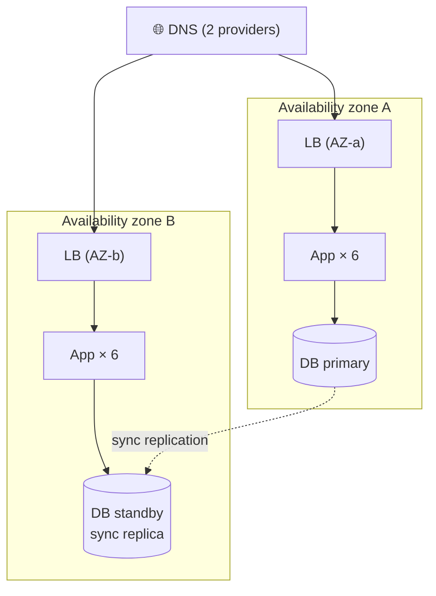

# 065 · Redundancy, Failover & Single Points of Failure

> ⏱ 9 min · 📈 65% · 🅰️ Part A (core) · Phase 08: Reliability, Security & Ops
>
> `█████████████░░░░░░░` 65% of the whole guide

---

## 📖 Story

Saturday, 6:45 p.m. Fifteen minutes before peak dinner.

The primary database's NVMe drive **dies**. Not slowly. One moment it's serving 9,000 queries a second, and the next it's a brick.

There is **no standby**. Read replicas, yes, but nothing configured to take over writes. Maya, on call, watches the error graph go vertical while she restores the last nightly snapshot and replays the write-ahead log, one painful segment at a time.

**Ninety minutes** of total darkness. On a Saturday. At dinnertime.

The next morning, sleepless, coffee in hand, she opens a blank document and types the question that I believe starts every reliability project, and that I want you to ask of every design you ever draw:

**"What else do we only have *one* of?"**

The list is longer than she'd like.

## 🎯 One-sentence idea

**A single point of failure is any component whose death takes down the whole system, and you remove it with redundancy, health detection, and automatic failover, spreading the copies across independent failure domains (hosts, racks, availability zones).**

## 🧸 Analogy

A **passenger plane**:

- **Two engines**: one fails, and it keeps flying.
- **Two pilots**: either can fly alone (active-active).
- A **backup generator** that switches on only if the main one fails (active-passive).
- Engines on **different wings**: one bird strike can't take out both (failure domains).

Would you board a plane with **one** of anything critical?

## 🖼️ Visual

*Diagram brief:* two availability zones side by side, each with its own load balancer and app servers. The primary database is in one zone and its synchronous standby in the other, joined by a replication line. Two DNS providers sit above both.



## 🔬 How it works

- **Hunt the SPOFs** by walking the request path and asking "if this dies, then what?": the DB primary, a single LB, one AZ/region, a single DNS provider, a NAT gateway, a **shared config service**, **certificates**, the deploy pipeline, and **people** (one admin with the keys is a SPOF too).
- **Active-active** (every copy serves, and a failure only reduces capacity) suits stateless tiers. **Active-passive** (hot/warm/cold standby takes over) suits stateful primaries, but failover takes time and the idle standby costs money.
- **N+1 / N+2 capacity:** after losing a unit, an AZ, or a node **at peak**, the survivors must still carry the load. Otherwise failover just moves the outage.
- **Failure domains:** host → rack → **AZ** → region. **Correlated failures** (power, a bad deploy, a config push) hit everything inside one domain, so three replicas in one rack ≈ one replica.
- **Failover mechanics:**
  1. **Detect:** heartbeats and health checks.
  2. **Decide:** automatically, with a **quorum** so you never get split brain.
  3. **Redirect:** the LB removes the target, a VIP moves, DNS changes, or a replica is promoted.
  4. **Fence the old primary** (lesson 086).
  5. **Test it constantly**, with chaos experiments and game days.

## 🧩 Worked example

**Maya's SPOF audit:**

| Component | Redundant? | Fix |
|---|---|---|
| DNS (one provider) | ❌ | Secondary provider |
| Load balancer | ✅ managed, multi-AZ | — |
| App servers (all in AZ-a) | ⚠️ | Spread across 3 AZs |
| Postgres primary | ❌ | **Sync standby in AZ-b + Patroni auto-failover + fencing** |
| Redis (single node) | ❌ | Replica + failover, *or* tolerate its loss (it's a cache) |
| Cron box | ❌ | Leader-elected scheduler |
| TLS certificate | ⚠️ manual | Automated renewal + expiry alerts |
| Production access (one person) | ❌ human SPOF | Runbooks, two on-call engineers, break-glass access |

**Capacity for losing an AZ:**

```
Peak needs 12 app servers.
3 AZs: lose one → 2 must carry 12 → 6 per AZ → 18 total (+50%)
4 AZs: lose one → 3 must carry 12 → 4 per AZ → 16 total (+33%)
```

**Saturday, replayed with the standby:** the disk dies → Patroni promotes the standby in **~20 s** → zero committed writes lost (synchronous) → customers see **~20 s** of retried writes instead of **90 minutes** of darkness.

## ⚖️ Trade-offs

| Maya's choice | What she gains | What she pays |
|---|---|---|
| Active-active | No failover gap, all capacity used | Hard for stateful data (conflicts) |
| Active-passive | Simple for databases | Failover delay, idle cost |
| Multi-AZ | Survives a datacenter failure | ~1–2 ms cross-AZ latency, transfer fees |
| Multi-region | Survives region failures | Much more complexity (lesson 066) |
| Automatic failover | Fast recovery | False failovers, split-brain risk |

## 🌍 Real world

- **AWS** recommends multi-AZ for all production workloads. Single-AZ deployments take the worst hits in AZ outages.
- **Netflix Chaos Monkey** randomly kills production instances to force failure-tolerant design.
- **Facebook's 2021 outage** showed how shared dependencies (DNS, internal tooling, even badge access) become a hidden SPOF.

## 📌 Cheat card

> - **SPOF = "if this dies, everything dies."** That includes DNS, certificates, cron, and people.
> - **Active-active** (all serve) vs **active-passive** (a standby takes over).
> - Spread across **failure domains**: host → rack → **AZ** → region.
> - **N+1 at peak.**
> - **Untested failover = no failover.**

## 🧪 Feynman check

Explain the airplane, and why two engines on the *same* wing are far less safe than one on each.

⚠️ **Common confusion:** "We have 3 replicas, so we're redundant." Not if all three share a rack, an AZ, a config service, or a deploy wave. **Correlated failures** defeat naive redundancy. Count *independent* failure domains, not copies.

## ⚡ Quick recall

1. What's the difference between active-active and active-passive?
<details><summary>Reveal Answer</summary>

Active-active: all copies serve traffic simultaneously. Active-passive: a standby takes over only when the primary fails.
</details>

2. What is a failure domain?
<details><summary>Reveal Answer</summary>

A group of components that can fail together (host, rack, AZ, region). Redundant copies belong in different domains.
</details>

3. Why plan capacity for failover?
<details><summary>Reveal Answer</summary>

After losing a node or AZ, the survivors must carry peak load, or the failover just moves the outage.
</details>

## 🎤 Interview practice

**Q. "Find the SPOFs in DNS → one LB → 5 app servers → one Postgres → one Redis, and tell me how you'd prove the failover actually works."**
<details><summary>Model answer</summary>

- **The SPOFs and their fixes:**
  - **One LB** → a managed multi-AZ LB, or an active-passive pair with a floating IP.
  - **One Postgres** → a **sync standby in another AZ**, consensus-backed auto-failover (Patroni/etcd or managed), **fencing**, plus backups and **PITR**.
  - **One Redis** → a replica + automatic failover, **or** design the app to survive cache loss (DB fallback with concurrency limits and single-flight).
  - **App servers** → confirm they span ≥ 2–3 AZs with **N+1 capacity at peak**.
  - **DNS** → add a secondary provider.
  - Don't forget **secrets and config stores, CI/CD, monitoring, certificates, and people**.
- **What failover feels like:** ~10–60 s of write errors during DB promotion. Clients retry **idempotent** writes with backoff, and non-urgent writes can queue.
- **Proving it works:**
  - **Game days:** deliberately kill a DB primary, an instance, or an entire AZ, first in staging, then in production with guardrails and a kill switch.
  - **Chaos tooling** (Chaos Monkey, Gremlin, AWS FIS) for continuous, randomized injection.
  - **Measure** detection time, failover time, data loss, and customer impact against **RTO/RPO**.
  - Turn every gap into runbook updates and postmortem actions.
- **Likely follow-up:** "Isn't breaking production reckless?" → it's far riskier to discover a broken failover during a real outage at 3 a.m. Start small, run it in business hours, and keep the team ready.
</details>

## 📖 Teaser

> 📖 *Every component now has a twin, and then an entire cloud region goes dark, taking every twin, every replica, and every backup with it.*

---

⬅️ [064 · Circuit Breakers & Bulkheads](064-circuit-breakers-and-bulkheads.md) · 🗺️ [Phase map](README.md) · ➡️ [✅ Checkpoint 65%](checkpoint-65.md)

✅ **Safe stopping point.** Tick lesson 065 in [PROGRESS.md](../../PROGRESS.md), then do the checkpoint!
