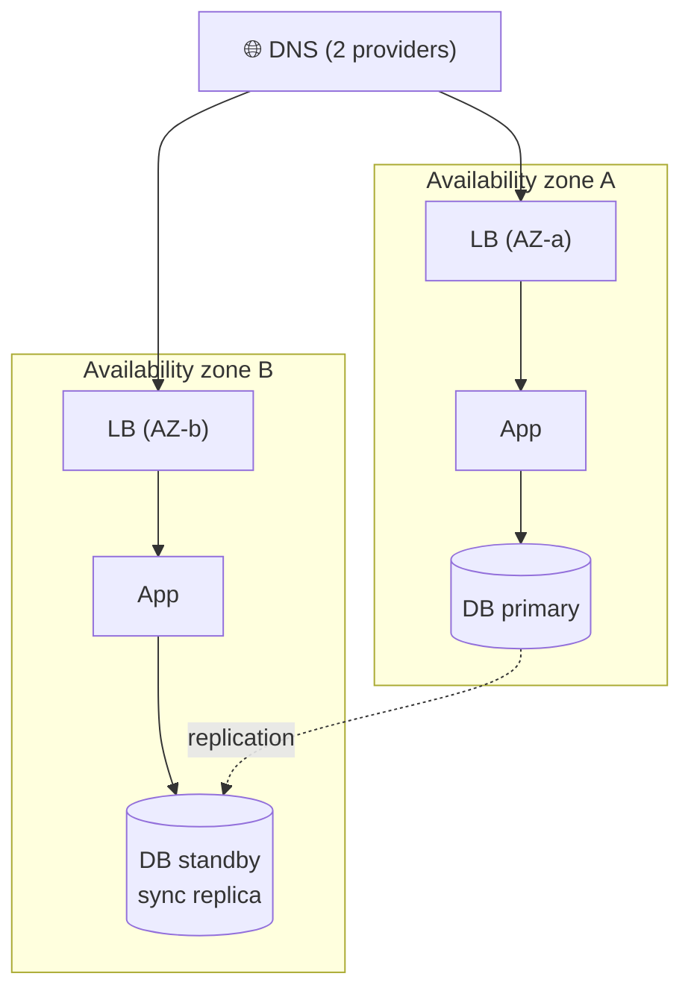

# 065 · Redundancy, Failover & Single Points of Failure

> ⏱ 9 min · 📈 65% · 🅰️ Part A (core) · Phase 08: Reliability, Security & Ops
>
> `█████████████░░░░░░░` 65% of the whole guide

---

## 📖 Story

At 6:45 pm, the primary database's disk failed. There was no standby. Pantry was down for ninety minutes while Priya restored from a backup. The next morning, Leo asked the question that I believe starts every reliability project, and that I want you to ask of every design: "What else do we only have *one* of?"

## 🎯 One-sentence idea

**A single point of failure (SPOF) is any component whose failure takes down the whole system. Remove SPOFs with redundancy (spare copies), health detection, and automatic failover, and spread the copies across failure domains (machines, racks, availability zones).**

## 🧸 Analogy

A **passenger plane**:

- It has **two engines** (redundancy). One fails? It keeps flying.
- **Two pilots** (active-active: both work, and either can fly alone).
- A **backup generator** that only switches on if the main one fails (active-passive).
- The engines are on **different wings** (different failure domains). One bird strike doesn't take out both.

Would you fly on a plane with **one** of anything critical? That's a SPOF.

## 🖼️ Visual



## 🔬 How it works

- **Find the SPOFs:** walk the request path and ask, "if this dies, what happens?" Common SPOFs: a single DB primary, a single LB, one AZ or region, a single DNS provider, a single NAT gateway, **a shared config service**, **a single person with the access** (human SPOFs are real!), certificates, and a deploy pipeline.
- **Redundancy patterns:**
  - **Active-active:** all copies serve traffic, and a failure just reduces capacity. ✅ Instant, uses all resources. ❌ Needs stateless design or multi-writer data handling.
  - **Active-passive (hot/warm/cold standby):** the standby takes over on failure. ✅ Simpler for stateful things (DB primaries). ❌ Failover takes time, and the idle standby costs money.
  - **N+1 / N+2 capacity:** enough spare capacity to lose 1 (or 2) units at peak.
- **Failure domains:** spread the copies across **hosts → racks → availability zones → regions**. Correlated failures (a power loss, a bad deploy, a config push) hit everything in a domain.
- **Failover mechanics:** **health checks / heartbeats** → **decision** (automatic, with a quorum to avoid split brain) → **redirect traffic** (LB removes a target, DNS updates, a floating IP moves, the DB promotes a replica) → **fencing** of the old primary (lesson 086).
- **Test it:** untested failover doesn't work. Use **chaos engineering** (kill instances or AZs on purpose, e.g., Netflix Chaos Monkey) and regular **game days**.
- **Don't forget:** capacity after failover (can one AZ handle the full load?), data replication mode (can failover lose data?), and dependencies (does the standby need the same secrets, config, and quotas?).

## 🧩 Worked example

**SPOF audit of a "simple" web app:**

| Component | Redundant? | Fix |
|---|---|---|
| DNS (one provider) | ❌ | Secondary DNS provider |
| Load balancer | ✅ Managed, multi-AZ | — |
| App servers (3, all in AZ-a) | ⚠️ One AZ | Spread across 3 AZs |
| Postgres primary | ❌ | Sync standby in another AZ + automatic failover |
| Redis (single node) | ❌ | Replica + Sentinel/Cluster, or tolerate its loss (it's a cache) |
| Cron server | ❌ | Scheduler with leader election, or a managed scheduler |
| TLS certificate | ⚠️ Manual renewal | Automate + expiry alerts |
| Deploy access (one admin) | ❌ Human SPOF | Documented runbooks, multiple on-call |

**Capacity math for AZ failure (N+1 at the AZ level):**

```
Peak needs 12 app servers. Spread across 3 AZs.
Lose 1 AZ → the remaining 2 AZs must carry 12 → need 6 per AZ → 18 total (50% over)
Or 4 AZs: lose 1 → 3 must carry 12 → 4 per AZ → 16 total (33% over)
```

## ⚖️ Trade-offs

| Choice | Gain | Cost |
|---|---|---|
| Active-active | No failover gap, uses all capacity | Complex for stateful systems (conflicts) |
| Active-passive | Simple for databases | Failover delay, idle cost |
| Multi-AZ | Survives datacenter failures | Cross-AZ latency (~1–2 ms) and data transfer cost |
| Multi-region | Survives region failures | Much more complex (lesson 066) |
| Auto failover | Fast recovery | Risk of false failovers and split brain |

## 🌍 Real world

- **AWS recommends multi-AZ** for anything production. Many major outages hit single-AZ deployments hardest.
- **Netflix Chaos Monkey/Simian Army** randomly kills production instances so engineers must design for failure.
- The **2021 Facebook outage** took down DNS and internal tools together, which showed how shared dependencies become SPOFs.

## 📌 Cheat card

> - **SPOF = "if this dies, everything dies."** Find them all, including DNS, certificates, cron, and people.
> - **Active-active** (all serve) vs **active-passive** (standby takes over).
> - **Spread across failure domains:** host → rack → **AZ** → region.
> - **N+1 capacity:** survive losing one unit *at peak*.
> - **Untested failover = no failover.** Use chaos engineering and game days.

## 🧪 Feynman check

Explain the airplane analogy, and why two engines on the *same* wing would be much less safe than one on each wing.

⚠️ **Common confusion:** "We have 3 replicas, so we're redundant." Not if all 3 are in the same rack or AZ, share a single config service, or get the same bad deploy at once. **Correlated failures** defeat naive redundancy.

## ⚡ Quick recall

1. Active-active vs active-passive?
<details><summary>Answer</summary>

Active-active: all copies serve traffic simultaneously. Active-passive: a standby takes over only when the primary fails.
</details>

2. What is a failure domain?
<details><summary>Answer</summary>

A group of components that can fail together (a host, rack, AZ, or region). Spread redundant copies across different domains.
</details>

3. Why must you plan capacity for failover?
<details><summary>Answer</summary>

After losing a node or AZ, the survivors must handle the full peak load, or failover just moves the outage.
</details>

## 🎤 Interview practice

**Q1. "Identify the single points of failure in this design: DNS → one LB → 5 app servers → one Postgres → one Redis."**
<details><summary>Model answer</summary>

- **One LB** → use a managed multi-AZ LB, or a pair with a floating IP.
- **One Postgres** → a synchronous standby in another AZ with automatic failover (+ fencing), plus backups and PITR.
- **One Redis** → a replica + automatic failover, *or* make the app tolerate cache loss (fall back to the DB with load protection).
- **App servers:** check they span AZs.
- **DNS:** a single provider? Add a secondary.
- Also: secrets and config stores, CI/CD, and the monitoring itself.
- **Likely follow-up:** "What happens during the DB failover?" → ~10–60 s of write errors. Retry idempotent operations, and queue writes if possible.
</details>

**Q2. "How would you verify that your failover actually works?"**
<details><summary>Model answer</summary>

- **Scheduled game days:** deliberately fail a DB primary, an AZ, or a dependency, in staging and then production (with guardrails).
- **Chaos engineering tools** (Chaos Monkey, Gremlin, AWS FIS): automated, randomized failure injection.
- Measure the **detection time, failover time, data loss, and customer impact** against the RTO/RPO targets.
- Keep runbooks up to date, and do postmortems for the gaps.
- **Likely follow-up:** "Isn't breaking production risky?" → start small (one instance, low traffic), have a kill switch, and do it during business hours with the team ready. It's safer than discovering the gaps during a real outage.
</details>

> 📖 *Next, an entire cloud region goes dark.*

---

⬅️ [064 · Circuit Breakers & Bulkheads](064-circuit-breakers-and-bulkheads.md) · 🗺️ [Phase map](README.md) · ➡️ [✅ Checkpoint 65%](checkpoint-65.md)

✅ **Safe stopping point.** Tick lesson 065 in [PROGRESS.md](../../PROGRESS.md), then do the checkpoint!
