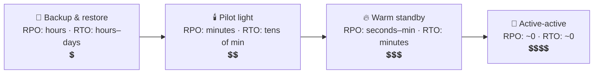

# 066 · Multi-Region & Disaster Recovery (RPO / RTO)

> ⏱ 10 min · 📈 66% · 🅰️ Part A (core) · Phase 08: Reliability, Security & Ops
>
> `█████████████░░░░░░░` 66% of the whole guide

---

## 📖 Story

10:14 a.m. The cloud provider's status page turns from green to amber to red: **"Increased error rates in us-east-1."**

Maya refreshes Pantry's dashboard. Blank. Not degraded: **gone**. Every app server, every database, every replica, every standby, and, she realizes with a sinking feeling, **every backup** lives in that one region. She'd built twins for everything, then put all the twins in the same house.

For **six hours** Pantry simply doesn't exist. No menus. No orders. No payouts for cooks.

When the region recovers, the board asks two crisp questions:

*"How much data could we have lost? And how long could we have been down?"*

Maya has no numbers. Only a shrug and a very long night behind her.

I told her she needed **two numbers and a plan**. Let me give you both.

## 🎯 One-sentence idea

**Disaster recovery plans for losing a whole datacenter or region, where RPO is how much data you can afford to lose and RTO is how long you can afford to be down, and those two numbers decide between simple backups, a standby region, or active-active multi-region.**

## 🧸 Analogy

Protecting your **family photos**:

- 📀 **Backup & restore:** copy to a USB drive **every Sunday**. Lose the laptop on Saturday → **6 days** of photos gone (RPO), and **an afternoon** to restore (RTO).
- ☁️ **Warm standby:** photos **sync to the cloud continuously**, and a spare laptop waits. You lose **minutes**, and you're back in **an hour**.
- 🔁 **Active-active:** use **two laptops at once**, always in sync. You lose **almost nothing**, with **no downtime**, at double the cost.

## 🖼️ Visual

*Diagram brief:* a timeline with a 💥 in the middle. To its left, the RPO window (data written here may be lost). To its right, the RTO window (dark until service returns). Below, a four-step ladder of strategies, cost rising as RPO and RTO shrink.

```
          ◀────────── RPO ──────────▶│◀────────── RTO ──────────▶
  last recoverable point              │ disaster   ...   service restored
  (writes after it may be lost)       💥
```



## 🔬 How it works

- **RPO** is the max acceptable **data loss in time**, set by backup frequency and replication lag. **RTO** is the max acceptable **downtime**, set by how warm the standby is and how automated the failover is.
- **The DR ladder:** **backup & restore** (snapshots + logs copied cross-region, rebuild on disaster) → **pilot light** (data continuously replicated, minimal infra kept dormant) → **warm standby** (a scaled-down running copy, scale up and switch) → **active-active** (full capacity in 2+ regions).
- **Cross-region physics:** **~60–150 ms** RTT makes synchronous replication expensive, so most setups replicate **asynchronously** (RPO > 0). RPO ≈ 0 needs **global consensus** (Spanner/CockroachDB) or sync to a nearby region, and every write pays the latency.
- **Active-active data:** a **home region per user** (no conflicts), CRDTs, or consensus. Traffic moves via **global LB / Anycast / health-checked GeoDNS**. Respect **data residency** (GDPR).
- **Replication ≠ backup:** a bad migration, ransomware, or `DROP TABLE` **replicates in milliseconds**. Keep **point-in-time recovery** and **immutable, cross-account** backups (the **3-2-1 rule**: 3 copies, 2 media/services, 1 off-site or immutable), and **test restores** regularly.

## 🧩 Worked example

**Maya's DR tiers:**

| Service | RPO | RTO | Strategy |
|---|---|---|---|
| Orders, payments | ≤ 1 min | ≤ 15 min | **Warm standby** in us-west, async replication (lag < 1 s), automated global-LB failover |
| Dish catalogue | 1 h | 1 h | Pilot light + CDN keeps serving cached pages |
| Analytics warehouse | 24 h | 1–2 days | Backup & restore |
| Sessions | Lose all | Minutes | None (users log in again) |

**PITR saves a bad Tuesday:**

```
Continuous WAL archiving → object storage in ANOTHER region + account, nightly base snapshot
Accidental DELETE at 14:03:27 → restore snapshot + replay WAL to 14:03:26 → data back ✅
(Replicas deleted the rows everywhere within ~50 ms ❌)
```

**The next region outage, replayed:** health checks fail → the global LB shifts traffic to us-west in **~2 min** → the standby scales from 30% to 100% in **~8 min** → **RTO ≈ 10 min, RPO ≈ 1 s**, against six hours of darkness last time.

## ⚖️ Trade-offs

| Strategy | RPO | RTO | Cost | Complexity |
|---|---|---|---|---|
| Backup & restore | Hours | Hours–days | 💲 | 🟢 |
| Pilot light | Minutes | Tens of min | 💲💲 | 🟡 |
| Warm standby | Seconds–min | Minutes | 💲💲💲 | 🟡 |
| Active-active | ~0 | ~0 | 💲💲💲💲 | 🔴 conflicts, routing |

## 🌍 Real world

- **Netflix** runs active-active across AWS regions and can **evacuate a region in minutes**.
- The **2017 AWS S3 us-east-1 outage** knocked out countless single-region sites.
- **GitLab's 2017 incident:** an accidental deletion, and multiple backup methods turned out to be broken. The lesson: **test your restores**.

## 📌 Cheat card

> - **RPO = data you lose. RTO = time you're down.** ("**P**oint vs **T**ime")
> - **Backup → pilot light → warm standby → active-active** (cost ↑, RPO/RTO ↓).
> - Cross-region ≈ **60–150 ms** → usually async → **RPO > 0**.
> - **Replication ≠ backup.** Keep **PITR + immutable backups**.
> - **3-2-1 rule. Test restores.**

## 🧪 Feynman check

Explain RPO and RTO with the family photos, and why a live synced copy doesn't protect you from accidentally deleting a photo.

⚠️ **Common confusion:** "Multi-AZ is disaster recovery." Multi-AZ survives a **datacenter**. A **region** outage, a bad deploy, or logical corruption needs **cross-region DR plus point-in-time backups**, stored somewhere a compromised account can't delete.

## ⚡ Quick recall

1. Define RPO and RTO.
<details><summary>Reveal Answer</summary>

RPO: the max acceptable data loss (time since the last recoverable point). RTO: the max acceptable time to restore service.
</details>

2. Why is replication not a substitute for backups?
<details><summary>Reveal Answer</summary>

Replication copies mistakes and corruption instantly. Backups with point-in-time recovery let you restore to before the mistake.
</details>

3. Why do most multi-region setups replicate asynchronously?
<details><summary>Reveal Answer</summary>

Synchronous replication would add the cross-region round trip (~60–150 ms) to every write.
</details>

## 🎤 Interview practice

**Q. "The business demands: no lost orders, and back within 5 minutes if a region fails. Design it. Also: a migration corrupted the users table two hours ago. Recover it."**
<details><summary>Model answer</summary>

- **RPO ≈ 0 for orders:**
  - **Synchronous cross-region commit**: a consensus DB spanning **3 regions** (Spanner/CockroachDB, majority = 2 regions), or a sync replica in a **nearby** region.
  - The cost: **+20–100 ms per write**. Confirm the business truly needs zero loss for *orders* (not catalogue or analytics).
- **RTO ≤ 5 min:**
  - **Warm or active standby** at near-full capacity.
  - **Automated health-based traffic shift** (global LB / Anycast, or DNS with low TTLs).
  - Secrets, config, quotas, and container images **pre-replicated**.
  - Runbooks + **quarterly region-evacuation drills**.
  - Cheaper tiers for non-critical services.
- **The corrupted users table:**
  1. **Stop the bleeding:** halt the migration, jobs, or writes causing damage.
  2. **PITR to a separate instance** at the moment just before the migration (base snapshot + WAL replay).
  3. **Diff and surgically restore** the affected rows and columns into production, preserving legitimate writes from the last two hours. Do a full restore only if the corruption is widespread **and** the business accepts losing that window.
  4. **Why not fail over to a replica?** It faithfully received the same corruption.
  5. **Postmortem:** reversible, batched migrations, reviews, and **tested** PITR.
- **Likely follow-up:** "Where do backups live?" → a different region **and** a different account, with object lock (immutable), so ransomware or a compromised admin can't delete them.
</details>

## 📖 Teaser

> 📖 *Pantry can survive a whole region vanishing now, yet the team still learns about most incidents from angry tweets instead of from their own dashboards.*

---

⬅️ [✅ Checkpoint 65%](checkpoint-65.md) · 🗺️ [Phase map](README.md) · ➡️ [067 · Observability](067-observability.md)

✅ **Safe stopping point.** Tick lesson 066 in [PROGRESS.md](../../PROGRESS.md).
