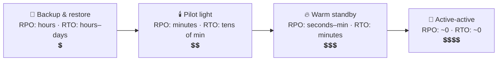

# 066 · Multi-Region & Disaster Recovery (RPO / RTO)

> ⏱ 10 min · 📈 66% · 🅰️ Part A (core) · Phase 08: Reliability, Security & Ops
>
> `█████████████░░░░░░░` 66% of the whole guide

---

## 📖 Story

A major cloud region suffered an outage, and every Pantry server, database, and backup lived in that region. For six hours, Pantry simply didn't exist. Leo asked, "How much data could we lose, and how long could we be down?" I told Maya she needed two numbers and a plan. Let me give you both.

## 🎯 One-sentence idea

**Disaster recovery plans for losing a whole datacenter or region. RPO is how much data you can afford to lose, and RTO is how long you can afford to be down. Those two numbers decide whether you need simple backups, a standby region, or fully active-active multi-region.**

## 🧸 Analogy

Protecting your **family photos**:

- 📀 **Backup & restore:** you copy them to a USB drive **every Sunday**. If the laptop dies on Saturday, you lose **up to 6 days of photos** (RPO ≈ a week), and restoring takes **an afternoon** (RTO ≈ hours).
- ☁️ **Pilot light / warm standby:** photos **sync to the cloud continuously**, and a spare laptop sits ready. You lose **minutes** of photos, and you're back in **an hour**.
- 🔁 **Active-active:** you use **two laptops at once**, always in sync. One dies, and you just keep working on the other. You lose **almost nothing**, with **no downtime**, and it costs twice as much.

## 🖼️ Visual

```
          ◀────────── RPO ──────────▶│◀────────── RTO ──────────▶
  last good backup / replicated point │ disaster   ...   service restored
  (data written here may be lost)     💥
```



## 🔬 How it works

- **RPO (Recovery Point Objective):** the max acceptable **data loss**, measured in time ("we can lose at most 5 minutes of orders"). It's driven by **backup frequency / replication lag**.
- **RTO (Recovery Time Objective):** the max acceptable **downtime** ("back within 30 minutes"). It's driven by **how ready the standby is** and **how automated failover is**.
- **DR strategies (cheapest → most robust):**
  1. **Backup & restore:** regular snapshots + logs to another region. Rebuild everything after a disaster.
  2. **Pilot light:** core data is continuously replicated to region B, and minimal infrastructure is kept "off" and scaled up on disaster.
  3. **Warm standby:** a scaled-down but running copy in region B. Scale it up and switch traffic.
  4. **Multi-site active-active:** full capacity in 2+ regions serving users simultaneously.
- **Multi-region data challenges:**
  - Cross-region latency (**~60–150 ms**) makes **synchronous** replication slow, so most use **async** replication, which means non-zero RPO.
  - Active-active writes need **conflict handling** (a home region per user, CRDTs) or **global consensus databases** (Spanner, CockroachDB) that pay latency on writes.
  - **Data residency** laws (GDPR) may require keeping some data in certain regions.
- **Traffic failover:** DNS/GeoDNS with health checks, Anycast, or global load balancers.
- **Backups ≠ DR unless restores are tested.** Also protect against **logical disasters** (a bad migration, ransomware, or an accidental `DROP TABLE`, which gets replicated instantly!) with **point-in-time recovery** and immutable, offline backups.
- **The 3-2-1 backup rule:** 3 copies, on 2 different media or services, 1 off-site (or offline/immutable).

## 🧩 Worked example

**Choosing DR per service at an online store:**

| Service | RPO | RTO | Strategy |
|---|---|---|---|
| Checkout / orders | ~0–1 min | < 15 min | Warm standby region, async replication with small lag (or a consensus DB), automated failover |
| Product catalog | 1 hour | 1 hour | Pilot light, rebuild from replicated DB + CDN serving cached pages |
| Analytics warehouse | 24 h | 1–2 days | Backup & restore |
| User sessions | Can lose all | Minutes | No DR (users log in again) |

**PITR (point-in-time recovery):**

```
Continuous WAL archiving to object storage in another region + a nightly base snapshot
Accidental DELETE at 14:03:27 → restore the snapshot + replay WAL up to 14:03:26 → recovered ✅
(Replication alone would have replicated the DELETE everywhere within milliseconds ❌)
```

## ⚖️ Trade-offs

| Strategy | RPO | RTO | Cost | Complexity |
|---|---|---|---|---|
| Backup & restore | Hours | Hours–days | 💲 | 🟢 Low |
| Pilot light | Minutes | 10s of minutes | 💲💲 | 🟡 |
| Warm standby | Seconds–minutes | Minutes | 💲💲💲 | 🟡 |
| Active-active | ~0 | ~0 | 💲💲💲💲 | 🔴 High (data conflicts, routing) |

## 🌍 Real world

- **Netflix** runs active-active across multiple AWS regions, and can evacuate a region in minutes.
- **The 2017 AWS S3 us-east-1 outage** took down many sites that depended on a single region.
- **GitLab's 2017 database incident:** an accidental deletion, and several backup mechanisms turned out not to be working. The lesson was "test your restores".

## 📌 Cheat card

> - **RPO = how much data you lose. RTO = how long you're down.** ("**P**oint vs **T**ime")
> - Ladder: **backup → pilot light → warm standby → active-active** (cost ↑, RPO/RTO ↓).
> - Cross-region = **~60–150 ms** → usually **async** → RPO > 0.
> - **Replication ≠ backup.** Bad deletes replicate too, so keep **PITR + immutable backups**.
> - **3-2-1 rule.** **Test your restores.**

## 🧪 Feynman check

Explain RPO and RTO with the family-photos story, and why having a live copy (replication) doesn't protect you from accidentally deleting a photo.

⚠️ **Common confusion:** "Multi-AZ is disaster recovery." Multi-AZ protects against a **datacenter** failure. Region-wide outages, bad deploys, and logical corruption need **cross-region** DR and **backups**.

## ⚡ Quick recall

1. Define RPO and RTO.
<details><summary>Answer</summary>

RPO: the max acceptable data loss (time since the last recoverable point). RTO: the max acceptable time to restore service.
</details>

2. Why is replication not a substitute for backups?
<details><summary>Answer</summary>

Replication copies mistakes and corruption (like deletes) instantly. Backups with point-in-time recovery let you restore to before the mistake.
</details>

3. Why do most multi-region setups use async replication?
<details><summary>Answer</summary>

Synchronous replication would add the cross-region round trip (~60–150 ms) to every write.
</details>

## 🎤 Interview practice

**Q1. "The business says: 'We can't lose any orders and must be back up within 5 minutes if a region fails.' Design it."**
<details><summary>Model answer</summary>

- RPO ≈ 0 across regions means **synchronous cross-region commit** for orders: a consensus-based DB spanning 3 regions (Spanner/CockroachDB, a majority of regions), or a sync replica in a nearby region (with the latency cost accepted).
- RTO ≤ 5 min means a **warm or active standby** with automated health-based traffic failover (global LB / DNS with low TTLs), pre-scaled capacity, and replicated secrets and config.
- Keep the non-critical data (catalog, analytics) on cheaper DR tiers.
- Regular failover drills, and runbooks.
- **Likely follow-up:** "What's the cost?" → higher write latency (tens to 100+ ms) and ~2–3× infrastructure. Confirm the business really needs RPO = 0 for orders.
</details>

**Q2. "An engineer ran a migration that corrupted the users table 2 hours ago. How do you recover?"**
<details><summary>Model answer</summary>

- **Stop the bleeding:** halt the writes or jobs causing more damage.
- **Point-in-time restore** to a **separate** instance at the moment just before the migration (base snapshot + WAL replay).
- Compare and **surgically restore** the affected rows or columns into production (keeping the legitimate writes from the last 2 hours), or do a full restore if the corruption is widespread and the business accepts losing 2 hours.
- Postmortem: safer migrations (backfills in batches, reversible steps, reviews), and tested PITR.
- **Likely follow-up:** "Why not fail over to a replica?" → replicas received the same corruption.
</details>

> 📖 *Next, the team keeps learning about problems from angry customers instead of from dashboards.*

---

⬅️ [✅ Checkpoint 65%](checkpoint-65.md) · 🗺️ [Phase map](README.md) · ➡️ [067 · Observability](067-observability.md)

✅ **Safe stopping point.** Tick lesson 066 in [PROGRESS.md](../../PROGRESS.md).
