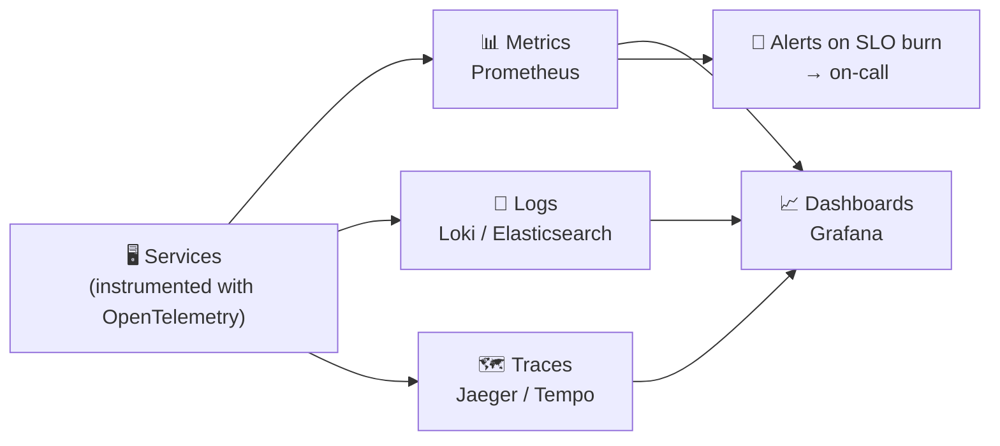

# 067 · Observability: Metrics, Logs, Traces

> ⏱ 10 min · 📈 67% · 🅰️ Part A (core) · Phase 08: Reliability, Security & Ops
>
> `█████████████░░░░░░░` 67% of the whole guide

---

## 📖 Story

For the third time that month, Pantry learned about an outage from social media before a single alarm went off. And when the site was slow, nobody could tell *which* of 30 services was to blame. I've been in that war room, and it's miserable. Maya needed a way to see inside the system.

## 🎯 One-sentence idea

**Observability is being able to understand what your system is doing from the outside. Metrics tell you *that* something is wrong, traces show *where*, and logs explain *why*. Alerts should fire on user-visible symptoms (SLOs), not on every twitch.**

## 🧸 Analogy

A **car**:

- 📊 **Metrics = the dashboard gauges:** speed, fuel, engine temperature. Numbers over time, cheap to watch constantly. "The engine's overheating!"
- 🗺️ **Traces = a GPS trip record:** exactly which roads you took and how long each stretch took. "The slowdown was on Main Street."
- 📓 **Logs = the mechanic's detailed diary:** "14:03 coolant pump made a grinding noise; pressure dropped to 0.2 bar." Rich detail about specific events.
- 🚨 **Alerts = the warning lights.** You want them for real problems ("oil pressure low"), not blinking every time you brake.

## 🖼️ Visual



**A trace (one request's journey):**

```
GET /checkout  ─────────────────────────────────── 820 ms
 ├─ auth-service                ── 20 ms
 ├─ cart-service                ──── 60 ms
 ├─ pricing-service             ────────── 150 ms
 └─ payment-service             ─────────────────────── 560 ms  ← the culprit
      └─ SELECT ... FOR UPDATE  ─────────────────── 480 ms (lock wait)
```

## 🔬 How it works

- **Metrics:** numeric time series with labels (`http_requests_total{service, route, status}`). Types: **counters, gauges, histograms** (for latency percentiles).
  - Cheap to store and query, and ideal for dashboards and alerts. **Keep cardinality bounded** (lesson 044).
  - **The four golden signals ("LETS"):** **L**atency, **E**rrors, **T**raffic, **S**aturation.
  - **RED** (for services): **R**ate, **E**rrors, **D**uration. **USE** (for resources): **U**tilization, **S**aturation, **E**rrors.
- **Logs:** timestamped event records. Use **structured (JSON)** logs with a **request/trace ID** for correlation.
  - Rich context, but expensive at volume, so use **levels**, **sampling**, and **retention** policies.
  - Never log secrets or personal data (tokens, passwords, card numbers).
- **Distributed traces:** a **trace ID** propagated through every service call (W3C `traceparent` header). Each hop creates a **span** with its timing.
  - Pinpoints which service or query is slow in a microservice call graph.
  - **Sampling** (head- or tail-based) keeps costs manageable. Keep all errors and slow traces.
- **OpenTelemetry:** the vendor-neutral standard SDKs and collector for all three signals.
- **Alerting philosophy:**
  - Alert on **symptoms users feel** (SLO burn rate, error rate, p99 latency), not causes (CPU at 80%).
  - Every page must be **actionable**, with a **runbook**. Avoid alert fatigue.
  - **Multi-window burn-rate alerts:** fast burn → page now. Slow burn → ticket.
- **Also:** health dashboards per service, **synthetic monitoring** (fake users probing from outside), **real user monitoring (RUM)**, and **profiling**.

## 🧩 Worked example

**Structured log line with a trace ID:**

```json
{"ts":"2026-10-01T12:00:03.112Z","level":"error","service":"payment",
 "trace_id":"4bf92f3577b34da6a3ce929d0e0e4736","user_id":"u_42",
 "msg":"card authorization timeout","provider":"acme-pay","latency_ms":3000}
```

**PromQL for the golden signals:**

```
# Traffic
sum(rate(http_requests_total{service="checkout"}[5m]))
# Errors (ratio)
sum(rate(http_requests_total{service="checkout",status=~"5.."}[5m])) / sum(rate(http_requests_total{service="checkout"}[5m]))
# Latency p99
histogram_quantile(0.99, sum by (le) (rate(http_request_duration_seconds_bucket{service="checkout"}[5m])))
# Saturation
avg(container_cpu_utilization{service="checkout"})
```

**SLO burn-rate alert (99.9% SLO, 30 days):**

```
Page if: error ratio over 1 h > 14.4 × 0.1%  (burning 2% of the monthly budget per hour)
      AND error ratio over 5 min > 14.4 × 0.1%  (still happening now)
```

## ⚖️ Trade-offs

| Signal | Great for | Cost / weakness |
|---|---|---|
| Metrics | Dashboards, alerts, trends | Low detail. Cardinality limits. |
| Logs | Detailed debugging, audits | Volume and cost. Hard to aggregate. |
| Traces | Finding *where* latency or errors come from | Instrumentation effort, sampling gaps |
| Many alerts | "Nothing missed" | Alert fatigue → real pages ignored |

## 🌍 Real world

- **Google SRE book** introduced the four golden signals and SLO-based alerting.
- **Dapper** (Google's tracing paper) → Zipkin → Jaeger → OpenTelemetry.
- **Datadog, New Relic, Honeycomb, Grafana stack, Splunk, Elastic** are common platforms.

## 📌 Cheat card

> - **Metrics = gauges (that), traces = GPS (where), logs = diary (why).** "**MLT**"
> - Golden signals: **LETS**: Latency, Errors, Traffic, Saturation. **RED** for services, **USE** for resources.
> - **Structured logs + trace IDs everywhere.** No secrets or PII in logs.
> - **Alert on SLO burn (symptoms), not on causes.** Every alert is actionable, with a runbook.
> - Standardize on **OpenTelemetry**.

## 🧪 Feynman check

Explain the car dashboard / GPS / mechanic's diary analogy, and why a warning light that blinks all the time is worse than no light at all.

⚠️ **Common confusion:** "Monitoring = observability." Monitoring answers **known questions** (is CPU high?). Observability lets you answer **new questions** you didn't predict ("why are only iOS users in Brazil failing checkout?") through rich, correlated telemetry.

## ⚡ Quick recall

1. Name the four golden signals.
<details><summary>Answer</summary>

Latency, errors, traffic, saturation.
</details>

2. What does a trace ID enable?
<details><summary>Answer</summary>

Correlating all the spans and logs of one request as it passes through many services, to see where time went or where it failed.
</details>

3. Why alert on symptoms rather than causes?
<details><summary>Answer</summary>

Symptoms (errors, latency, SLO burn) reflect real user impact. Cause-based alerts (CPU high) are often noisy and not actionable.
</details>

## 🎤 Interview practice

**Q1. "How would you monitor the system you just designed?"** (Asked at the end of most design interviews.)
<details><summary>Model answer</summary>

- **SLOs** for the key user journeys (e.g., 99.9% of checkouts succeed, p99 < 800 ms), with **burn-rate alerts** that page on-call.
- **Golden-signal dashboards** per service (RED), plus **USE** for the DB, cache, and queues (connection pools, replication lag, queue depth, consumer lag, cache hit ratio).
- **Distributed tracing** via OpenTelemetry, and **structured logs** with trace IDs.
- **Business metrics:** orders per minute, payment success rate (they catch silent failures).
- **Synthetic checks** from multiple regions.
- **Likely follow-up:** "Which one metric would you watch?" → the SLI for the most important user journey (e.g., successful checkouts per minute vs the forecast).
</details>

**Q2. "Users report that the app is slow, but all the dashboards are green. What do you do?"**
<details><summary>Model answer</summary>

- Dashboards may show **averages** or **server-side** metrics only, so check **p99 and p99.9**, per-region and per-client breakdowns, and **RUM** (client-side timings).
- Look at **traces** for affected users, whether sampled slow ones or found via their user IDs in logs.
- Consider paths outside your dashboards: DNS, CDN, a third-party script, mobile networks, and specific endpoints.
- Then add the missing SLI or dashboard so it's visible next time.
- **Likely follow-up:** "How do you find the needle in 1B requests?" → high-cardinality event exploration (Honeycomb-style), filtering by user, app version, region, and endpoint.
</details>

> 📖 *Next, the latest outage turns out to have started with a Friday afternoon deploy.*

---

⬅️ [066 · Multi-Region & DR](066-multi-region-and-disaster-recovery.md) · 🗺️ [Phase map](README.md) · ➡️ [068 · Deployment Strategies](068-deployment-strategies.md)

✅ **Safe stopping point.** Tick lesson 067 in [PROGRESS.md](../../PROGRESS.md).
