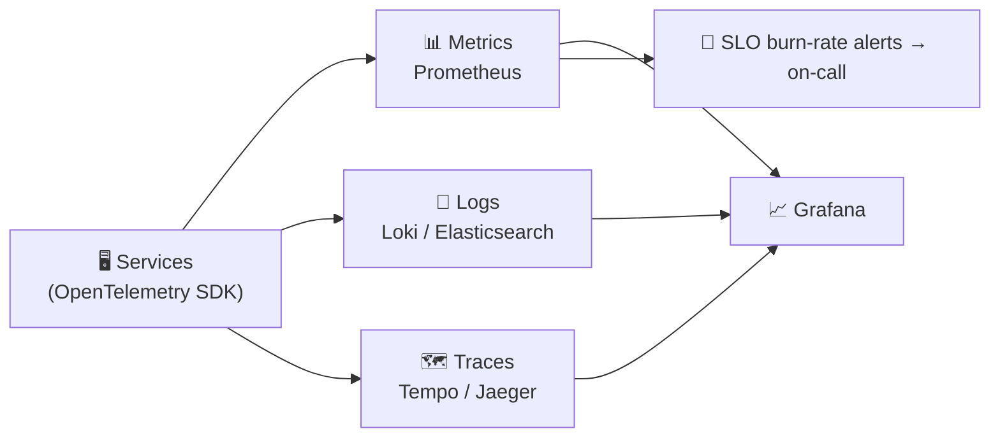

# 067 · Observability: Metrics, Logs, Traces

> ⏱ 10 min · 📈 67% · 🅰️ Part A (core) · Phase 08: Reliability, Security & Ops
>
> `█████████████░░░░░░░` 67% of the whole guide

---

## 📖 Story

For the **third time this month**, Maya learns about an outage from a stranger on social media.

*"@Pantry is your checkout broken or is it just me?? 😤"* Posted 7:12 p.m. Pantry's first internal alert fires at **7:31 p.m.**: CPU high on a database replica. Nineteen minutes of silence while customers walked away.

And once she's in the war room, it gets worse. Checkout is slow, but **which** of 30 services is to blame? Payments says *"not us."* Pricing says *"our graphs are green."* The cart team is tailing log files on six machines at once, grepping blind, like searching a dark warehouse with a match.

I've been in that war room, and it's miserable. Thirty services, a thousand dials, and no way to see the **one request** that's actually slow.

Maya needs a way to **see inside** the system: what's wrong, where it's wrong, and why.

## 🎯 One-sentence idea

**Observability means being able to understand what your system is doing from the outside: metrics tell you *that* something is wrong, traces show *where*, and logs explain *why*, and alerts should fire on user-visible symptoms (SLO burn), not on every twitch.**

## 🧸 Analogy

A **car**:

- 📊 **Metrics = dashboard gauges:** speed, fuel, temperature. Cheap to watch constantly.
- 🗺️ **Traces = a GPS trip record:** which roads, and how long each stretch took.
- 📓 **Logs = the mechanic's diary:** "14:03 coolant pump grinding, pressure 0.2 bar."
- 🚨 **Alerts = warning lights:** for real danger, not every time you brake.

## 🖼️ Visual

*Diagram brief:* services instrumented once with OpenTelemetry stream three signals into three stores, all joined in one dashboard. Below, a single waterfall trace in which one red span is obviously the villain.



```
GET /checkout  ─────────────────────────────────── 820 ms   trace_id 4bf92f…
 ├─ auth-service                ── 20 ms
 ├─ cart-service                ──── 60 ms
 ├─ pricing-service             ────────── 150 ms
 └─ payment-service             ─────────────────────── 560 ms  ← the culprit
      └─ SELECT … FOR UPDATE    ─────────────────── 480 ms (row-lock wait)
```

## 🔬 How it works

- **Metrics:** labelled time series. **Counters, gauges, and histograms** (for percentiles), with **bounded cardinality** (lesson 044). Watch the **golden signals (LETS: Latency, Errors, Traffic, Saturation)**, **RED** for services, and **USE** for resources.
- **Logs:** **structured JSON** events carrying a **`trace_id`**, with levels, sampling, and retention to control cost. **Never** log secrets, tokens, or card data.
- **Traces:** a **trace ID** travels with every call (W3C `traceparent`), and each hop records a **span**. Use **tail-based sampling** to keep all errors and slow traces. **OpenTelemetry** standardizes all three signals.
- **Alert on symptoms, not causes:** page on **SLO burn rate** (fast burn → page, slow burn → ticket), error rate, and p99. Every page must be **actionable with a runbook**. Noisy alerts train humans to ignore them.
- **See from the outside too:** **synthetic probes** (fake customers checking out every minute from several regions), **real-user monitoring**, and **business metrics** (orders/min vs forecast), which catch silent failures that technical metrics miss.

## 🧩 Worked example

```json
{"ts":"2026-10-01T19:00:03.112Z","level":"error","service":"payment",
 "trace_id":"4bf92f3577b34da6a3ce929d0e0e4736","order_id":"o_123",
 "msg":"card authorization timeout","provider":"acme-pay","latency_ms":800}
```

```
# Errors (ratio)
sum(rate(http_requests_total{service="checkout",status=~"5.."}[5m]))
  / sum(rate(http_requests_total{service="checkout"}[5m]))
# p99 latency
histogram_quantile(0.99, sum by (le) (rate(http_request_duration_seconds_bucket{service="checkout"}[5m])))
```

**Burn-rate page (99.9% SLO, 30 days):**

```
Page if error ratio(1h) > 14.4 × 0.1%   (2% of the monthly budget burning per hour)
     AND error ratio(5m) > 14.4 × 0.1%  (and it's still happening)
```

**7:12 p.m., replayed:** synthetic checkout fails at **7:13** → the burn-rate alert pages at **7:15** → Maya opens a **slow trace** → the red span is the payment service's `FOR UPDATE` lock wait → the log with the same `trace_id` names the culprit query. **Detected in 3 min, diagnosed in 9.** Not one tweet.

## ⚖️ Trade-offs

| Signal | Great for | Cost / weakness |
|---|---|---|
| Metrics | Dashboards, alerts, trends | Low detail, cardinality limits |
| Logs | Deep debugging, audits | Volume and cost, hard to aggregate |
| Traces | *Where* latency and errors originate | Instrumentation effort, sampling gaps |
| Lots of alerts | "Nothing missed" | **Alert fatigue**: real pages ignored |

## 🌍 Real world

- The **Google SRE book** introduced the golden signals and SLO burn-rate alerting.
- **Google's Dapper** paper led to Zipkin, then Jaeger, then **OpenTelemetry**.
- **Honeycomb** popularized high-cardinality, event-based debugging ("observability" in its modern sense).

## 📌 Cheat card

> - **Metrics = *that*, traces = *where*, logs = *why*.**
> - **LETS** golden signals · **RED** (services) · **USE** (resources).
> - **Structured logs + trace IDs everywhere.** No secrets or PII.
> - **Alert on SLO burn (symptoms)**, with runbooks.
> - **Synthetics + business metrics** catch silent failures.

## 🧪 Feynman check

Explain the dashboard, the GPS record, and the mechanic's diary, and why a warning light that blinks constantly is worse than no light at all.

⚠️ **Common confusion:** "Monitoring = observability." Monitoring answers **questions you predicted** ("is CPU high?"). Observability lets you answer **questions you didn't predict** ("why do only Android users in Lisbon fail checkout on app v4.2?") by slicing rich, correlated telemetry by any dimension.

## ⚡ Quick recall

1. Name the four golden signals.
<details><summary>Reveal Answer</summary>

Latency, errors, traffic, saturation.
</details>

2. What does a trace ID enable?
<details><summary>Reveal Answer</summary>

Correlating every span and log line of one request across many services, to see where time went or where it failed.
</details>

3. Why alert on symptoms rather than causes?
<details><summary>Reveal Answer</summary>

Symptoms (errors, latency, SLO burn) reflect real user impact. Cause alerts (CPU high) are noisy and often not actionable.
</details>

## 🎤 Interview practice

**Q. "How would you monitor the system you just designed? And when users say it's slow but every dashboard is green, what do you do?"**
<details><summary>Model answer</summary>

- **Monitoring plan:**
  - **SLOs** per critical journey (e.g. 99.9% of checkouts succeed, p99 < 800 ms) with **multi-window burn-rate alerts** that page on-call.
  - **RED dashboards** per service, plus **USE** for the infrastructure: connection pools, **replication lag**, **queue depth / consumer lag**, cache **hit ratio**, disk and CPU saturation.
  - **OpenTelemetry tracing** with tail-based sampling, and **structured logs** keyed by `trace_id`.
  - **Business metrics** (orders/min vs forecast, payment success rate) for silent failures.
  - **Synthetic checks** from multiple regions.
- **Green dashboards, slow users:**
  - Dashboards often show **averages** or **server-side** time. Check **p99/p99.9**, broken down **by region, client, app version, and endpoint**.
  - Add **RUM** (client-side timing): DNS, CDN, TLS, third-party scripts, and mobile networks live outside server dashboards.
  - Pull **traces for affected users** (by user ID or `trace_id` from support tickets) and find the slow span.
  - **Close the gap:** add the missing SLI or dashboard so it's visible next time.
- **Likely follow-up:** "If you could watch only one number?" → the SLI for the most valuable journey: **successful checkouts per minute vs forecast**.
</details>

## 📖 Teaser

> 📖 *Maya can finally see everything, and what she sees is that the last three outages all started the same way: with a Friday-afternoon deploy.*

---

⬅️ [066 · Multi-Region & DR](066-multi-region-and-disaster-recovery.md) · 🗺️ [Phase map](README.md) · ➡️ [068 · Deployment Strategies](068-deployment-strategies.md)

✅ **Safe stopping point.** Tick lesson 067 in [PROGRESS.md](../../PROGRESS.md).
