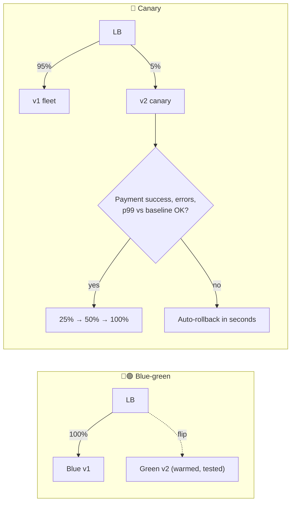

# 068 · Deployment Strategies: Rolling, Blue-Green, Canary, Feature Flags

> ⏱ 9 min · 📈 68% · 🅰️ Part A (core) · Phase 08: Reliability, Security & Ops
>
> `█████████████░░░░░░░` 68% of the whole guide

---

## 📖 Story

Friday, 4:47 p.m. A new checkout release ships to **all 120 servers at once**. Green build. Green tests. Weekend vibes.

At 4:52 p.m. the payment success rate drops from **98% to 61%**. A tiny change in how currency rounding works has made a third of all card authorizations fail, and **every single customer** is on the new code.

Rolling back means rebuilding the old version, redeploying 120 servers, and waiting for health checks. **Forty minutes.** At the start of the Friday dinner rush.

Maya pulls up the incident history and feels a chill. **The last three outages all started with a deploy.** Not a disk failure, not a region outage. *Pantry's own changes.*

I confessed to her what I'll confess to you: most outages I've ever caused were changes I made myself. I'll teach you what I taught her: **ship gradually, and be able to undo instantly.**

## 🎯 One-sentence idea

**Most outages come from changes, so ship them gradually and reversibly: rolling updates replace servers bit by bit, blue-green flips all traffic between two environments, canaries expose a small percentage first, and feature flags separate "deploying code" from "turning features on."**

## 🧸 Analogy

A **restaurant changing its menu**:

- 🔄 **Rolling:** swap menus **table by table** through the evening.
- 🔵🟢 **Blue-green:** prepare a **second identical dining room**, move every guest at once, and move them back instantly if needed.
- 🐤 **Canary:** serve the new dish to **5% of tables** first. (Miners carried canaries as early warning.)
- 🎚️ **Feature flags:** the dish is **already in the kitchen**, and a switch on the manager's panel decides who gets offered it.

## 🖼️ Visual

*Diagram brief:* on the left, a load balancer pointing at blue with a dotted "flip" arrow to green. On the right, a thin 5% stream to a canary feeding a metrics gate that either widens the stream or snaps it back.



## 🔬 How it works

- **Rolling:** replace instances in batches (e.g. 10%) gated by readiness. It's cheap and the Kubernetes default, but versions are mixed and rollback is itself a slow roll.
- **Blue-green:** deploy to the idle environment, test it, then **flip traffic** at the LB. **Rollback is instant** (flip back), but you need **2× capacity** briefly, and the **database is shared**, so schemas must suit both versions.
- **Canary:** send 1% → 5% → 25% → 100% of real traffic, **automatically comparing** error rate, latency, and **business metrics** against the stable baseline, and **auto-rolling back** on regression. Small blast radius, but it needs good metrics.
- **Feature flags:** ship code **dark**, then enable it per user, percentage, region, or staff. **Deploy ≠ release**, with instant kill switches and A/B tests. Clean up **flag debt**. **Shadow launches** mirror real traffic to v2 and discard its responses.
- **Database changes are expand → migrate → contract:** add new structures (old code ignores them) → dual-write + backfill → switch reads → stop the old writes → drop. **Never** ship code and a breaking schema change together. Freeze risky deploys during peaks.

## 🧩 Worked example

```yaml
strategy:
  canary:
    steps:
      - setWeight: 5
      - pause: { duration: 10m }
      - analysis: { templates: [{ templateName: payment-success-and-p99 }] }
      - setWeight: 25
      - pause: { duration: 10m }
      - setWeight: 50
      - pause: { duration: 10m }
      - setWeight: 100
```

```python
if flags.enabled("new_currency_rounding", user=user):   # staff + 1% of users, sticky
    return new_checkout(cart)
return old_checkout(cart)
```

**Friday, replayed:** v2 gets **5%** → payment success on the canary drops to 61% vs 98% on stable → analysis fails at **minute 3** → **automatic rollback**. Impact: **~1.6% of checkouts for 3 minutes** instead of **every checkout for 40 minutes**. The fix ships Monday, behind a flag.

**Renaming a column safely:**

```
R1: ADD COLUMN full_name; write name + full_name, read name
    Backfill full_name in throttled batches
R2: read full_name, still write both
R3: stop writing name
R4: DROP COLUMN name           ← each step deployable AND rollback-safe ✅
```

## ⚖️ Trade-offs

| Strategy | Rollback speed | Extra capacity | Blast radius | Complexity |
|---|---|---|---|---|
| Recreate | Slow | None | 100% + downtime | 🟢 |
| Rolling | Medium | Little | Growing % | 🟢 |
| Blue-green | ⚡ Instant | 2× | 100% at the flip | 🟡 |
| Canary | Fast (automatic) | Little | Small % | 🟡–🔴 |
| Feature flags | ⚡ Instant, per feature | None | Configurable | 🟡 flag debt |

## 🌍 Real world

- **Google SRE** estimates that roughly **70% of outages come from changes**, so progressive rollouts are mandatory there.
- **Netflix Spinnaker + Kayenta** do automated canary analysis. **Argo Rollouts / Flagger** do it on Kubernetes.
- **The 2024 CrowdStrike incident** showed the cost of pushing one change to everyone simultaneously, with no staged rollout.

## 📌 Cheat card

> - **Most outages = changes.** Make every change **gradual and reversible**.
> - **Rolling · Blue-green (instant flip-back) · Canary (small % + automatic analysis) · Flags (deploy ≠ release).**
> - **Schema: expand → migrate → contract.**
> - **Automate rollback** on SLO and business-metric regression.
> - **Clean up flags.** Avoid deploying before peaks.

## 🧪 Feynman check

Explain each strategy with the restaurant menu, and why changing the database and the code in one step is dangerous.

⚠️ **Common confusion:** "Blue-green makes rollback free." Only for **stateless code**. If green already wrote data in a new format, or ran a destructive migration, flipping back to blue can break, which is why schema changes must stay backward-compatible across both versions.

## ⚡ Quick recall

1. Canary vs blue-green, in one line each?
<details><summary>Reveal Answer</summary>

Canary: shift a small, growing percentage of traffic to the new version, gated by metrics. Blue-green: switch 100% of traffic between two full environments, with instant rollback.
</details>

2. What do feature flags decouple?
<details><summary>Reveal Answer</summary>

Deploying code from releasing (enabling) the feature to users.
</details>

3. What are the three phases of a safe schema change?
<details><summary>Reveal Answer</summary>

Expand (add new structures), migrate (dual-write, backfill, switch reads), contract (remove old structures).
</details>

## 🎤 Interview practice

**Q. "Roll out a risky change to the payment service, including a schema change that splits `users.name` into first and last name, with zero downtime."**
<details><summary>Model answer</summary>

- **The code path:**
  - Ship behind a **feature flag**, off by default (deployed dark).
  - Enable for **internal staff**, then a **canary cohort** (1%, random but **sticky per user**, excluding high-value merchants at first).
  - **Automated comparison** vs control: payment **authorization rate**, error rate, p99. Business metrics catch what HTTP 200s hide.
  - Ramp **1 → 5 → 25 → 100%** with bake time at each step. Any regression → **automatic flag-off** in seconds.
- **The schema (expand/contract):**
  1. **Expand:** add nullable `first_name`, `last_name`.
  2. **Dual-write** old and new. **Backfill** existing rows in throttled batches (watch replica lag).
  3. **Switch reads** to the new columns behind a flag, and verify with consistency checks.
  4. **Stop writing** `name`, and wait out the rollback window.
  5. **Drop** `name`.
  - Every step is deployable and reversible **on its own**.
- **Other consumers reading `users.name` directly?** That's the shared-database anti-pattern. Keep the old column until every consumer moves to an API or event, and coordinate the migration.
- **Guardrails:** no deploys during peak windows, an on-call engineer watching, runbooks for manual flag-off, and a post-rollout cleanup ticket for the flag.
- **Likely follow-up:** "Why not blue-green here?" → it flips 100% at once, so a subtle payment regression would hit everyone before the metrics noticed. Canaries contain it.
</details>

## 📖 Teaser

> 📖 *Deploys are boring now, in the best way, and then a security researcher emails a single line: "I can see other people's orders."*

---

⬅️ [067 · Observability](067-observability.md) · 🗺️ [Phase map](README.md) · ➡️ [069 · AuthN, AuthZ, OAuth & JWT](069-authn-authz-oauth-jwt.md)

✅ **Safe stopping point.** Tick lesson 068 in [PROGRESS.md](../../PROGRESS.md).
