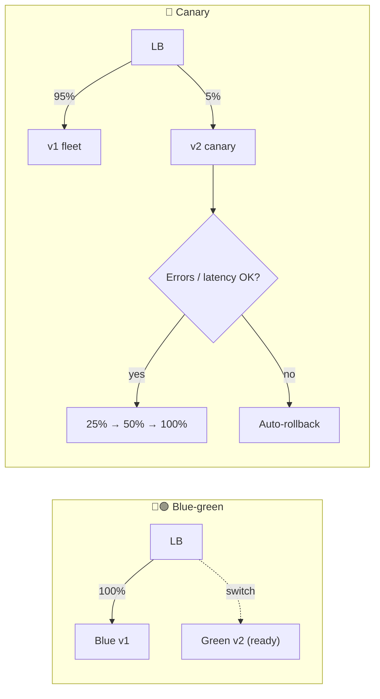

# 068 · Deployment Strategies: Rolling, Blue-Green, Canary, Feature Flags

> ⏱ 9 min · 📈 68% · 🅰️ Part A (core) · Phase 08: Reliability, Security & Ops
>
> `█████████████░░░░░░░` 68% of the whole guide

---

## 📖 Story

The last three outages all started with a deploy. One broke checkout for every customer at once, and rolling it back took forty minutes. Maya wants changes to go out gradually, and to come back instantly.

## 🎯 One-sentence idea

**Most outages are caused by changes, so ship them gradually and reversibly. Rolling updates replace servers bit by bit, blue-green switches all traffic between two environments at once, canaries expose a small percentage first, and feature flags separate "deploying code" from "turning features on".**

## 🧸 Analogy

A **restaurant changing its menu**:

- 🔄 **Rolling:** swap the menus **table by table** through the evening.
- 🔵🟢 **Blue-green:** set up a **second identical dining room** with the new menu. When it's ready, **redirect all guests** to it at once. Problem? **Send everyone back** to the old room instantly.
- 🐤 **Canary:** give the new dish to **5% of tables first**. If no one gets sick, roll it out to everyone. (Miners took canaries into mines as early warning.)
- 🎚️ **Feature flags:** the new dish is **already in the kitchen**, and a switch on the manager's panel decides who gets offered it, with no kitchen rebuild needed.

## 🖼️ Visual



## 🔬 How it works

- **Rolling update:** replace instances in batches (e.g., 10% at a time), gated by readiness checks.
  - ✅ No extra capacity needed, and it's the Kubernetes default. ❌ Mixed versions run at once, and rollback is also a rolling process (slower).
- **Blue-green:** two full environments. Deploy to the idle one (green), test it, then **flip traffic** (LB/DNS).
  - ✅ **Instant rollback** (flip back), and you test in a production-like environment. ❌ 2× capacity during the switch, and the database is shared (schema changes must suit both).
- **Canary:** send a small slice of real traffic (1% → 5% → 25% → 100%) to the new version. **Automatically compare** error rate and latency against the baseline, and promote or roll back.
  - ✅ Catches problems with minimal blast radius, using real traffic. ❌ Needs good metrics and traffic splitting, and it's slower.
- **Feature flags / toggles:** code ships **dark** (off), and is enabled per user, percentage, region, or internal staff.
  - ✅ Decouples deploy from release, gives instant kill switches, A/B tests, and trunk-based development. ❌ Flag debt (clean them up!), and combinations to test.
- **Shadow / dark launch:** mirror real traffic to the new version without using its responses, to test performance safely.
- **Database changes: expand → migrate → contract** (backward-compatible migrations):
  1. **Expand:** add the new column or table (the old code ignores it).
  2. Deploy code that writes **both** and reads the new one, and **backfill** the data.
  3. **Contract:** remove the old column once nothing uses it.
  - Never deploy code and a breaking schema change together, because rollback would break.
- **Automate rollback** on SLO regression. Deploy during working hours, and freeze during peak events.

## 🧩 Worked example

**Canary with automatic analysis (Argo Rollouts-style):**

```yaml
strategy:
  canary:
    steps:
      - setWeight: 5
      - pause: { duration: 10m }
      - analysis: { templates: [{ templateName: error-rate-and-p99 }] }   # compare vs stable
      - setWeight: 25
      - pause: { duration: 10m }
      - setWeight: 50
      - pause: { duration: 10m }
      - setWeight: 100
```

**Feature flag in code:**

```python
if flags.enabled("new_checkout_flow", user=user):   # 10% of users, staff always on
    return new_checkout(cart)
return old_checkout(cart)
```

**Renaming a column safely (expand/contract):**

```
Release 1: ADD COLUMN full_name; code writes name + full_name, still reads name
Backfill:  UPDATE users SET full_name = name WHERE full_name IS NULL (in batches)
Release 2: code reads full_name, and still writes both
Release 3: code stops writing name
Release 4: DROP COLUMN name
Every step is independently deployable AND rollback-safe ✅
```

## ⚖️ Trade-offs

| Strategy | Rollback speed | Extra capacity | Blast radius | Complexity |
|---|---|---|---|---|
| Recreate (stop all, start new) | Slow | None | 100% + downtime | 🟢 |
| Rolling | Medium | Little | Growing % | 🟢 |
| Blue-green | ⚡ Instant | 2× | 100% at the switch | 🟡 |
| Canary | Fast (automatic) | Little | Small % | 🟡–🔴 |
| Feature flags | ⚡ Instant (per feature) | None | Configurable | 🟡 (flag debt) |

## 🌍 Real world

- **Google SRE:** about 70% of outages come from changes, hence progressive rollouts everywhere.
- **Netflix Spinnaker / Kayenta** does automated canary analysis. **Argo Rollouts / Flagger** does it for Kubernetes.
- **LaunchDarkly, Unleash, Flagsmith** are feature flag platforms. Facebook's **Gatekeeper** is an internal equivalent.
- **The 2024 CrowdStrike incident** showed the danger of pushing a change to everyone at once, with no staged rollout.

## 📌 Cheat card

> - **Most outages = changes.** Make every change **gradual and reversible**.
> - **Rolling** (default) · **Blue-green** (instant flip-back) · **Canary** (small % + auto-analysis) · **Flags** (deploy ≠ release).
> - **DB migrations: expand → migrate → contract.** Always backward compatible.
> - **Automate rollback** on SLO regressions. Clean up old flags.

## 🧪 Feynman check

Explain the restaurant menu-change analogy for each strategy, and why changing the database and the code in one step is dangerous.

⚠️ **Common confusion:** "Blue-green makes rollbacks free." Only for **stateless** code. If green already wrote data in a new format or ran a destructive migration, flipping back to blue may break. That's why schema changes must be backward compatible.

## ⚡ Quick recall

1. Canary vs blue-green in one line each?
<details><summary>Answer</summary>

Canary: shift a small percentage of traffic to the new version and increase it gradually based on metrics. Blue-green: switch 100% of traffic between two full environments, with instant rollback.
</details>

2. What do feature flags decouple?
<details><summary>Answer</summary>

Deploying code from releasing (enabling) the feature to users.
</details>

3. What are the three phases of a safe schema change?
<details><summary>Answer</summary>

Expand (add new structures), migrate (dual-write, backfill, switch reads), contract (remove old structures).
</details>

## 🎤 Interview practice

**Q1. "How would you roll out a risky change to the payment service?"**
<details><summary>Model answer</summary>

- Put it behind a **feature flag** (off by default), and deploy dark.
- Enable it for **internal users**, then a **canary cohort** (1% of traffic, low-risk regions or merchants), with automated comparison of the payment success rate, error rate, and latency against control.
- Ramp up gradually (1 → 5 → 25 → 100%) with bake time at each step. Automatic rollback (flag off) on regression.
- Any DB changes are expand/contract. Watch business metrics (authorization rates) as well as technical ones.
- **Likely follow-up:** "How do you pick the canary population?" → random but sticky per user (a consistent experience), and exclude VIP or high-value merchants at first.
</details>

**Q2. "We need to split the `users.name` column into first_name and last_name with zero downtime. How?"**
<details><summary>Model answer</summary>

- **Expand:** add `first_name` and `last_name` (nullable).
- **Dual-write:** the app writes both the old and new columns, and **backfills** existing rows in batches (throttled, to avoid replica lag).
- **Switch reads** to the new columns (behind a flag), and verify.
- **Stop writing** the old column, and later **drop** it.
- Each step is deployable and reversible on its own.
- **Likely follow-up:** "What if other services read `users.name` directly?" → that's the shared-DB anti-pattern. Coordinate via APIs or events, and keep the old column until all consumers migrate.
</details>

> 📖 *Next time: A security researcher emails: "I can see other people's orders."*

---

⬅️ [067 · Observability](067-observability.md) · 🗺️ [Phase map](README.md) · ➡️ [069 · AuthN, AuthZ, OAuth & JWT](069-authn-authz-oauth-jwt.md)

✅ **Safe stopping point.** Tick lesson 068 in [PROGRESS.md](../../PROGRESS.md).
