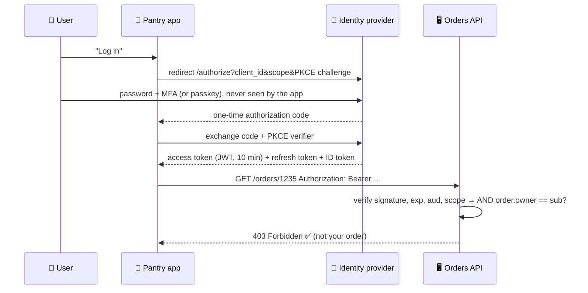

# 069 · Authentication, Authorization, OAuth & JWT

> ⏱ 10 min · 📈 69% · 🅰️ Part A (core) · Phase 08: Reliability, Security & Ops
>
> `█████████████░░░░░░░` 69% of the whole guide

---

## 📖 Story

The email arrives at 11:48 p.m. from a security researcher, and it's three lines long:

> *Log in to Pantry. Open `/orders/1234`. Change it to `/orders/1235`.*

Maya tries it, and her blood runs cold. **Someone else's order** fills the screen: their name, their **home address**, their phone number, what they ate for dinner. She changes it to `1236`. Another stranger. `1237`. Another.

Pantry checks **who you are**. It never asks **what you're allowed to see**. Every logged-in customer holds a skeleton key to every order in the building.

Somewhere out there, someone might already have scraped them all.

This one keeps me up at night, and I want it to stick with you. Let's dive into **identity, tokens, and permissions**.

## 🎯 One-sentence idea

**Authentication proves who you are and authorization decides what you may do, sessions or tokens (often JWTs) carry that identity between requests, and OAuth 2.0 / OpenID Connect let users log in through another provider or grant apps limited access without sharing passwords.**

## 🧸 Analogy

A **music festival**:

- 🪪 **Authentication:** at the gate you show **ID + ticket**.
- 🎟️ **Token:** you get a **wristband**, so there's no ID check at every stage.
- 🚪 **Authorization:** the **VIP** wristband gets you backstage, and the regular one doesn't.
- 🔑 **OAuth:** a **valet key** that drives and parks the car but **can't open the trunk**, and can be **cancelled any time**, without handing over your house keys.

## 🖼️ Visual

*Diagram brief:* the "Log in with Google" dance. The app never sees the password, gets a one-time code, swaps it for tokens, then calls the API with a bearer token that the API verifies before checking ownership.



## 🔬 How it works

- **Authenticate well:** passwords hashed with **argon2/bcrypt** (never fast hashes), **MFA**, and ideally **passkeys/WebAuthn** (phishing-resistant). **SSO** via OIDC/SAML for staff, and **mTLS** or client credentials for machines.
- **Sessions vs JWTs:** a **server-side session** (a random ID in an httpOnly cookie, with state in Redis) is **instantly revocable**. A **JWT** (`header.payload.signature`, with claims like `sub`, `exp`, `aud`, `scope`) is verified **without a lookup** using the issuer's public key, so it's **hard to revoke**. Keep access tokens **short (5–15 min)** with **rotating refresh tokens**. JWTs are **signed, not encrypted**, so keep secrets out of them.
- **OAuth 2.0 = delegated authorization:** use **Authorization Code + PKCE** for web and mobile, **Client Credentials** for service-to-service, and **Device Code** for TVs and CLIs. Implicit and password grants are deprecated. **OIDC** adds the **ID token**: that's *login*.
- **Authorization models:** **RBAC** (roles), **ABAC / policy engines** (OPA, Cedar rules over attributes), and **ReBAC** (Zanzibar-style relationships: SpiceDB, OpenFGA).
- **Object-level checks everywhere:** *"does user 42 own order 1235?"* Missing them is **BOLA/IDOR**, **#1 on the OWASP API Top 10**, and exactly Maya's bug. Validate tokens at the **gateway**, and authorize objects **in the service** that owns the data.

## 🧩 Worked example

```json
// header
{ "alg": "RS256", "kid": "key-2026-09" }
// payload
{ "iss": "https://auth.pantry.app", "sub": "user_42", "aud": "orders-api",
  "scope": "orders:read", "exp": 1790000000, "iat": 1789999400, "jti": "t_8f2…" }
```

```python
claims = jwt.decode(token, jwks.key_for(kid),          # cached public keys from the IdP
                    algorithms=["RS256"],              # never accept "none"
                    audience="orders-api", issuer="https://auth.pantry.app")
require("orders:read" in claims["scope"].split())
order = db.get_order(order_id)
if order.user_id != claims["sub"]:                     # object-level authorization
    raise Forbidden()                                  # → 403 (or 404 to avoid leaking existence)
```

**Maya's fix, in order:**

1. Add the ownership check everywhere (an audit found **14 endpoints** missing it).
2. Switch to **non-sequential IDs** (defence in depth, not a substitute).
3. **Rate-limit and alert** on enumeration patterns.
4. Review the access logs for past scraping, and **notify affected users** if needed.

**Revocation:** access tokens live 10 min, and refresh tokens **rotate** on each use (stored hashed). Logout → revoke the refresh token. Emergency → a short **`jti` denylist** at the gateway, or **rotate the signing keys**.

## ⚖️ Trade-offs

| Maya's choice | What she gains | What she pays |
|---|---|---|
| Session cookie + Redis | Instant revocation | A lookup per request |
| JWT access tokens | Stateless verification across services | Hard to revoke, larger headers |
| Short JWT + refresh token | The best of both | More moving parts |
| RBAC | Simple | Role explosion |
| ReBAC (Zanzibar) | Fine-grained sharing | Infrastructure complexity |

## 🌍 Real world

- **Auth0/Okta, AWS Cognito, Keycloak, and Firebase Auth** are common identity providers.
- **Google Zanzibar** runs permissions for Drive and YouTube. **SpiceDB/OpenFGA** are the open-source descendants.
- **OWASP API Security Top 10:** #1 is **Broken Object Level Authorization**.

## 📌 Cheat card

> - **AuthN = who you are. AuthZ = what you may do.**
> - **argon2/bcrypt + MFA**, ideally **passkeys**.
> - **JWT = signed, not encrypted, hard to revoke** → **short-lived + rotating refresh tokens**.
> - **OAuth = delegated access. OIDC = login.** Use **Auth Code + PKCE**.
> - **Check object ownership on every request.**

## 🧪 Feynman check

Explain the wristband and the valet key, and why a wristband that can't be taken back (a JWT) should expire quickly.

⚠️ **Common confusion:** "OAuth is for authentication." OAuth 2.0 is **authorization** (delegated access). **OpenID Connect** adds authentication. Treating a bare OAuth access token as proof of *who* someone is has caused real account-takeover bugs.

## ⚡ Quick recall

1. What's the difference between AuthN and AuthZ?
<details><summary>Reveal Answer</summary>

Authentication verifies identity. Authorization decides what that identity is allowed to do.
</details>

2. Why are JWTs hard to revoke, and what's the usual mitigation?
<details><summary>Reveal Answer</summary>

They're validated without a server lookup, so a stolen token works until it expires. Mitigate with short expiry, revocable rotating refresh tokens, and a denylist for emergencies.
</details>

3. Which OAuth flow should a mobile app use?
<details><summary>Reveal Answer</summary>

Authorization Code with PKCE.
</details>

## 🎤 Interview practice

**Q. "Design authentication and authorization for a platform with a web app, mobile apps, and 20 microservices, including Google-Drive-style sharing."**
<details><summary>Model answer</summary>

- **Identity:** a central **OIDC provider** with passwords (argon2) + MFA or passkeys, social login, and SSO for staff.
- **Clients:**
  - **Auth Code + PKCE** → a **10-minute JWT access token** + a **rotating refresh token**.
  - On the web, a **BFF** holds tokens in **httpOnly, Secure, SameSite** cookies to reduce XSS token theft.
- **The gateway:** verifies JWTs against cached **JWKS** (`alg`, `iss`, `aud`, `exp`), rejects early, forwards verified claims, and **strips** any client-supplied identity headers.
- **Service-to-service:** **mTLS** via a mesh (identity per workload) or client-credentials tokens.
- **Authorization inside services:**
  - **Object-level checks** on every read and write.
  - Coarse **RBAC** for admin features.
  - For sharing, **ReBAC (Zanzibar-style)**: tuples like `doc:123#viewer@user:42`, `doc:123#parent@folder:9`, `folder:9#editor@group:eng#member`.
  - A dedicated authz service answers `check`/`list`, with **consistency tokens** so a revocation can't be bypassed by a stale cache.
- **Logout everywhere:** revoke all of the user's refresh tokens. Access tokens die within minutes, and a `jti` denylist covers emergencies.
- **Likely follow-up:** "How do you list every doc a user can see?" → reverse indexes or materialized permission views. It's genuinely hard at scale, so cache aggressively and paginate.
</details>

## 📖 Teaser

> 📖 *The order leak is sealed, so Maya commissions a full security audit, and the report that comes back is long enough to ruin her week.*

---

⬅️ [068 · Deployment Strategies](068-deployment-strategies.md) · 🗺️ [Phase map](README.md) · ➡️ [070 · Security Essentials](070-security-essentials.md)

✅ **Safe stopping point.** Tick lesson 069 in [PROGRESS.md](../../PROGRESS.md).
