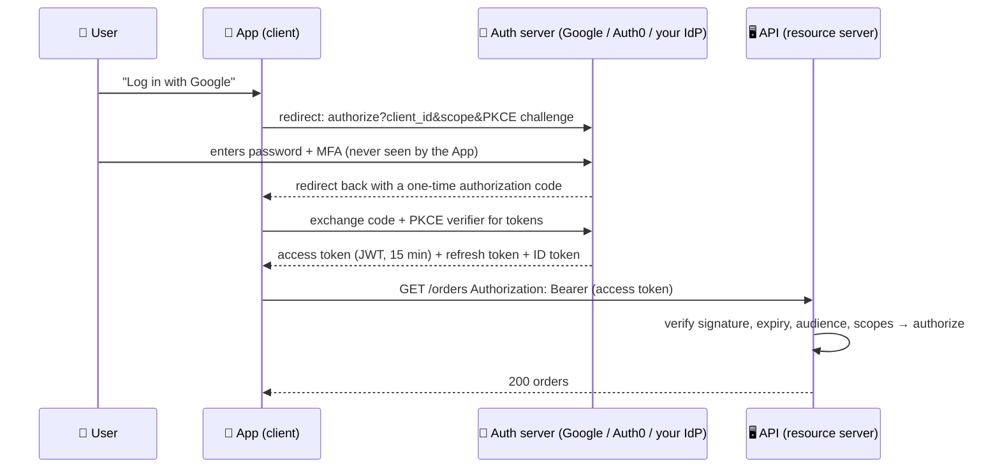

# 069 · Authentication, Authorization, OAuth & JWT

> ⏱ 10 min · 📈 69% · 🅰️ Part A (core) · Phase 08: Reliability, Security & Ops
>
> `█████████████░░░░░░░` 69% of the whole guide

---

## 📖 Story

A security researcher reported that changing `/orders/1234` to `/orders/1235` in the address bar showed *someone else's* order, home address and all. Pantry checked *who you are*, but never *what you're allowed to see*. This one keeps me up at night, and I want it to stick with you. Let's dive into identity, tokens, and permissions.

## 🎯 One-sentence idea

**Authentication (AuthN) proves *who you are*, and authorization (AuthZ) decides *what you may do*. Sessions or tokens (often JWTs) carry that identity between requests, and OAuth 2.0 / OpenID Connect let users log in with another provider or grant apps limited access without sharing passwords.**

## 🧸 Analogy

A **music festival**:

- 🪪 **Authentication:** at the gate, you show your **ID + ticket**, and they confirm it's really you.
- 🎟️ **Token:** they give you a **wristband**. You don't show your ID at every stage. The wristband proves you were checked (a session cookie or JWT).
- 🚪 **Authorization:** a **VIP wristband** gets you backstage, and a regular one doesn't. Same person, different **permissions**.
- 🔑 **OAuth:** you give a friend a **valet key** for your car. It can drive and park, but **can't open the trunk**, and you can **cancel it any time**, all without handing over your house keys (your password).

## 🖼️ Visual



## 🔬 How it works

- **Authentication methods:** passwords (hashed with **bcrypt/argon2**, never plain or fast hashes), **MFA** (TOTP, SMS, push), **passkeys/WebAuthn** (phishing-resistant), SSO via **OIDC/SAML**, and API keys or **mTLS** for machines.
- **Sessions vs tokens:**
  - **Server-side session:** a random session ID in a secure **cookie**, with the state in Redis/DB. ✅ Easy revocation. ❌ A lookup per request (cheap with Redis).
  - **JWT (JSON Web Token):** a **signed**, self-contained token `header.payload.signature` with claims (`sub`, `exp`, `scope`, `aud`). ✅ Any service can verify it **without a lookup** (using the public key). ❌ **Hard to revoke before expiry**, so keep access tokens short-lived (5–15 min) + **refresh tokens** (revocable, stored server-side).
  - JWTs are **signed, not encrypted** (by default), so **don't put secrets in them**.
- **OAuth 2.0:** a framework for **delegated authorization** ("let this app read my calendar"). Key flows:
  - **Authorization Code + PKCE:** for web and mobile apps (the recommended default).
  - **Client Credentials:** service-to-service (no user).
  - **Device Code:** TVs and CLIs.
  - (Implicit and password grants are **deprecated**.)
- **OpenID Connect (OIDC):** an identity layer on top of OAuth 2.0 that adds an **ID token** ("who logged in"). It's what "Log in with Google" uses.
- **Authorization models:**
  - **RBAC:** roles → permissions (admin, editor, viewer).
  - **ABAC / policy-based:** rules over attributes ("managers can approve expenses < $5k in their department"). Tools: OPA, Cedar.
  - **ReBAC:** relationship-based ("can view if they're a member of the folder's team"). Google **Zanzibar**-style (SpiceDB, OpenFGA).
  - Always check **object-level** access ("does user 42 own order 99?"). Missing this = the #1 API vulnerability (BOLA/IDOR).
- **Where to enforce:** validate tokens at the **gateway** (lesson 022), and do fine-grained authorization **in each service** (it knows its data).

## 🧩 Worked example

**A decoded JWT access token:**

```json
// header
{ "alg": "RS256", "kid": "key-2026-09" }
// payload
{ "iss": "https://auth.shop.com", "sub": "user_42", "aud": "orders-api",
  "scope": "orders:read orders:write", "exp": 1790000000, "iat": 1789999100 }
// signature = RS256(base64(header) + "." + base64(payload), private_key)
```

**API verification checklist:**

```python
claims = jwt.decode(token, jwks.get_key(kid),       # public key from the IdP's JWKS endpoint (cached)
                    algorithms=["RS256"],             # never accept "none"!
                    audience="orders-api", issuer="https://auth.shop.com")
require("orders:read" in claims["scope"])
order = db.get_order(order_id)
require(order.user_id == claims["sub"])             # object-level authorization (prevents IDOR)
```

**Revocation strategy:** access token = 10 min + refresh token (rotated on each use, stored hashed in the DB). Logout or compromise → revoke the refresh token. Emergency → a short denylist of token IDs (`jti`) at the gateway, or rotate the signing keys.

## ⚖️ Trade-offs

| Choice | Gain | Cost | Use when |
|---|---|---|---|
| Session cookie + Redis | Easy revocation, small cookie | A lookup per request | Classic web apps |
| JWT access tokens | Stateless verification across services | Hard to revoke, bigger headers | Microservices, mobile, third-party APIs |
| Short JWT + refresh token | Balance of both | More moving parts | Most modern systems |
| RBAC | Simple | Role explosion | Small to medium permission models |
| ReBAC (Zanzibar) | Fine-grained sharing | Infrastructure complexity | Docs and files sharing (Drive-like) |

## 🌍 Real world

- **Auth0/Okta, AWS Cognito, Keycloak, Firebase Auth** are common identity providers.
- **Google Zanzibar** powers permissions for Drive, YouTube, and Cloud. **SpiceDB / OpenFGA** are open-source equivalents.
- **OWASP API Security Top 10:** #1 is **Broken Object Level Authorization**.

## 📌 Cheat card

> - **AuthN = who you are (ID check). AuthZ = what you may do (VIP wristband).**
> - Passwords: **argon2/bcrypt + MFA**, and ideally **passkeys**.
> - **JWT = signed (not encrypted), stateless, hard to revoke** → **short-lived + refresh tokens**.
> - **OAuth 2.0 = delegated access** (the valet key). **OIDC = login** (ID token). Use **Auth Code + PKCE**.
> - **Always check object ownership** in the service (prevents IDOR).

## 🧪 Feynman check

Explain the festival wristband and the valet key, and why a wristband that can't be taken back (a JWT) should expire quickly.

⚠️ **Common confusion:** "OAuth is for authentication." OAuth 2.0 is for **authorization** (delegated access). **OpenID Connect** adds authentication on top. Using a bare OAuth access token as proof of identity has led to real security bugs.

## ⚡ Quick recall

1. AuthN vs AuthZ?
<details><summary>Answer</summary>

Authentication verifies identity. Authorization decides what that identity is allowed to do.
</details>

2. Why are JWTs hard to revoke, and what's the usual mitigation?
<details><summary>Answer</summary>

They're validated without a server lookup, so a stolen token works until it expires. Mitigate with short expiry + revocable refresh tokens (and a denylist for emergencies).
</details>

3. Which OAuth flow should a mobile app use?
<details><summary>Answer</summary>

Authorization Code with PKCE.
</details>

## 🎤 Interview practice

**Q1. "Design authentication for a platform with a web app, mobile apps, and 20 microservices."**
<details><summary>Model answer</summary>

- A central **identity provider** (OIDC): login with passwords + MFA or passkeys, and social login.
- Clients use **Auth Code + PKCE** → get a **short-lived JWT access token** + a **refresh token** (rotated, revocable).
- The **API gateway** validates JWTs (cached JWKS), rejects invalid ones, and forwards verified claims.
- Services do **fine-grained authorization** (RBAC/ReBAC via a policy service) and **object ownership checks**.
- Service-to-service: **mTLS** (a service mesh) or client-credentials tokens.
- Web: tokens in **httpOnly, Secure, SameSite cookies** (a BFF pattern) to reduce XSS token theft.
- **Likely follow-up:** "How do you log a user out everywhere?" → revoke their refresh tokens, and access tokens expire within minutes (or use the denylist for urgent cases).
</details>

**Q2. "How would you design permissions for a Google Drive–like sharing model?"**
<details><summary>Model answer</summary>

- **ReBAC (Zanzibar-style):** store relationship tuples like `doc:123#viewer@user:42`, `folder:9#editor@group:eng#member`, `doc:123#parent@folder:9`.
- Permission checks traverse the relations (inherited from folders and groups), and the results are cached with consistency tokens ("zookies") to avoid a stale ACL allowing access after revocation.
- It's a dedicated authorization service, with the `check`, `expand`, and `list objects` APIs.
- **Likely follow-up:** "How do you list all docs a user can see?" → reverse indexes or materialized permission views. That's hard at scale.
</details>

> 📖 *Next, the security audit that follows finds many more gaps.*

---

⬅️ [068 · Deployment Strategies](068-deployment-strategies.md) · 🗺️ [Phase map](README.md) · ➡️ [070 · Security Essentials](070-security-essentials.md)

✅ **Safe stopping point.** Tick lesson 069 in [PROGRESS.md](../../PROGRESS.md).
