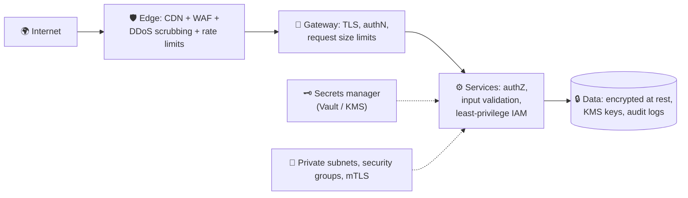

# 070 · Security Essentials for System Design

> ⏱ 9 min · 📈 70% · 🅰️ Part A (core) · Phase 08: Reliability, Security & Ops
>
> `██████████████░░░░░░` 70% of the whole guide

---

## 📖 Story

The security audit arrives as a 41-page PDF. Maya opens it, and every page feels like a door she forgot to lock:

- **Page 3:** the production database password sits in a **public-by-mistake git repo**, in a config file, in plain text.
- **Page 9:** nightly backups are **unencrypted** in an object storage bucket.
- **Page 14:** the admin panel is reachable from **the entire internet**, protected by a password and nothing else.
- **Page 22:** the "dish preview" feature fetches **any URL a user types**, from *inside* Pantry's network.
- **Page 30:** one service's cloud role can **read every bucket** in the account.

None of these is a single catastrophe. Each one is a **stepping stone**. Chain three together and an attacker walks from the internet to the vault.

Maya reads it with her head in her hands. I told her what I'll tell you: **security isn't one big lock. It's layers.**

## 🎯 One-sentence idea

**Secure systems use defence in depth: encrypt data in transit and at rest, keep secrets out of code, grant every component least privilege, validate all input, shield the edge from abuse and DDoS, and collect and keep only the personal data you truly need.**

## 🧸 Analogy

A **bank building**:

- 🧱 **Defence in depth:** fence, locked doors, guards, cameras, *and* a vault.
- 🔐 **Encryption:** armoured trucks (in transit) and a vault (at rest).
- 🗝️ **Secrets:** vault codes in a safe, **not on a sticky note by the door**.
- 👮 **Least privilege:** the cleaner's key opens offices, **not the vault**.
- 🛂 **Validation:** the teller checks every form instead of obeying whatever a note says.
- 🚧 **DDoS protection:** barriers keep a mob from blocking real customers.

## 🖼️ Visual

*Diagram brief:* concentric rings around the data core: edge (WAF, DDoS), gateway (TLS, authN, limits), services (authZ, validation, least-privilege IAM), and data (encryption, KMS, audit). A secrets vault and network segmentation sit beside the rings.



## 🔬 How it works

- **Encrypt in transit and at rest:** TLS everywhere, including **mTLS** internally for zero-trust (lesson 013). AES-256 at rest with keys in a **KMS** via **envelope encryption**, plus **field-level** encryption or **tokenization** for the crown jewels (card data, national IDs).
- **Secrets never live in code:** use Vault / Secrets Manager, **short-lived credentials** (IAM roles, workload identity), **rotation**, and secret scanning in CI. Assume anything committed to git is already leaked.
- **Least privilege + zero trust:** narrowly scoped IAM per service, private subnets, security groups, **no public admin surfaces** (SSO + VPN/zero-trust proxy), and authenticate and authorize **every** call, because "inside the network" is not a credential.
- **Input is hostile (OWASP):** **parameterized SQL** (injection), output encoding + CSP (XSS), SameSite cookies / CSRF tokens, **SSRF defences** (egress proxy, block private and metadata IPs *after* DNS resolution), **object-level authZ** (lesson 069), and strict size and type limits.
- **Edge, privacy, supply chain:** WAF + **Anycast DDoS scrubbing** + rate limits and bot detection (lesson 024). **Data minimization**, retention, deletion rights, and residency (GDPR). Pinned and scanned dependencies, signed artifacts, minimal images. **Assume breach**: audit logs, anomaly alerts, and an incident runbook.

## 🧩 Worked example

```python
# ❌ Injectable: name = "x'; DROP TABLE users; --"
db.execute(f"SELECT * FROM users WHERE name = '{name}'")
# ✅ Parameterized: data travels separately from the SQL
db.execute("SELECT * FROM users WHERE name = %s", (name,))
```

**Envelope encryption for backups:**

```
1. Ask KMS for a data key → {plaintext_key, encrypted_key}
2. Encrypt the backup with plaintext_key (AES-256-GCM), then wipe plaintext_key from memory
3. Store encrypted_backup + encrypted_key
4. Restore: KMS decrypts encrypted_key (IAM-checked, audited) → decrypt the backup
→ The master key never leaves the KMS; rotating it doesn't mean re-encrypting terabytes.
```

**Maya's remediation map:**

| Audit page | Fix |
|---|---|
| 3: DB password in git | Rotate it **now**, move to Secrets Manager, IAM DB auth, secret scanning in CI |
| 9: unencrypted backups | KMS envelope encryption, a separate backup account, object lock |
| 14: public admin panel | Behind SSO + a zero-trust proxy, MFA, IP allow-list |
| 22: URL preview (SSRF) | Isolated egress proxy, block RFC1918 and `169.254.169.254`, IMDSv2 |
| 30: over-broad role | Per-service least-privilege policies, access analyzer |

## ⚖️ Trade-offs

| Maya's choice | What she gains | What she pays |
|---|---|---|
| mTLS everywhere | Zero-trust service identity | Certificate machinery (use a mesh) |
| Field-level encryption | Protects data even from DB admins | Hard to query or index those fields |
| Strict WAF rules | Blocks attacks | False positives hit real users |
| Data minimization | Less to breach, easier compliance | Less data for analytics and ML |
| Card tokenization | Out of most PCI scope | Dependency on the vault provider |

## 🌍 Real world

- **Equifax 2017:** an unpatched framework exposed **147M** people's data. Patch and segment.
- **Capital One 2019:** **SSRF + an over-permissive IAM role** exposed **~100M** records. Least privilege matters.
- **Google BeyondCorp** pioneered zero-trust networking. **Stripe Elements** keeps card numbers off merchants' servers.

## 📌 Cheat card

> - **Defence in depth:** edge → gateway → service → data.
> - **TLS in transit · AES at rest · KMS envelope encryption.**
> - **Secrets in a vault**, rotated, short-lived. Never in git or logs.
> - **Least privilege + zero trust.**
> - **OWASP:** parameterized SQL, output encoding, CSRF tokens, SSRF egress controls, object-level authZ.
> - **Collect less PII**, with retention and deletion.

## 🧪 Feynman check

Explain the bank's layers, and why "the cleaner's key doesn't open the vault" matters on the day an attacker steals the cleaner's key.

⚠️ **Common confusion:** "We're behind a firewall/VPN, so internal traffic is safe." Phishing, a compromised dependency, or one leaked credential puts an attacker **inside**, where flat networks let them move laterally to anything. **Zero trust** assumes the network is already hostile.

## ⚡ Quick recall

1. What is envelope encryption?
<details><summary>Reveal Answer</summary>

Data is encrypted with a data key, and that data key is encrypted by a master key held in a KMS, so the master key never leaves the KMS.
</details>

2. How do you prevent SQL injection?
<details><summary>Reveal Answer</summary>

Parameterized queries or prepared statements (never concatenate input into SQL), plus validation and a least-privilege DB user.
</details>

3. What does "least privilege" mean?
<details><summary>Reveal Answer</summary>

Each user or component gets only the minimum permissions required for its job.
</details>

## 🎤 Interview practice

**Q. "Your service fetches previews of user-supplied URLs. What's the risk, and how do you secure a healthcare app's patient records in the same platform?"**
<details><summary>Model answer</summary>

- **The URL preview risk: SSRF.**
  - Attackers make your server fetch **internal** targets: the cloud metadata endpoint `169.254.169.254` (stealing role credentials), admin APIs, internal databases.
  - **Mitigations:**
    - Run fetches through an **isolated egress proxy** in a sandboxed network.
    - Allow only http/https.
    - **Block private, loopback, and link-local ranges *after* DNS resolution**, re-check on **every redirect**, and **pin the resolved IP** (to defeat DNS rebinding).
    - Size and time limits, and **IMDSv2** on AWS.
- **Patient records:**
  - **Encryption:** TLS + mTLS internally, KMS-backed encryption at rest, **field-level encryption** for the most sensitive attributes, and encrypted backups in a separate account.
  - **Access:** MFA/SSO for staff, **fine-grained authZ** (patients see their own records, clinicians see their patients'), **break-glass** access with justification, and **audit logs for every read**, with anomaly alerts.
  - **Network:** private subnets, no public DB endpoints, least-privilege IAM per service.
  - **Compliance:** HIPAA (BAAs with vendors), data minimization, and retention and deletion policies.
  - **Analytics:** **de-identified or pseudonymized** datasets in a separate environment.
  - **Operations:** secrets in a vault, patch SLAs, dependency scanning, and an incident response plan with breach-notification steps.
- **Likely follow-up:** "What's DNS rebinding?" → a hostname resolves to a public IP at check time and a private IP at fetch time. Pinning the IP you validated closes the gap.
</details>

## 📖 Teaser

> 📖 *Pantry is locked down, but it now runs 60 services whose addresses change every few minutes, and nobody knows anymore where anything actually lives.*

---

⬅️ [069 · AuthN, AuthZ, OAuth & JWT](069-authn-authz-oauth-jwt.md) · 🗺️ [Phase map](README.md) · ➡️ [✅ Checkpoint 70%](checkpoint-70.md)

✅ **Safe stopping point.** Tick lesson 070 in [PROGRESS.md](../../PROGRESS.md), then do the checkpoint!
