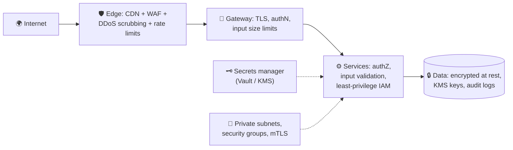

# 070 · Security Essentials for System Design

> ⏱ 9 min · 📈 70% · 🅰️ Part A (core) · Phase 08: Reliability, Security & Ops
>
> `██████████████░░░░░░` 70% of the whole guide

---

## 🎯 One-sentence idea

**Secure systems use layers of defense: encrypt data in transit and at rest, keep secrets out of code, give every component the least privilege it needs, validate all input, protect the edge from abuse and DDoS, and collect and keep only the personal data you need.**

## 🧸 Analogy

A **bank building**:

- 🧱 **Defense in depth:** a fence, locked doors, guards, cameras, *and* a vault. Breaking one layer doesn't give you the money.
- 🔐 **Encryption:** cash moves in **armored trucks** (in transit) and sits in a **locked vault** (at rest).
- 🗝️ **Secrets management:** vault codes are kept in a **safe**, not written on a sticky note by the door (not in source code).
- 👮 **Least privilege:** the cleaner's key opens the offices, **not the vault**.
- 🛂 **Input validation:** the teller checks every form, and doesn't blindly do whatever a note says.
- 🚧 **DDoS protection:** crowd barriers stop a mob from blocking the entrance for real customers.

## 🖼️ Visual



## 🔬 How it works

- **Encryption in transit:** TLS everywhere (lesson 013), including internal traffic in zero-trust setups (mTLS).
- **Encryption at rest:** disk and database encryption (AES-256), with keys in a **KMS**. **Envelope encryption:** data keys encrypt the data, and a master key in the KMS encrypts the data keys. Field-level encryption for the most sensitive fields (SSN, card data).
- **Secrets management:** API keys, DB passwords, and signing keys live in **Vault / AWS Secrets Manager / KMS**, never in git or images. **Rotate** them regularly, prefer short-lived credentials (IAM roles, workload identity), and scan repos for leaked secrets.
- **Least privilege & zero trust:** every service gets only the permissions it needs (IAM policies). The network is segmented (private subnets, security groups). Nothing is trusted just because it's "inside the network". Every call is authenticated and authorized.
- **Input handling (OWASP basics):**
  - **SQL injection** → parameterized queries, never string concatenation.
  - **XSS** → output encoding, Content Security Policy.
  - **CSRF** → SameSite cookies, CSRF tokens.
  - **SSRF** → don't fetch arbitrary user-provided URLs from inside your network, or allow-list them.
  - **Broken object-level authorization** → check ownership on every object (lesson 069).
  - Limit request sizes, validate types and ranges, and reject unexpected fields.
- **Edge protection:** **WAF** (blocks common attack patterns), **DDoS protection** (CDN/Anycast absorbs volumetric floods: Cloudflare, AWS Shield), **rate limiting** and **bot detection** (lesson 024).
- **Privacy & compliance:** **data minimization** (don't collect what you don't need), **PII** classification, retention limits, the **right to deletion** (GDPR), **data residency**, **tokenization** of card data (PCI-DSS, so card numbers never touch your servers), and **audit logs** (who accessed what).
- **Supply chain:** pin dependencies, scan for vulnerabilities, sign build artifacts, and use minimal container images.
- **Assume breach:** detection (anomaly alerts), blast-radius limits, and an incident response plan.

## 🧩 Worked example

**SQL injection vs parameterized query:**

```python
# ❌ Vulnerable: name = "x'; DROP TABLE users; --"
db.execute(f"SELECT * FROM users WHERE name = '{name}'")

# ✅ Safe: the driver sends data separately from the SQL
db.execute("SELECT * FROM users WHERE name = %s", (name,))
```

**Envelope encryption:**

```
1. App asks KMS: "generate a data key" → gets {plaintext_key, encrypted_key}
2. App encrypts the file with plaintext_key (AES-256-GCM), then discards plaintext_key
3. Stores: encrypted_file + encrypted_key
4. To read: ask KMS to decrypt encrypted_key (access is audited and policy-checked), then decrypt the file
→ The master key never leaves the KMS. Rotating it doesn't require re-encrypting all data.
```

**Security review checklist for any design:**

| Layer | Question |
|---|---|
| Edge | WAF? DDoS? Rate limits? TLS 1.2+? |
| Identity | MFA? Short-lived tokens? Service identity (mTLS)? |
| AuthZ | Object-level checks? Least-privilege IAM? |
| Data | Encrypted at rest? PII minimized? Retention? Backups encrypted? |
| Secrets | In a vault? Rotated? None in code or logs? |
| Monitoring | Audit logs? Anomaly alerts? Incident runbook? |

## ⚖️ Trade-offs

| Control | Gain | Cost |
|---|---|---|
| mTLS everywhere | Zero-trust service identity | Certificate management (use a mesh) |
| Field-level encryption | Protects the most sensitive data even from DB admins | Can't easily query or index encrypted fields |
| Strict WAF rules | Blocks attacks | False positives block real users |
| Data minimization | Less to breach, easier compliance | Less data for analytics or ML |
| Tokenization (card vault) | Out of PCI scope | Dependency on the vault provider |

## 🌍 Real world

- **Equifax 2017:** an unpatched web framework led to 147M people's data leaked. Patching and segmentation matter.
- **Capital One 2019:** an SSRF + an overly permissive IAM role led to 100M records. Least privilege matters.
- **Stripe Elements / tokenization** keeps card numbers off merchants' servers.
- **Google BeyondCorp** pioneered zero-trust networking.

## 📌 Cheat card

> - **Defense in depth**: edge → gateway → service → data.
> - **TLS in transit + AES at rest (KMS, envelope encryption).**
> - **Secrets in a vault**, rotated, short-lived. Never in git or logs.
> - **Least privilege + zero trust** (authenticate every call).
> - OWASP basics: **parameterized SQL, output encoding, CSRF tokens, SSRF allow-lists, object-level authZ**.
> - **Collect less PII**, set retention, and support deletion.

## 🧪 Feynman check

Explain the bank-building layers, and why "the cleaner's key doesn't open the vault" matters when a hacker steals the cleaner's key.

⚠️ **Common confusion:** "We're behind a firewall/VPN, so internal traffic is safe." Attackers who get in (phishing, a compromised dependency) move laterally. **Zero trust** assumes the network is hostile.

## ⚡ Quick recall

1. What is envelope encryption?
<details><summary>Answer</summary>

Data is encrypted with a data key, and that data key is itself encrypted with a master key held in a KMS, so the master key never leaves the KMS.
</details>

2. How do you prevent SQL injection?
<details><summary>Answer</summary>

Parameterized queries or prepared statements (never concatenate user input into SQL), plus input validation and a least-privilege DB user.
</details>

3. What does "least privilege" mean?
<details><summary>Answer</summary>

Each user or component gets only the minimum permissions required to do its job.
</details>

## 🎤 Interview practice

**Q1. "How would you secure a healthcare app storing patient records?"**
<details><summary>Model answer</summary>

- **Encryption:** TLS everywhere, encryption at rest with KMS-managed keys, and field-level encryption for especially sensitive fields.
- **Access control:** strong AuthN (MFA/SSO for staff), fine-grained AuthZ (patients see their own records, clinicians see their patients'), and **audit logs of every access**, with alerts on anomalies.
- **Network:** private subnets, no public DB endpoints, mTLS between services.
- **Compliance:** HIPAA (BAAs with vendors), data minimization, retention policies, backups encrypted and tested.
- **Ops:** secrets in a vault, patch management, and an incident response plan.
- **Likely follow-up:** "How do you let analysts use the data?" → de-identified or pseudonymized datasets in a separate environment, with strict access.
</details>

**Q2. "Your service accepts a URL from users and fetches a preview. What's the risk?"**
<details><summary>Model answer</summary>

- **SSRF:** attackers make your server fetch internal endpoints (the cloud metadata service `169.254.169.254`, internal admin APIs) and exfiltrate credentials.
- Mitigate: fetch from an **isolated egress proxy** in a sandboxed network, **block private/link-local IP ranges** (checked *after* DNS resolution, and re-checked on redirects), allow only http/https, set size and time limits, and use IMDSv2 in AWS.
- **Likely follow-up:** "What's DNS rebinding?" → a hostname resolves to a public IP at check time and a private IP at fetch time, so pin the resolved IP for the request.
</details>

---

⬅️ [069 · AuthN, AuthZ, OAuth & JWT](069-authn-authz-oauth-jwt.md) · 🗺️ [Phase map](README.md) · ➡️ [✅ Checkpoint 70%](checkpoint-70.md)

✅ **Safe stopping point.** Tick lesson 070 in [PROGRESS.md](../../PROGRESS.md), then do the checkpoint!
