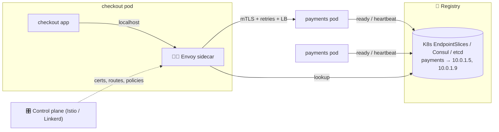

# 071 · Service Discovery & Service Mesh

> ⏱ 9 min · 📈 71% · 🅰️ Part A (core) · Phase 08: Reliability, Security & Ops
>
> `██████████████░░░░░░` 71% of the whole guide

---

## 📖 Story

Pantry now runs **60 services** across **hundreds of containers** that are born, scaled, rescheduled, and killed all day long. An IP address that was the payments service at 9 a.m. is a log shipper by 9:15.

Every Monday, something breaks because a **hard-coded address** in some config file points at a container that no longer exists. Calls vanish into empty space like letters posted to a demolished house.

And every team has written its **own** retry logic, its **own** TLS setup, its **own** timeout values. Some in Go, some in Python, one in Kotlin. Each slightly different, each slightly wrong. When Maya asks *"which services talk to payments?"*, nobody can answer.

I told Maya she needed two things: a **live directory** that always knows where everyone is right now, and maybe a **helper standing beside every service** to make each call safely. I'll show you both.

## 🎯 One-sentence idea

**In a fleet where instances come and go, service discovery lets services find each other's current healthy addresses through a registry, and a service mesh puts a proxy beside every service to handle discovery, load balancing, retries, mTLS, and telemetry so app code doesn't have to.**

## 🧸 Analogy

- 📒 **Discovery = the hotel front desk.** Guests check in and out all day. To reach "housekeeping", you **ask the desk**, which always has the **current** list.
- 🧑‍✈️ **Mesh = a personal assistant for every employee.** The assistant **looks up the number**, **retries if busy**, **uses a secure line**, **logs the call**, and **refuses** to connect you to departments you're not allowed to call.

## 🖼️ Visual

*Diagram brief:* pods register with a registry and heartbeat. Inside the checkout pod, the app talks only to localhost, where a sidecar proxy does the lookup, the encryption, and the retries. A control plane above pushes certificates and policies to every sidecar.



## 🔬 How it works

- **Registration:** **self-registration** (the instance registers and heartbeats, and is evicted on TTL expiry) or **platform registration** (Kubernetes adds **Ready** pods to EndpointSlices automatically).
- **Discovery styles:** **client-side** (the client fetches endpoints and balances itself: Eureka, gRPC xDS), **server-side** (call a stable name or VIP, and an LB or proxy picks: K8s Service, ALB), and **DNS** (`payments.prod.svc.cluster.local`, but watch the DNS caching TTLs).
- **The registry is critical infrastructure:** Consul, etcd, and ZooKeeper run **consensus** (lesson 085) on 3–5 nodes. Clients **cache the last-known endpoints** to survive a registry outage.
- **Service mesh:** the **data plane** is an Envoy **sidecar** per pod (or per node in ambient/eBPF modes) intercepting all traffic. The **control plane** pushes routes, **automatic mTLS certificates**, and policies. You get identity, retries, timeouts, circuit breaking, canary traffic splits, per-call golden-signal metrics, and **authorization** ("only checkout may call payments") **without code changes**.
- **The bill:** extra latency per hop (~sub-ms to a few ms, twice per call), CPU and memory per sidecar, control-plane upgrades, and **retry amplification** if the mesh and the app both retry. Adopt it when **many services + polyglot stacks + zero-trust** justify it.

## 🧩 Worked example

```yaml
apiVersion: v1
kind: Service
metadata: { name: payments }
spec:
  selector: { app: payments }          # every Ready pod labelled app=payments becomes an endpoint
  ports: [{ port: 80, targetPort: 8080 }]
# Any pod calls http://payments/ → routed to a healthy pod, whatever its IP is today
```

```yaml
kind: VirtualService                    # canary + resilience, zero app changes
spec:
  hosts: [payments]
  http:
    - route:
        - destination: { host: payments, subset: v1 }
          weight: 95
        - destination: { host: payments, subset: v2 }
          weight: 5
      retries: { attempts: 2, perTryTimeout: 300ms }
      timeout: 1s
---
kind: AuthorizationPolicy               # only checkout may call payments
spec:
  selector: { matchLabels: { app: payments } }
  rules:
    - from: [{ source: { principals: ["cluster.local/ns/pantry/sa/checkout"] } }]
```

**Maya's Monday, after:** zero hard-coded IPs, **mTLS on 100% of internal calls**, one retry policy defined in one place, and a live **service graph** that finally answers *"who calls payments?"* (exactly 3 services, each with its own p99).

## ⚖️ Trade-offs

| Maya's choice | What she gains | What she pays |
|---|---|---|
| DNS-based discovery | Simple, universal | Caching delays, basic balancing |
| Client-side discovery | Smart LB, no extra hop | A library per language |
| Server-side (LB / K8s Service) | Thin clients | An extra hop, or kube-proxy limits |
| Service mesh | mTLS, telemetry, traffic control for free | Latency, resources, operational complexity |
| Libraries only, no mesh | Less infrastructure | Duplicated resilience code per language |

## 🌍 Real world

- **Kubernetes Services + CoreDNS** is today's most common discovery mechanism.
- **Netflix Eureka** pioneered client-side discovery. **HashiCorp Consul** spans VMs and containers.
- **Istio, Linkerd, and Consul service mesh** are the meshes, and **Envoy** dominates the data plane.

## 📌 Cheat card

> - **Discovery = a live directory of healthy instances** (register/heartbeat → lookup).
> - **Client-side · server-side · DNS.**
> - **Mesh = sidecar proxies + a control plane** → mTLS, retries, canaries, telemetry, authZ with **no code changes**.
> - The registry needs **consensus-grade reliability**, and clients cache endpoints.
> - **Adopt a mesh when its value beats its cost.**

## 🧪 Feynman check

Explain the hotel front desk and the personal assistant, and why moving retries and encryption into the "assistant" helps a company with 300 services written in 5 languages.

⚠️ **Common confusion:** "Microservices require a service mesh." Plenty of teams thrive on **Kubernetes Services + solid client libraries**. A mesh pays off with **many services, polyglot stacks, and mandatory mTLS/zero-trust**. Before that, it's mostly extra moving parts.

## ⚡ Quick recall

1. Client-side vs server-side discovery?
<details><summary>Reveal Answer</summary>

Client-side: the client queries the registry and chooses an instance. Server-side: the client calls a stable address, and an LB or proxy chooses.
</details>

2. What's a sidecar proxy?
<details><summary>Reveal Answer</summary>

A proxy (like Envoy) deployed beside each service instance that intercepts its traffic to add mTLS, retries, load balancing, and metrics.
</details>

3. How do dead instances leave the registry?
<details><summary>Reveal Answer</summary>

Missed heartbeats or TTL expiry, or the orchestrator removing them when health or readiness checks fail.
</details>

## 🎤 Interview practice

**Q. "How do services find each other in your design, and what are the downsides of adding a service mesh?"**
<details><summary>Model answer</summary>

- **Discovery:**
  - On Kubernetes: **Services + DNS** (`payments.prod.svc`), with endpoints gated by **readiness probes**.
  - For gRPC, prefer **client-side / xDS** load balancing (headless services or proxyless gRPC), because long-lived HTTP/2 connections otherwise pin to one pod (lesson 021).
  - For mixed VMs + containers: **Consul** with health checks.
  - The registry runs as a 3–5 node consensus cluster, and clients **cache endpoints** if it's unavailable.
- **Mesh value:** uniform **mTLS** and workload identity, consistent timeouts, retries, and breakers, **canary traffic splits**, per-call **golden signals and traces**, and **service-to-service authorization**, all without touching app code.
- **Mesh costs:**
  - **Latency:** two proxy traversals per call (~sub-ms to a few ms).
  - **Resources:** CPU and memory per sidecar across thousands of pods.
  - **Operations:** control-plane upgrades, certificate rotation, and debugging through proxies.
  - **Retry amplification:** if both the app and the mesh retry, so coordinate one owner.
  - **Learning curve.**
- **Reducing overhead:** sidecar-less **ambient** modes (per-node proxies, eBPF) and **proxyless gRPC** with xDS.
- **Likely follow-up:** "What if the control plane goes down?" → the data plane keeps its last config and keeps serving. You just can't push changes or rotate certs until it's back, so watch certificate lifetimes.
</details>

## 📖 Teaser

> 📖 *Services find each other perfectly now, and then two database shards both generate order #558201, and one customer receives a stranger's refund.*

---

⬅️ [✅ Checkpoint 70%](checkpoint-70.md) · 🗺️ [Phase map](README.md) · ➡️ [072 · Unique ID Generation](072-unique-id-generation.md)

✅ **Safe stopping point.** Tick lesson 071 in [PROGRESS.md](../../PROGRESS.md).
