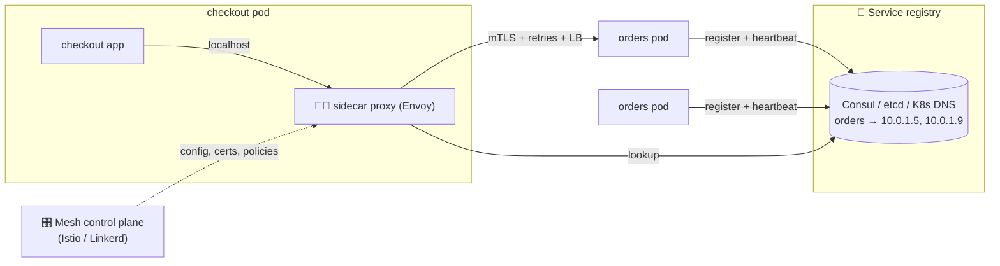

# 071 · Service Discovery & Service Mesh

> ⏱ 9 min · 📈 71% · 🅰️ Part A (core) · Phase 08: Reliability, Security & Ops
>
> `██████████████░░░░░░` 71% of the whole guide

---

## 🎯 One-sentence idea

**In a dynamic fleet where instances come and go, service discovery lets services find each other's current addresses through a registry. A service mesh adds a proxy next to every service that handles discovery, load balancing, retries, mTLS, and telemetry, so app code doesn't have to.**

## 🧸 Analogy

- 📒 **Service discovery = a hotel's front-desk directory.** Guests (instances) check in and out all day. To reach "housekeeping," you don't memorize room numbers. You **ask the front desk**, which always has the **current** list.
- 🧑‍✈️ **Service mesh = a personal assistant for every employee.** Every call goes through your assistant, who **looks up the number**, **retries if busy**, **uses a secure line**, **logs the call**, and **won't connect you** to departments you're not allowed to contact. Employees just say "call accounting."

## 🖼️ Visual



## 🔬 How it works

- **Why:** in autoscaled or containerized systems, IPs change constantly. Hard-coded addresses break.
- **Registration:**
  - **Self-registration:** the instance registers on start and sends heartbeats. It's removed on failure or TTL expiry.
  - **Platform registration:** the orchestrator does it (Kubernetes knows every pod and updates Endpoints/EndpointSlices).
- **Discovery:**
  - **Client-side:** the client queries the registry and picks an instance itself (Netflix Eureka + Ribbon, gRPC xDS).
  - **Server-side:** the client calls a stable name or virtual IP, and a load balancer or proxy routes it (Kubernetes Service, AWS ALB).
  - **DNS-based:** `orders.default.svc.cluster.local` resolves to the healthy endpoints (watch out for DNS caching TTLs).
- **The registry must be highly available and consistent:** Consul, etcd, and ZooKeeper use consensus (lesson 085).
- **Service mesh:**
  - **Data plane:** a **sidecar proxy** (Envoy) next to each instance (or per node, in "ambient"/sidecar-less modes) intercepts all traffic.
  - **Control plane:** pushes routing rules, **certificates** (automatic mTLS), and policies to the proxies.
  - **Features without code changes:** mTLS and service identity, retries, timeouts, circuit breaking, traffic splitting (canaries), **golden-signal metrics and traces** for every call, and authorization policies ("only checkout may call payments").
  - **Costs:** extra latency per hop (~sub-ms to a few ms), resource overhead, and operational complexity.

## 🧩 Worked example

**Kubernetes built-in discovery:**

```yaml
apiVersion: v1
kind: Service
metadata: { name: orders }
spec:
  selector: { app: orders }        # all pods labelled app=orders (and Ready) become endpoints
  ports: [{ port: 80, targetPort: 8080 }]
# Any pod can call http://orders/ → kube-proxy/DNS routes it to a healthy pod
```

**Istio traffic split for a canary (no app changes):**

```yaml
kind: VirtualService
spec:
  hosts: [orders]
  http:
    - route:
        - destination: { host: orders, subset: v1 }
          weight: 95
        - destination: { host: orders, subset: v2 }
          weight: 5
      retries: { attempts: 2, perTryTimeout: 300ms }
      timeout: 1s
```

**Mesh authorization policy:**

```yaml
kind: AuthorizationPolicy
spec:
  selector: { matchLabels: { app: payments } }
  rules:
    - from: [{ source: { principals: ["cluster.local/ns/shop/sa/checkout"] } }]   # only checkout may call payments
```

## ⚖️ Trade-offs

| Choice | Gain | Cost |
|---|---|---|
| DNS-based discovery | Simple, universal | Caching delays, basic load balancing |
| Client-side discovery | Smart LB, no extra hop | Library per language |
| Server-side (LB/K8s Service) | Clients stay simple | An extra hop, or relies on kube-proxy |
| Service mesh | mTLS, telemetry, traffic control for free | Latency, resources, complexity |
| No mesh (libraries) | Less infrastructure | Duplicated resilience code per language |

## 🌍 Real world

- **Kubernetes Services + CoreDNS** is the most common discovery mechanism today.
- **Netflix Eureka** (client-side discovery) was a pioneer. **HashiCorp Consul** is used across VMs and containers.
- **Istio, Linkerd, Consul Connect**, and **AWS App Mesh** (retired in favour of other options) are service meshes. **Envoy** is the dominant data-plane proxy.

## 📌 Cheat card

> - **Discovery = a live directory of healthy instances** (register + heartbeat → lookup).
> - **Client-side** (the client picks) vs **server-side** (an LB or proxy picks) vs **DNS**.
> - **Mesh = a sidecar proxy per service + a control plane**: mTLS, retries, timeouts, canaries, telemetry, and authZ **without code changes**.
> - The registry needs **consensus-level reliability** (etcd, Consul).
> - Only adopt a mesh when you have **many services** and the need for it.

## 🧪 Feynman check

Explain the hotel front desk and the personal assistant, and why moving retries and encryption into the "assistant" helps a company with 300 services written in 5 languages.

⚠️ **Common confusion:** "We need a service mesh for microservices." Many teams run well with Kubernetes Services + good client libraries. A mesh pays off with **many services, polyglot stacks, and zero-trust or mTLS requirements**.

## ⚡ Quick recall

1. Client-side vs server-side discovery?
<details><summary>Answer</summary>

Client-side: the client queries the registry and chooses an instance. Server-side: the client calls a stable address, and a load balancer or proxy chooses the instance.
</details>

2. What's a sidecar proxy?
<details><summary>Answer</summary>

A proxy (like Envoy) deployed alongside each service instance that intercepts its network traffic to add features like mTLS, retries, and metrics.
</details>

3. How do instances get removed from a registry when they die?
<details><summary>Answer</summary>

Missed heartbeats or TTL expiry (or the orchestrator removes them when they fail health or readiness checks).
</details>

## 🎤 Interview practice

**Q1. "How do services find each other in your design?"**
<details><summary>Model answer</summary>

- On Kubernetes: **Services + DNS** (`payments.prod.svc`), with endpoints based on readiness probes, and optionally gRPC client-side balancing via headless services or xDS.
- For mixed VMs and containers: a **Consul** registry with health checks.
- Add a **mesh** (Istio/Linkerd) if you need mTLS between all services, uniform retries and timeouts, canary routing, and per-call telemetry.
- **Likely follow-up:** "What if the registry is down?" → clients cache the last known endpoints. The registry runs as a 3–5 node consensus cluster.
</details>

**Q2. "What are the downsides of a service mesh?"**
<details><summary>Model answer</summary>

- **Latency** per hop (two extra proxy traversals per call), and **CPU/memory** for every sidecar.
- **Operational complexity:** control plane upgrades, certificate rotation, and debugging through proxies.
- **Retry amplification** if the mesh and the app both retry. You must coordinate the policies.
- **Learning curve** for the team.
- **Likely follow-up:** "How do newer meshes reduce the overhead?" → sidecar-less / ambient modes (per-node proxies, eBPF) and proxyless gRPC with xDS.
</details>

---

⬅️ [✅ Checkpoint 70%](checkpoint-70.md) · 🗺️ [Phase map](README.md) · ➡️ [072 · Unique ID Generation](072-unique-id-generation.md)

✅ **Safe stopping point.** Tick lesson 071 in [PROGRESS.md](../../PROGRESS.md).
