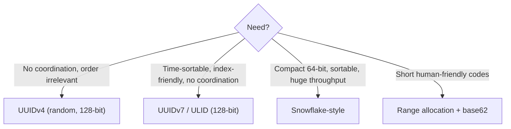

# 072 · Unique ID Generation at Scale

> ⏱ 9 min · 📈 72% · 🅰️ Part A (core) · Phase 08: Reliability, Security & Ops
>
> `██████████████░░░░░░` 72% of the whole guide

---

## 📖 Story

Shard 3 creates **order #558201** at 7:14:02 p.m. Shard 7, counting upward on its own, creates **order #558201** at 7:14:05 p.m.

Two different customers. Two different dinners. **One order number.**

The payments system matches by order number. The refund meant for one customer lands in the other's account. The receipt emails cross in the night like mixed-up letters. Support spends a day untangling it by hand.

Each shard had its own `AUTO_INCREMENT`, a counter that only knew about its **own** little world. In the sharded universe, that's like 16 ticket booths each starting their raffle at #1.

And the obvious fix, **one central counter for everything**, would put a single machine in the path of every single write in Pantry: a bottleneck and a single point of failure.

I showed Maya a trick from Twitter's engineers that I still admire: **IDs that are unique everywhere, with no central bottleneck at all.**

## 🎯 One-sentence idea

**When many machines create records at once, a single auto-increment counter becomes a bottleneck and a single point of failure, so use IDs each machine can generate independently, like UUIDs (random) or Snowflake-style IDs (timestamp + machine ID + sequence), which are unique, compact, and time-sortable.**

## 🧸 Analogy

Numbering tickets at a festival with **100 gates**:

- 🎫 **One central machine:** every gate radios the office for the next number. It's slow, and when the radio dies, **nobody gets in**.
- 🎲 **Random codes (UUID):** each gate prints a long random code. It's practically unique, but it's long and **doesn't say who came first**.
- ⏱️ **Snowflake:** each gate prints **time · gate number · counter**: unique, **sorted by time**, and short.

## 🖼️ Visual

*Diagram brief:* a 64-bit bar sliced into three coloured segments (timestamp, machine, sequence) with their bit widths. Below, a decision fork for choosing an ID scheme.

```
Snowflake ID (64 bits)
┌─┬─────────────────────────────────────────┬────────────┬──────────────┐
│0│ 41 bits: ms since custom epoch (~69 yrs) │ 10 bits:   │ 12 bits:     │
│ │                                          │ worker ID  │ sequence     │
│ │                                          │ (1,024)    │ (4,096 / ms) │
└─┴─────────────────────────────────────────┴────────────┴──────────────┘
```



## 🔬 How it works

- **Clarify first:** unique system-wide? time-sortable? 64- or 128-bit? **publicly guessable**? how many per second?
- **Auto-increment:** compact and simple, but a **write bottleneck + SPOF**, collisions across shards (offset tricks like 1, 3, 5… / 2, 4, 6… are hard to grow), the ID only exists **after** the insert, and it **leaks business volume** (#1000 → #1050 = 50 orders today) while inviting enumeration.
- **UUIDv4** (122 random bits): generate anywhere, with negligible collision risk. But it's 128 bits, unsortable, and **random inserts thrash B-tree indexes** (lesson 037). **UUIDv7 / ULID** put a **timestamp prefix** first, so they're roughly time-ordered, index-friendly, and still coordination-free. A great modern default (**RFC 9562**).
- **Snowflake:** `41 bits time | 10 bits worker | 12 bits sequence` → **4,096 IDs/ms per worker**, ~**69 years** of range, k-sorted, in a `BIGINT`. You need **unique worker IDs** (etcd/ZooKeeper leases, pod ordinals) and must **refuse or wait when the clock moves backwards**.
- **Range allocation:** a central allocator hands out **blocks** (1–10,000 to server A), so it's rarely contacted and yields short sequential IDs, perfect for **base62 short codes** (lesson 074). **Instagram's variant** embeds the **shard ID** inside the ID for instant routing.

## 🧩 Worked example

```python
import time, threading

EPOCH = 1704067200000                       # 2024-01-01 in ms: a custom epoch buys more years
class Snowflake:
    def __init__(self, worker_id):
        assert 0 <= worker_id < 1024
        self.worker, self.seq, self.last = worker_id, 0, -1
        self.lock = threading.Lock()

    def next_id(self):
        with self.lock:
            now = int(time.time() * 1000)
            if now < self.last:
                raise RuntimeError("clock moved backwards")       # or sleep until it catches up
            if now == self.last:
                self.seq = (self.seq + 1) & 0xFFF                  # 12 bits
                if self.seq == 0:                                  # 4,096 used this ms → next ms
                    while now <= self.last: now = int(time.time() * 1000)
            else:
                self.seq = 0
            self.last = now
            return ((now - EPOCH) << 22) | (self.worker << 12) | self.seq
```

**Capacity:** 2⁴¹ ms ≈ **69.7 years** · 1,024 workers × 4,096,000 IDs/s ≈ **4.2 billion IDs/s** total.

**Maya's fix:** order IDs become Snowflake-style with the **logical shard in the worker bits**, so `order_id → shard` is a bit shift, with no lookup. Customers see a separate **random public order code** (`PNTRY-7KQ2-X9M4`), so nobody can count Pantry's daily volume.

| Format | Size | Sortable | Coordination | Guessable? |
|---|---|---|---|---|
| Auto-increment | 64-bit | ✅ | Central DB | ✅ very |
| UUIDv4 | 128-bit | ❌ | None | ❌ |
| UUIDv7 / ULID | 128-bit | ✅ (ms) | None | Partly |
| Snowflake | 64-bit | ✅ (k-sorted) | Worker IDs | Partly |
| Range blocks | 64-bit | ~✅ | Occasional | ✅ |

## ⚖️ Trade-offs

| Maya's choice | What she gains | What she pays |
|---|---|---|
| Auto-increment | Simplest, compact | Bottleneck, SPOF, leaks volume, shard collisions |
| UUIDv4 | Zero coordination | Big, unordered → index churn |
| UUIDv7 / ULID | No coordination + time order | 128 bits |
| Snowflake | Compact + ordered + fast | Worker ID management, clock-skew handling |
| Separate public IDs | No enumeration or volume leaks | One more identifier to map |

## 🌍 Real world

- **Twitter Snowflake** (2010) inspired **Discord's** IDs, **Sony's Sonyflake**, and **Baidu's UidGenerator**.
- **Instagram** embeds a 13-bit logical shard ID in IDs generated inside Postgres.
- **MongoDB ObjectId** = timestamp + random value + counter, also roughly sortable.

## 📌 Cheat card

> - **Snowflake = 41 time | 10 worker | 12 sequence** ("**41-10-12**") → 4,096/ms/worker, ~69 years.
> - **UUIDv7/ULID** = time-ordered 128-bit, no coordination (a great default).
> - **UUIDv4** hurts B-tree insert locality.
> - Watch **unique worker IDs**, **backwards clocks**, and **don't expose sequential IDs**.
> - Short codes → **range allocation + base62**.

## 🧪 Feynman check

Explain the festival gates, and why "time + gate number + counter" can never collide even without ever calling the office.

⚠️ **Common confusion:** "Snowflake IDs are strictly ordered." They're only **k-sorted** (roughly ordered). Two machines in the same millisecond, or with slightly skewed clocks, can produce IDs out of real-time order. Never treat them as a perfect global sequence.

## ⚡ Quick recall

1. What are the three parts of a Snowflake ID?
<details><summary>Reveal Answer</summary>

Timestamp (41 bits), worker/machine ID (10 bits), and a per-millisecond sequence (12 bits).
</details>

2. Why are random UUIDv4 primary keys bad for B-tree writes?
<details><summary>Reveal Answer</summary>

Inserts land at random positions in the index, causing page splits, poor cache locality, and more I/O.
</details>

3. What happens if a Snowflake generator's clock moves backwards?
<details><summary>Reveal Answer</summary>

It could reuse timestamps and generate duplicates, so it must detect this and wait or refuse until the clock catches up.
</details>

## 🎤 Interview practice

**Q. "Design a unique ID generator producing 1M IDs per second across many services. And why not just use the database's auto-increment?"**
<details><summary>Model answer</summary>

- **Clarify:** 64-bit or 128-bit? time-sortable? exposed publicly?
- **Design:**
  - A **Snowflake-style library** embedded in each service instance, so there's **no network hop** per ID.
  - A **custom epoch**, 10-bit **worker IDs** leased from etcd/ZooKeeper (or derived from StatefulSet ordinals), and a 12-bit sequence.
  - **Capacity:** 4,096/ms ≈ 4M/s per worker, so 1M/s needs just a handful of workers.
- **Hazards:**
  - **Clock skew:** monitor NTP, **refuse or wait** on backward jumps, and alert.
  - **Worker ID reuse:** leases expire before an ID can be reassigned, so two live processes never share one.
- **Alternative:** **UUIDv7**, if 128 bits is acceptable. No worker IDs to manage at all.
- **Public exposure:** keep internal IDs internal, and show customers an **opaque public ID** (a random slug or an encrypted ID) to prevent enumeration and volume leaks.
- **Why not auto-increment:**
  - One sequence = a **write bottleneck and SPOF**.
  - **Shards collide** without offsets or a central allocator.
  - The ID exists only **after** the insert, which is awkward when you need it beforehand for events, idempotency keys, or outbox rows.
  - Sequential public IDs leak metrics and invite scraping.
  - It's **fine** for a single primary with modest write rates and internal-only IDs.
- **Likely follow-up:** "Can the ID encode routing?" → yes, put the logical shard in the worker bits (Instagram-style), so the service routes by bit-shifting, with no lookup.
</details>

## 📖 Teaser

> 📖 *Chapter 9 is next. Pantry has every building block it needs, and Maya's year of big features begins with a blank whiteboard and a framework for designing anything.*

---

⬅️ [071 · Service Discovery & Mesh](071-service-discovery-and-mesh.md) · 🗺️ [Phase map](README.md) · ➡️ [073 · The Design Framework](../09-core-case-studies/073-design-framework.md)

✅ **Safe stopping point.** Tick lesson 072 in [PROGRESS.md](../../PROGRESS.md). 🎉 **Phase 08 complete!** Review the [cheatsheet](CHEATSHEET.md) and [interview bank](INTERVIEW-QUESTIONS.md).
