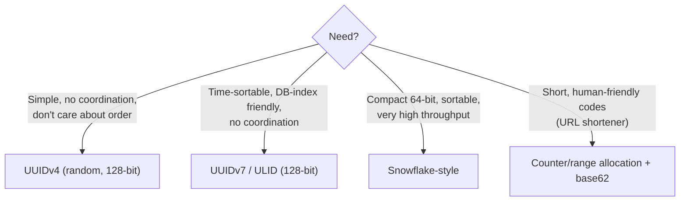

# 072 · Unique ID Generation at Scale

> ⏱ 9 min · 📈 72% · 🅰️ Part A (core) · Phase 08: Reliability, Security & Ops
>
> `██████████████░░░░░░` 72% of the whole guide

---

## 🎯 One-sentence idea

**When many machines create records at once, a single auto-increment counter becomes a bottleneck and a single point of failure. Use IDs that each machine can generate independently, like UUIDs (random) or Snowflake-style IDs (timestamp + machine ID + sequence), which are unique, compact, and sortable by time.**

## 🧸 Analogy

Numbering **tickets at a huge festival** with 100 entrances:

- 🎫 **One central ticket machine:** every entrance radios the office for the next number. It's slow, and if the office radio dies, **no one gets in**. (Auto-increment in one DB.)
- 🎲 **Random codes (UUID):** each entrance prints a **long random code**. Duplicates are practically impossible, but the codes are long and **don't tell you who came first**.
- ⏱️ **Snowflake:** each entrance prints **time + entrance number + a counter**: `10:03:05.123 · gate 17 · #004`. It's unique (no two gates share a number), **sorted by time**, and short.

## 🖼️ Visual

```
Snowflake ID (64 bits)
┌─┬─────────────────────────────────────────┬────────────┬──────────────┐
│0│ 41 bits: milliseconds since custom epoch │ 10 bits:   │ 12 bits:     │
│ │ (~69 years)                              │ machine ID │ sequence     │
│ │                                          │ (1,024)    │ (4,096/ms)   │
└─┴─────────────────────────────────────────┴────────────┴──────────────┘
 sign
```



## 🔬 How it works

- **Requirements to clarify:** unique across the whole system? sortable by time? 64-bit or 128-bit? guessable or not (security)? how many per second?
- **Auto-increment (single DB):** simple and compact. ❌ A write bottleneck and a SPOF, awkward across shards, and it **leaks business volume** (order #1000 → #1050 = 50 orders today).
  - Variants: **multi-master with offsets** (server 1: 1, 3, 5… / server 2: 2, 4, 6…) are hard to expand.
- **UUIDv4 (random 122 bits):** generate anywhere, and the collision risk is negligible. ❌ 128 bits, not sortable, **random inserts hurt B-tree indexes** (lesson 037).
- **UUIDv7 / ULID:** a timestamp prefix + randomness → **roughly time-ordered**, index-friendly, and generated anywhere. A great modern default.
- **Snowflake (Twitter):** `timestamp (41) | machine/worker ID (10) | sequence (12)`.
  - Each worker can make **4,096 IDs per millisecond** (~4M/s per worker) with no coordination.
  - Sortable by time, and fits in a 64-bit integer (a `BIGINT` column).
  - ⚠️ Needs **unique worker IDs** (assigned via config, ZooKeeper/etcd, or a lease).
  - ⚠️ **Clock going backwards** (NTP adjustments) could create duplicates, so detect it and wait or refuse.
- **Range/ticket allocation:** a central service hands out **blocks** of IDs (e.g., 1–10,000 to server A). It's rarely contacted, and sequential and compact. Used for short URL codes (lesson 074).
- **Instagram's variant:** 41 bits of time + 13 bits of **logical shard ID** + 10 bits of a per-shard sequence (generated inside Postgres), which **encodes the shard in the ID** for routing.

## 🧩 Worked example

**Snowflake generator (Python sketch):**

```python
import time, threading

EPOCH = 1704067200000          # custom epoch (2024-01-01) in ms → more years of range
class Snowflake:
    def __init__(self, worker_id):
        assert 0 <= worker_id < 1024
        self.worker, self.seq, self.last = worker_id, 0, -1
        self.lock = threading.Lock()

    def next_id(self):
        with self.lock:
            now = int(time.time() * 1000)
            if now < self.last:
                raise RuntimeError("clock moved backwards")        # or wait until it catches up
            if now == self.last:
                self.seq = (self.seq + 1) & 0xFFF                   # 12 bits
                if self.seq == 0:                                   # 4,096 used this ms → wait for the next ms
                    while now <= self.last: now = int(time.time() * 1000)
            else:
                self.seq = 0
            self.last = now
            return ((now - EPOCH) << 22) | (self.worker << 12) | self.seq
```

**Capacity math:**

```
41 bits of ms ≈ 2^41 ms ≈ 69.7 years from the custom epoch
10 bits → 1,024 workers · 12 bits → 4,096 IDs/ms/worker
Total ≈ 1,024 × 4,096,000 ≈ 4.2 billion IDs/s. Plenty.
```

**Comparison of formats:**

| Format | Size | Sortable | Coordination | Guessable? |
|---|---|---|---|---|
| Auto-increment | 64-bit | ✅ | Central DB | ✅ Very (enumeration risk) |
| UUIDv4 | 128-bit | ❌ | None | ❌ |
| UUIDv7 / ULID | 128-bit | ✅ (ms) | None | Partly (the time part) |
| Snowflake | 64-bit | ✅ | Worker ID assignment | Partly |
| Range blocks | 64-bit | ~✅ | Occasional | ✅ |

## ⚖️ Trade-offs

| Choice | Gain | Cost |
|---|---|---|
| Auto-increment | Simplest, compact | Bottleneck, SPOF, leaks volume, cross-shard pain |
| UUIDv4 | Zero coordination | Big, unordered → index churn |
| UUIDv7 / ULID | No coordination + time-ordered | 128 bits |
| Snowflake | Compact + ordered + fast | Worker IDs, clock skew handling |
| Don't expose raw IDs | Prevents enumeration | Needs public IDs or authZ checks anyway |

## 🌍 Real world

- **Twitter Snowflake** (2010) → **Discord**, **Instagram** (shard-embedded variant), **Sony Sonyflake**, **Baidu UidGenerator**.
- **UUIDv7** was standardized in **RFC 9562** (2024), with growing database support.
- **MongoDB ObjectId:** 4-byte timestamp + a 5-byte random value + a 3-byte counter (also roughly sortable).

## 📌 Cheat card

> - **Snowflake = 41 time | 10 machine | 12 sequence** ("**41-10-12**") → 4,096 IDs/ms/worker, ~69 years.
> - **UUIDv7/ULID** = time-ordered 128-bit IDs with no coordination (a great default).
> - **UUIDv4** = random, which hurts B-tree insert locality.
> - Watch out: **unique worker IDs**, **clock going backwards**, **don't leak volume** with sequential public IDs.
> - Need short codes? **Range allocation + base62** (lesson 074).

## 🧪 Feynman check

Explain the festival-ticket analogy, and why "time + gate number + counter" can never collide even without calling the office.

⚠️ **Common confusion:** "Snowflake IDs are strictly ordered." They're **roughly** ordered (k-sorted). IDs from different machines in the same millisecond, or with slight clock skew, may be out of order. Don't use them as a perfect global sequence.

## ⚡ Quick recall

1. What are the three parts of a Snowflake ID?
<details><summary>Answer</summary>

Timestamp (41 bits), machine/worker ID (10 bits), per-millisecond sequence (12 bits).
</details>

2. Why are random UUIDv4 primary keys bad for B-tree write performance?
<details><summary>Answer</summary>

Inserts land at random positions in the index, causing page splits, poor cache locality, and more I/O.
</details>

3. What happens if a Snowflake generator's clock moves backwards?
<details><summary>Answer</summary>

It could reuse timestamps and generate duplicates, so it must detect this and wait or refuse until the clock catches up.
</details>

## 🎤 Interview practice

**Q1. "Design a unique ID generator for a distributed system creating 1M IDs/s."**
<details><summary>Model answer</summary>

- Clarify: 64-bit? sortable? exposed publicly?
- A **Snowflake-style** generator embedded as a library in each service instance (no network hop): a custom epoch, a 10-bit worker ID assigned from etcd/ZooKeeper leases (or pod ordinal), and a 12-bit sequence.
- Capacity: 4,096/ms per worker × 1,000 = 4M/s per worker, so 1M/s is easy.
- Handle clock skew (NTP monitoring, refuse on backwards jumps), and worker ID reuse after crashes (lease expiry).
- Alternative: **UUIDv7** if 128 bits is acceptable, since there are no worker IDs to manage.
- **Likely follow-up:** "How do you avoid exposing volume?" → use opaque public IDs (a random slug or an encrypted ID) separate from internal IDs.
</details>

**Q2. "Why not just use the database's auto-increment?"**
<details><summary>Model answer</summary>

- A single sequence = a **write bottleneck and SPOF**. Across **shards**, the sequences collide unless you use offsets or a central allocator.
- IDs are generated only **after the insert** (a round trip), which is awkward for event-driven flows where you need the ID before writing.
- Sequential public IDs leak business metrics and invite enumeration.
- It's fine for small, single-DB systems, and it's simple.
- **Likely follow-up:** "When is auto-increment fine?" → a single primary with moderate write rates, and internal IDs only.
</details>

---

⬅️ [071 · Service Discovery & Mesh](071-service-discovery-and-mesh.md) · 🗺️ [Phase map](README.md) · ➡️ [073 · The Design Framework](../09-core-case-studies/073-design-framework.md)

✅ **Safe stopping point.** Tick lesson 072 in [PROGRESS.md](../../PROGRESS.md). 🎉 **Phase 08 complete!** Review the [cheatsheet](CHEATSHEET.md) and [interview bank](INTERVIEW-QUESTIONS.md).
