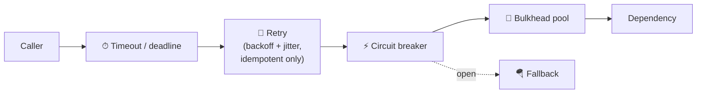

# 📌 Phase 08 Cheatsheet: Reliability, Security & Ops

## 🧠 Core ideas

| # | Idea in one line |
|---|---|
| 063 | **Always use timeouts. Retry only transient + idempotent operations**, with **exponential backoff + full jitter**, at one layer. |
| 064 | **Circuit breaker** (Closed → Open → Half-open) + **bulkheads** (a pool per dependency) + fallbacks. |
| 065 | **Find the SPOFs.** Active-active vs active-passive. Spread across **failure domains**. N+1. |
| 066 | **RPO = data loss, RTO = downtime.** Backup → pilot light → warm → active-active. Replication ≠ backup. |
| 067 | **Metrics (that), traces (where), logs (why).** Golden signals **LETS**. Alert on SLO burn. |
| 068 | **Changes cause outages.** Rolling, blue-green, **canary**, **feature flags**. Expand → migrate → contract. |
| 069 | **AuthN = who, AuthZ = what.** JWT short-lived + refresh. OAuth (delegation) vs OIDC (login). Object-level checks. |
| 070 | **Defense in depth**: TLS + KMS encryption, secrets vault, least privilege, OWASP, WAF/DDoS, minimize PII. |
| 071 | **Discovery = a live directory.** **Mesh = sidecar + control plane** (mTLS, retries, telemetry). |
| 072 | **Snowflake 41-10-12** or **UUIDv7**. Avoid central counters at scale. |

## 🔢 Numbers

```
Backoff: sleep = random(0, min(cap, base × 2^n)) · 2–3 attempts max · retry budget ~10%
3 layers × 3 retries = 27× amplification
Breaker: e.g. open at ≥50% failures over ≥20 calls, 30 s cool-down
Failover: ~10–60 s · Cross-region RTT ~60–150 ms
JWT access token: 5–15 min · refresh token: days–weeks (rotated)
Snowflake: 4,096 IDs/ms/worker · 1,024 workers · ~69 years
About 70% of outages come from changes (deploys/config)
```

## 🪄 Mnemonics

- **TRCB-R:** Timeouts, Retries, Circuit Breakers, Redundancy.
- **LETS:** Latency, Errors, Traffic, Saturation. **RED** for services, **USE** for resources.
- **MLT:** Metrics, Logs, Traces.
- **RPO = Point (data), RTO = Time (downtime).**
- **3-2-1 backups:** 3 copies, 2 media, 1 off-site.

## 🗺️ The resilience stack around every remote call



## ⚠️ Top mistakes

- No timeouts. Retries at every layer. No jitter.
- Redundancy all in one AZ. Untested failover and restores.
- Treating replication as backup.
- Alerting on CPU instead of user-facing SLOs. Alert fatigue.
- Big-bang deploys. Code + breaking schema change together.
- Long-lived JWTs. Missing object-level authZ. Secrets in git.

---

🗺️ [Phase map](README.md) · 🎤 [Interview questions](INTERVIEW-QUESTIONS.md)
