# 🛡️ Phase 08: Reliability, Security & Ops

> **Lessons 063–072 · 63% → 72% · 🅰️ Part A (core)**
> By the end of this phase you'll build systems that **survive failures**, **recover from disasters**, **can be observed and safely deployed**, **keep bad actors out**, and **generate unique IDs at scale**.

```mermaid
flowchart LR
    L63["063<br/>Timeouts &<br/>retries"] --> L64["064<br/>Circuit breakers<br/>& bulkheads"]
    L64 --> L65["065<br/>Redundancy &<br/>failover"]
    L65 --> C65{{"✅ 65%"}}
    C65 --> L66["066<br/>Multi-region<br/>& DR"]
    L66 --> L67["067<br/>Observability"]
    L67 --> L68["068<br/>Deployments"]
    L68 --> L69["069<br/>AuthN/AuthZ<br/>OAuth, JWT"]
    L69 --> L70["070<br/>Security<br/>essentials"]
    L70 --> C70{{"✅ 70%"}}
    C70 --> L71["071<br/>Service discovery<br/>& mesh"]
    L71 --> L72["072<br/>Unique ID<br/>generation"]
```

| # | Lesson | ⏱ | One-line idea |
|---|---|---|---|
| 063 | [Timeouts & retries (backoff + jitter)](063-timeouts-and-retries.md) | 9 min | Never wait forever, and retry politely |
| 064 | [Circuit breakers & bulkheads](064-circuit-breakers-and-bulkheads.md) | 9 min | Stop calling what's broken, and contain the damage |
| 065 | [Redundancy, failover & SPOFs](065-redundancy-and-failover.md) | 9 min | Two of everything that matters |
| ✅ | [Checkpoint 65%](checkpoint-65.md) | 15 min | |
| 066 | [Multi-region & disaster recovery](066-multi-region-and-disaster-recovery.md) | 10 min | RPO, RTO, and surviving a region going dark |
| 067 | [Observability](067-observability.md) | 10 min | Metrics, logs, traces: seeing inside the system |
| 068 | [Deployment strategies](068-deployment-strategies.md) | 9 min | Blue-green, canary, feature flags |
| 069 | [AuthN, AuthZ, OAuth & JWT](069-authn-authz-oauth-jwt.md) | 10 min | Who are you, and what may you do? |
| 070 | [Security essentials](070-security-essentials.md) | 9 min | Encryption, secrets, DDoS, least privilege, privacy |
| ✅ | [Checkpoint 70%](checkpoint-70.md) | 15 min | 🎉 Level-up! |
| 071 | [Service discovery & service mesh](071-service-discovery-and-mesh.md) | 9 min | How services find and safely talk to each other |
| 072 | [Unique ID generation](072-unique-id-generation.md) | 9 min | UUIDs, Snowflake, and friends |

📌 [Phase cheatsheet](CHEATSHEET.md) · 🎤 [Phase interview questions](INTERVIEW-QUESTIONS.md)

⬅️ Previous phase: [07 Async & messaging](../07-async-messaging/README.md) · ➡️ Next phase: [09 Core case studies](../09-core-case-studies/README.md)
