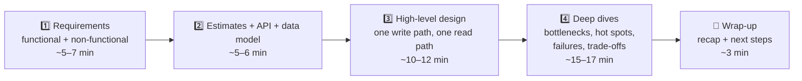

# 073 · The 4-Step System Design Framework

> ⏱ 10 min · 📈 73% · 🅰️ Part A (core) · Phase 09: Core Case Studies
>
> `██████████████░░░░░░` 73% of the whole guide

---

## 📖 Story

Pantry's roadmap for the year lands on Maya's desk, and it's terrifying: **short share links, a recipe feed, chat, notifications, cooking videos, and shared recipe folders.** Six big systems.

And Maya will lead the design of every one, presenting each to a review panel of senior engineers who will poke, prod, and ask *"what happens at 10×?"* It's a job interview, six times over, with real money on the line.

The night before her first review, she sits in front of a blank whiteboard. The marker is uncapped. Her mind is a blizzard of boxes, arrows, databases, and queues, everything at once and nothing in order. Where do you even *start* designing a system?

I've sat in that silence myself. So that night, I gave her the framework I use **every single time**: in interviews, in design reviews, on napkins.

Now I'm giving it to you.

## 🎯 One-sentence idea

**Every design, in an interview or at work, follows the same four steps: pin down requirements, estimate scale and define the API, sketch a simple high-level design, then deep-dive on the hardest parts while explaining trade-offs out loud.**

## 🧸 Analogy

Building a **custom house** with a client:

1. 🗣️ **Requirements:** "How many people? Budget? Earthquake zone?" Never pour concrete before asking.
2. 📐 **Estimates & plan:** "3 bedrooms, 200 m²." Rough numbers.
3. ✏️ **Sketch:** rooms and how they connect. The client nods.
4. 🔧 **Deep dives:** detail the earthquake-proof foundation and the plumbing, the risky parts.

## 🖼️ Visual

*Diagram brief:* a left-to-right pipeline of five stages, each with its time budget for a 45-minute interview.

## 🔬 How it works

- **1. Requirements (never skip):** the **top 3 features** plus explicit **out-of-scope**, then **measurable** non-functionals: DAU, QPS, data size, p99 latency, availability vs consistency, durability, compliance. **Ask, then assume out loud**: "I'll assume 100M DAU, read-heavy. OK?"
- **2. Estimates, API, data model:** back-of-envelope QPS (average and peak), storage, and bandwidth (lesson 005), each ending in **"so this means…"**. Write **3–5 endpoints** and the **core entities with keys**, then name each store **and why** (lesson 045).
- **3. High-level design:** start **simple** (client → LB → services → cache / DB / object storage / queue), then walk **one write path and one read path** end to end. **Get a nod before going deeper.**
- **4. Deep dives (where the senior signal lives):** what breaks first at 10×? **Caching, sharding (and the key), replication, async**, plus **hot spots** (celebrities, viral items), **consistency choices**, **failure modes** (retries, idempotency, failover, degradation), and **special algorithms** (IDs, ranking, geo).
- **Narrate trade-offs and wrap up:** "Option A gives X but costs Y. Given Z, I pick A." Close with a **30-second recap** and the next improvements (monitoring, security, multi-region, cost).

## 🧩 Worked example

**"Design Pastebin", one minute per step:**

1. **Requirements:** create a paste (≤ 1 MB), read it by short URL, optional expiry. Out of scope: editing, accounts. 10:1 read-heavy, 99.9% available, never lose a paste.
2. **Estimates:** 1M pastes/day → ~12 writes/s. 10M reads/day → ~120 reads/s (peak ~400). 10 KB avg → **10 GB/day → ~18 TB over 5 yrs**. **API:** `POST /pastes {content, ttl} → {id}`, `GET /p/{id}`. **Data:** metadata (id, created, expires, size, blob_key) in a KV/SQL store, **content in object storage**.
3. **High-level:** client → LB → paste service → metadata DB + S3. Reads: CDN/Redis → service → metadata → S3.
4. **Deep dives:**
   - **IDs:** range-allocated counter → base62, 7 chars.
   - **Hot pastes:** CDN + Redis.
   - **Expiry:** a TTL index + lifecycle rules.
   - **Abuse:** rate and size limits.
   - **Durability:** S3's 11 nines.

| Minutes (45-min interview) | Step |
|---|---|
| 0–7 | Requirements |
| 7–13 | Estimates + API + data model |
| 13–25 | High-level design |
| 25–42 | Deep dives (2–3 topics) |
| 42–45 | Wrap-up + questions |

## ⚖️ Trade-offs

| Maya's habit | What she gains | What it costs if overdone |
|---|---|---|
| Asking many questions | The right problem | Running out of time (cap it at ~7 min) |
| Detailed estimates | Credibility | An arithmetic rabbit hole (keep it to 2–3 min) |
| Starting simple | Clarity, visible evolution | Looking shallow if she never goes deep |
| Going deep early | Shows expertise | Losing the big picture |

## 🌍 Real world

- Real **design docs** follow the same arc: context and goals → requirements → proposal → alternatives → risks.
- Big-tech interview rubrics score **problem navigation, solution design, technical depth, trade-off reasoning, and communication**.

## 📌 Cheat card

> - **R → E → H → D → W.**
> - **Say assumptions out loud.** Check in often.
> - **One write path + one read path**, end to end.
> - Deep dives: **scale · hot spots · consistency · failures · special algorithms**.
> - The magic phrase: **"The trade-off here is…"**
> - Full template: [INTERVIEW-FRAMEWORK.md](../../cheatsheets/INTERVIEW-FRAMEWORK.md)

## 🧪 Feynman check

Explain the custom house, and why detailing the kitchen plumbing (a deep dive) before agreeing on the house's size is a mistake.

⚠️ **Common confusion:** "There's one correct answer the interviewer wants." There are **many acceptable designs**. What's evaluated is **your reasoning**: clarifying, justifying with numbers, weighing options, and adapting gracefully when constraints change.

## ⚡ Quick recall

1. What are the four steps, plus the wrap-up?

Reveal Answer

Requirements → estimates/API/data model → high-level design → deep dives → wrap-up.

2. Roughly how long should requirements take in a 45-minute interview?

Reveal Answer

About 5–7 minutes.

3. What must you walk through in the high-level design?

Reveal Answer

At least one end-to-end write path and one read path through the components.

## 🎤 Interview practice

**Q. "You're mid-way through your high-level design when the interviewer cuts in: 'What if traffic is 100× more?' How do you respond, without losing your structure?"**

Model answer

- **Treat the interruption as a hint:** they want to see scaling judgment, so go there without abandoning the framework.
- **Recompute out loud** in 30 seconds: "100× gives ~40k writes/s and ~400k reads/s at peak, and storage grows to ~1.8 PB over five years."
- **Find what saturates first:** usually the **primary DB** (writes, connections), then **bandwidth/egress**, then the **cache**.
- **Scale in a deliberate order:**
  1. **Caching + CDN** for the read path (hit ratio > 95%).
  2. **Stateless app tier** scaled horizontally behind the LB.
  3. **Read replicas**, then **sharding** with a clear key (e.g. `paste_id`), so every hot query stays single-shard.
  4. **Async** for non-critical work (analytics, cleanup) via queues.
  5. **Object storage + lifecycle tiers** for the bulk bytes.
- **Name the new trade-offs:** eventual consistency on replicas and caches, operational complexity, rebalancing, and cost.
- **Return to the framework:** "With that, let me finish the read path and then deep-dive into ID generation."
- **Likely follow-up:** "Which single metric would you watch?" → the SLI of the critical journey (e.g. successful paste reads under 100 ms) plus the DB's saturation signals.

## 📖 Teaser

> 📖 *The framework is in Maya's pocket, and her first real test arrives at once: cooks want to share dishes with links short enough to fit in a tweet, and the traffic estimate comes back in the billions.*

---

⬅️ [072 · Unique ID Generation](../08-reliability-ops/072-unique-id-generation.md) · 🗺️ [Phase map](README.md) · ➡️ [074 · Design a URL Shortener](074-design-url-shortener.md)

✅ **Safe stopping point.** Tick lesson 073 in [PROGRESS.md](../../PROGRESS.md).
